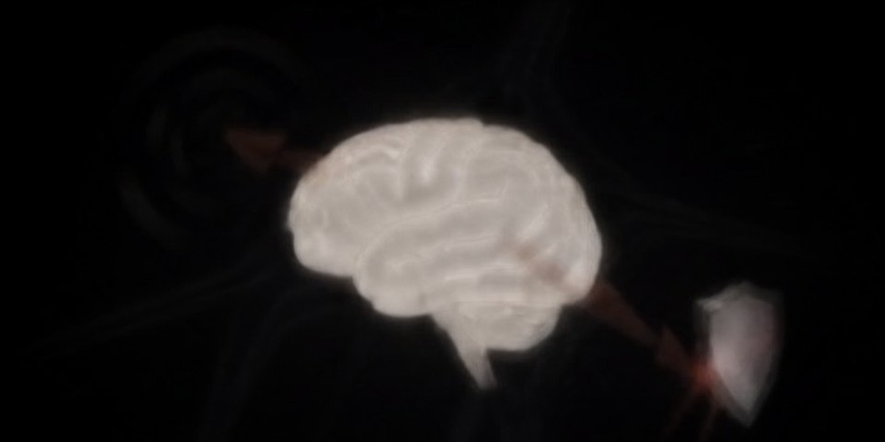
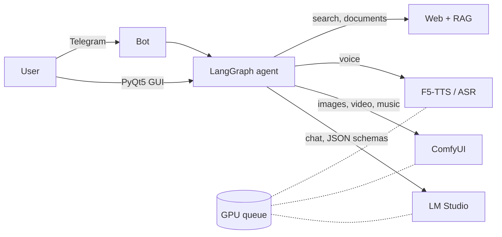

<p align="center">
  
</p>

<h1 align="center">Assistant DC</h1>

<p align="center">
  <b>A personal AI assistant that lives entirely on your own graphics card.</b><br>
  It talks, draws, edits photos, makes videos, writes songs, researches the web and builds slide decks,<br>
  in a desktop app and in Telegram, with no cloud and no subscription.
</p>

<p align="center">
  
  
  
  
  
</p>

---

## Why it is different

Most "local assistants" are a chat window over a model. Assistant DC is an agent that
**does the work** and **checks itself** before it answers:

- It draws from a **scene plan**, a JSON layout with boxes, not from one prompt line,
  and reads the lettering back with OCR.
- In slide decks it **checks every figure** against the sources it found (MiniCheck) and
  drops what the sources do not support.
- It remembers facts about the user and **replaces the outdated ones** instead of piling up
  contradictions.
- Structured answers are decoded under a **JSON schema** (constrained decoding), so plans
  and layouts never break halfway through.
- It shares **one GPU** between the LLM, images, video, music and voice, and queues work
  fairly between users.

Russian is the first-class language: voice, stress marks, speech recognition and the bot's
interface are tuned for it. English works too.

## Features

| | |
|---|---|
| 🧠 **Agent** | LangGraph, tools with argument validation, user fact memory, history compaction, prompt-injection guard |
| 🗣 **Voice** | F5-TTS with voice cloning from a short sample, RUAccent stress marks, GigaAM / faster-whisper recognition, VAD |
| 🎨 **Images** | Generation and local edits in ComfyUI (Ideogram 4, FireRed Image Edit), scene layout, lettering and face checks |
| 🎬 **Video** | MiniMax H3: text to video, image to video, first + last frame, reference images |
| 🎵 **Music** | YuE2 songs with Russian vocals, mashups, stem separation (Demucs) |
| 🔎 **Deep Research** | Multi-step web research with a cited report and quote verification |
| 📚 **Documents** | RAG over your own library (BGE-M3 + reranker), .pptx decks with charts and fact checks |
| 💬 **Telegram** | Multi-user bot: registration, quotas, one-GPU queue, replies as text / voice / both, threaded to the request |

## Measured on an RTX 3090 (24 GB) + 96 GB RAM

Every number below comes from an A/B run on the development machine, not from a spec sheet.

| What | Result |
|---|---|
| Chat model, Gemma 4 26B A4B (Q4 QAT) | **137 tok/s** in LM Studio; 148 tok/s with the MTP draft head on llama-server |
| Voice, F5-TTS at 10 flow steps | **0.81 s** per phrase (1.16 s at 16 steps, no extra recognition errors) |
| Speech recognition, GigaAM v3 vs Whisper large-v3-turbo | WER **10.4%** vs 13.3% on crowd recordings; 12.5 min of audio in **20 s** vs 80 s |
| Whisper large-v3-turbo, int8 | **1.0 GB** VRAM vs 3.8 GB for large-v3, 2x faster |
| Cross-language search (Russian query, English documents) | recall@10 **0.965** with BGE-M3 vs 0.000 with nomic-embed |
| Photo edit, FireRed Image Edit (fp8) | **22–24 s** per edit |
| Video, MiniMax H3 (int8 + 4-step turbo LoRA) | **~200 s** per 5 s clip (~390 s without the LoRA) |
| Song, YuE2 verse + chorus | **41 s** with the cuDNN attention backend (73.5 s with SDPA) |
| Deck planning under a JSON schema | **3/3** valid plans vs 0/3 without the schema |
| Deck fact check, MiniCheck | invented claim **0.01**, supported claim **0.98** |
| Deep research, standard depth | ~35 min for a full cited report |

## How it fits together



Everything runs on one machine. LM Studio and ComfyUI are separate local servers; the
launcher starts them and the app keeps them from fighting over video memory.

---

## Installation

### Quick start (one command)

Windows (PowerShell):

```powershell
git clone https://github.com/ArtemTopovi72/assistant-dc.git
cd assistant-dc
powershell -ExecutionPolicy Bypass -File setup.ps1
```

Linux / macOS:

```bash
git clone https://github.com/ArtemTopovi72/assistant-dc.git
cd assistant-dc
./setup.sh
```

The setup script needs only Git; it fetches everything else and is safe to run again.
Each step skips what is already done, so after a failure fix the line marked
`FAIL` and run it again. It:

1. installs [uv](https://docs.astral.sh/uv/) and a Python 3.13 venv in `venv/`;
2. on Windows, updates the Microsoft VC++ runtime when it is older than 14.40
   (an old `msvcp140.dll` crashes the app with `0xc0000005`);
3. installs PyTorch (CUDA 12.8 build when an NVIDIA GPU is present, CPU otherwise),
   the requirements and the import path; then Playwright Chromium;
4. creates `.env` from `.env.example` (an existing `.env` is never overwritten);
5. on Linux, installs the X11 libraries Qt needs to open a window and ffmpeg
   (apt, when it can run without a password prompt; otherwise it prints the command);
   on Windows, ffmpeg via winget;
6. voice: the vocoder and the Russian F5-TTS weights
   ([Misha24-10/F5-TTS_RUSSIAN](https://huggingface.co/Misha24-10/F5-TTS_RUSSIAN),
   `F5TTS_v1_Base_v4_winter`, newest checkpoint) into `models/f5/`;
7. installs LM Studio (winget on Windows, the official headless installer on Linux),
   starts its server and downloads the chat and embedding models
   (`MODEL_NAME`, `EMBED_MODEL`; the chat model is ~17 GB);
8. installs ComfyUI v0.38.2 with its own venv under `~/Documents/ComfyUI`
   (`COMFY_BASE_DIR`), the custom nodes the graphs use at pinned commits, and the
   graphs' model files (~127 GB for pictures + video; it checks free space first);
9. creates an **Assistant DC** desktop shortcut (Windows);
10. runs the health check (`scripts/healthcheck.py`) and starts the app.

Options: `--no-models` (skip model downloads, for CI or offline installs),
`--no-comfy` (skip ComfyUI entirely), `--media image,video` (which ComfyUI model
sets to download; e.g. `--media image` for pictures only, ~62 GB; add `music` for the
MiniMax Music3 weights, ~28 GB, used only with `MUSIC_ENGINE=music3`),
`--no-start` (do not open the app at the end), `--cpu` (CPU PyTorch even with a GPU),
`--dev` (also install the test dependencies), `--no-install` (do not install system
programs with winget/apt). On Windows they are written the same way: `setup.ps1 --no-start`.

| | |
|---|---|
| start | the desktop shortcut, `start.cmd` (Windows) or `./start.sh` |
| stop | close the window (LM Studio and ComfyUI keep running; quit them from the tray) |
| check | `venv\Scripts\python scripts\healthcheck.py` (`venv/bin/python` on Linux) |
| update | `git pull`, then run the setup script again |
| settings | `.env`; every key is explained in `.env.example` |

What stays manual: the YuE2 song engine (`venv_yue2/` plus `models_ext/YuE2-3B` and
`models_ext/YuE2-Vae`, see [docs/music_generation.md](docs/music_generation.md)) and
Docker Desktop for the `run_code` sandbox. Anything a download
could not fetch (network, disk space) is reported with the step that failed; run the
setup again to retry. Without a part the app runs with that feature off, and the
health check says which ones.

### 0. What you need

- Windows 10 or 11 (the main target). Linux (Ubuntu/Debian) runs the whole app too: the window opens on X11 and setup installs ComfyUI and LM Studio there as well.
- An NVIDIA GPU. Everything was built and measured on an RTX 3090 24 GB with 96 GB RAM;
  smaller cards are untested. Video generation needs the full 24 GB.
- Disk: about 60 GB for the MiniMax H3 video weights, plus the chat model and ComfyUI models.

### 1. Manual install (what setup does)

```bash
uv venv -p 3.13 venv
venv\Scripts\activate
uv pip install torch==2.8.0 torchaudio==2.8.0 torchvision==0.23.0 --index-url https://download.pytorch.org/whl/cu128
uv pip install -r requirements.txt --override overrides.txt
python scripts/install_paths.py
playwright install chromium
copy .env.example .env
```

> **Why uv and not pip?** `overrides.txt` lifts an over-cautious `rich<14` pin in
> `cached-path` (pulled in by f5-tts), which otherwise blocks `py7zz`, the rar/7z
> extractor. pip cannot override a dependency's pin.

### 2. LM Studio: the brain

1. Download a chat model in LM Studio (setup does this for you). The default is
   `gemma4-26b-a4b-uncensored-hauhaucs-balanced`
   ([HauhauCS/Gemma4-26B-A4B-Uncensored-HauhauCS-Balanced](https://huggingface.co/HauhauCS/Gemma4-26B-A4B-QAT-Uncensored-HauhauCS-Balanced-MTP));
   for any other model set `MODEL_NAME=<model id from LM Studio>` in `.env`.
2. Context: the system prompt plus the tool schemas take about 10k tokens, so the app
   reloads the model with at least **40960** tokens itself (`LM_MIN_CONTEXT`). Leave
   room for it in VRAM.
3. Download the embedding model **text-embedding-bge-m3**.
4. Start the server (Developer → Start Server). The default address is
   `http://127.0.0.1:1234`; change it with `LM_STUDIO_BASE`.

### 3. ComfyUI: images, video, music

1. Install ComfyUI and the **ComfyUI-GGUF** custom node.
2. The workflow graphs ship in [`workflows/`](workflows) (`workflows/<kind>/workflow_*.json`). The MiniMax H3 video
   weights (~60 GB, resumable) are fetched by:
   ```bash
   python scripts/fetch_h3_weights.py
   ```
3. The server is expected at `http://127.0.0.1:8000` (`COMFY_URL`). If ComfyUI is not in
   `Documents\ComfyUI`, set `COMFY_BASE_DIR`.

Without ComfyUI the assistant still works: chat, voice, search and documents, everything
except media generation.

### 4. Voice

TTS weights are not in the repo:

- a Russian F5-TTS checkpoint → the repo root, named `model_212000.safetensors`
  (or set `F5_WEIGHTS_REPO` and `F5_WEIGHTS_FILE` in `.env` and the setup script downloads it);
- the [charactr/vocos-mel-24khz](https://huggingface.co/charactr/vocos-mel-24khz) vocoder → the `vocos/` folder
  (the setup script downloads it);
- the assistant's voice sample (5–15 s of clean speech, `.wav`) → its path in `.env`:
  `ASSISTANT_REF_WAV=C:\path\to\voice.wav`.

Whisper, GigaAM, RUAccent and Silero VAD download themselves on first use. Without the
voice files the app starts with voice output off; without network on the first start,
speech recognition is off until the next start.

### 5. Run

```bash
start.cmd            # Windows (or the desktop shortcut)
./start.sh           # Linux
```

Both run `scripts/launch_all.py` with the venv's Python. The launcher starts LM Studio and ComfyUI if they are not already up, then opens the GUI.
Non-default install paths go in `LMSTUDIO_EXE`, `LMS_CLI` and `COMFY_EXE`.

### 6. Telegram bot (optional)

1. Create a bot with [@BotFather](https://t.me/BotFather) and copy its token.
2. Open the **Telegram** tab in the app, paste the token, press start.

The token is kept in Windows settings, not in project files. Quotas, queue limits and
2 GB uploads through a self-hosted Bot API server are configured in `.env`; every key is
documented in `.env.example`.

---

## Documentation

- [Desktop app](docs/gui.md): the three pages, every Workspace tab, settings and interface language
- [Telegram bot](docs/telegram.md): menus, the reply format picker, commands, queue

## Project layout

| Folder | Contents |
|---|---|
| [`core/`](core) | config, context, shared utilities |
| [`agent/`](agent) | LangGraph agent, tools, prompts, LM Studio client, per-turn trace |
| [`bot/`](bot) | Telegram bot: menus, queue, users, forwarded batches |
| [`gui/`](gui) | PyQt5 desktop app, one module per tab |
| [`imaging/`](imaging) | image generation and editing through ComfyUI, layout, lettering and face checks |
| [`media/`](media) | video (MiniMax H3), music (YuE2), video storyboards |
| [`voice/`](voice) | TTS (F5), ASR (GigaAM, Whisper), stress marks, diarization |
| [`research/`](research) | web search, deep research, report builder |
| [`knowledge/`](knowledge) | document library (RAG), user fact memory |
| [`services/`](services) | background services shared by the GUI and the bot |
| [`sandbox/`](sandbox), [`docker/`](docker) | code sandbox and its container |
| [`workflows/`](workflows) | ComfyUI graphs the app sends (see below) |
| [`personalities/`](personalities) | characters and casts for role-play scenes |
| [`h3_prompt_guides/`](h3_prompt_guides) | prompt guides for the video model |
| [`models/`](models) | small bundled models (face, stress marks) |
| [`assets/`](assets) | icon, banner, self-test image |
| [`docs/`](docs) | feature docs and audits |
| [`scripts/`](scripts) | launcher, installers, tools (`scripts/turns.py` reads turn traces) |
| [`tests/`](tests), [`bench/`](bench) | test suite (`tests/run_all.py`), live harnesses and benchmarks |

### ComfyUI workflows

| Folder | Graphs |
|---|---|
| [`workflows/image/`](workflows/image) | `workflow_ideogram4.json` drawing, `workflow_firered_edit.json` photo edits, `*_ui.json` copies to open in the ComfyUI editor |
| [`workflows/video/`](workflows/video) | `workflow_video_h3.json` text/image to video, `workflow_video_h3_ref.json` reference images, `*_ui.json` editor copies |
| [`workflows/music/`](workflows/music) | `workflow_music3.json` |
| [`workflows/other/`](workflows/other) | standalone graphs not called by the app |

`scripts/install_paths.py` puts these folders on the venv's import path (modules keep flat names).

## Troubleshooting

| Symptom | Check |
|---|---|
| The bot is silent or answers empty | Is the LM Studio server on, and is `MODEL_NAME` a model you have downloaded? |
| No images | Is ComfyUI running at `COMFY_URL`, with ComfyUI-GGUF installed? |
| No voice | Are `model_212000.safetensors` and `vocos/` in place, and is `ASSISTANT_REF_WAV` set? |
| `unsatisfiable` during install | Install with `uv` and `--override overrides.txt` (the setup script does) |
| The app closes at once, `0xc0000005` in the log | Old VC++ runtime: run the setup script again, or install the latest [VC++ redistributable](https://aka.ms/vs/17/release/vc_redist.x64.exe) |
| Not sure what is missing | `venv\Scripts\python scripts\healthcheck.py` lists every part with what to do |

## Tests

```bash
powershell -ExecutionPolicy Bypass -File setup.ps1 --dev --no-start   # Linux: ./setup.sh --dev --no-start
venv\Scripts\python tests/run_all.py
venv\Scripts\python tests/run_all.py -k telegram
```

About 475 suites run without a GPU or network: the LLM, ComfyUI and Telegram are faked,
and the runner ignores your `.env` so local settings cannot change the results.
CI runs them on Windows for every push to `main`, and runs the setup script twice on
clean Windows and Linux machines.
For live runs there is `bench/tg_sim.py`, a local Telegram simulator
(http://127.0.0.1:8765) where the bot talks to the real model.

## License

The code is [GPL-3.0](LICENSE), because the GUI is built on PyQt5, which is GPL v3.

Model weights are not in the repo and each has its own license. Check it before use,
commercial use especially: F5-TTS checkpoints are CC-BY-NC-4.0, Gemma is under the Gemma
Terms of Use. The repo does include the face detector and recognizer from
[OpenCV Zoo](https://github.com/opencv/opencv_zoo) (YuNet: MIT, SFace: Apache-2.0).
The texts in `bench/rag_eval/corpus` come from Wikipedia (CC BY-SA 4.0).
