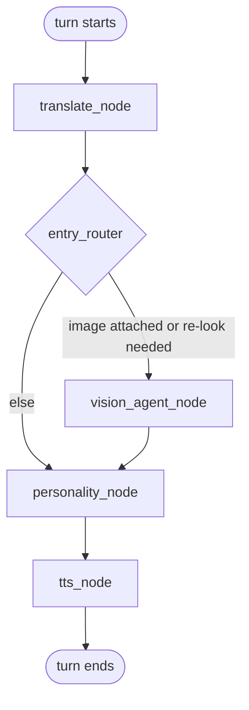
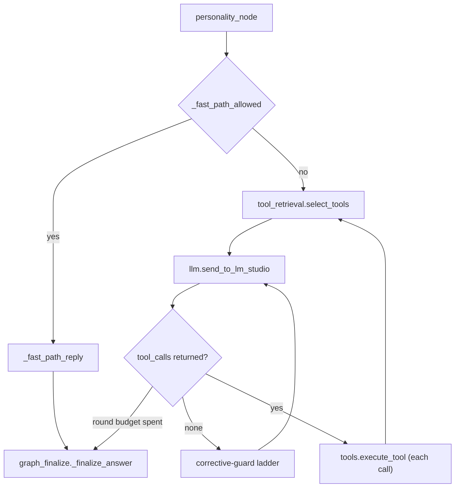
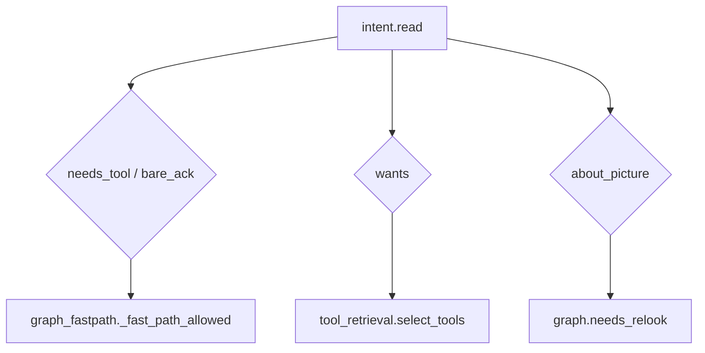
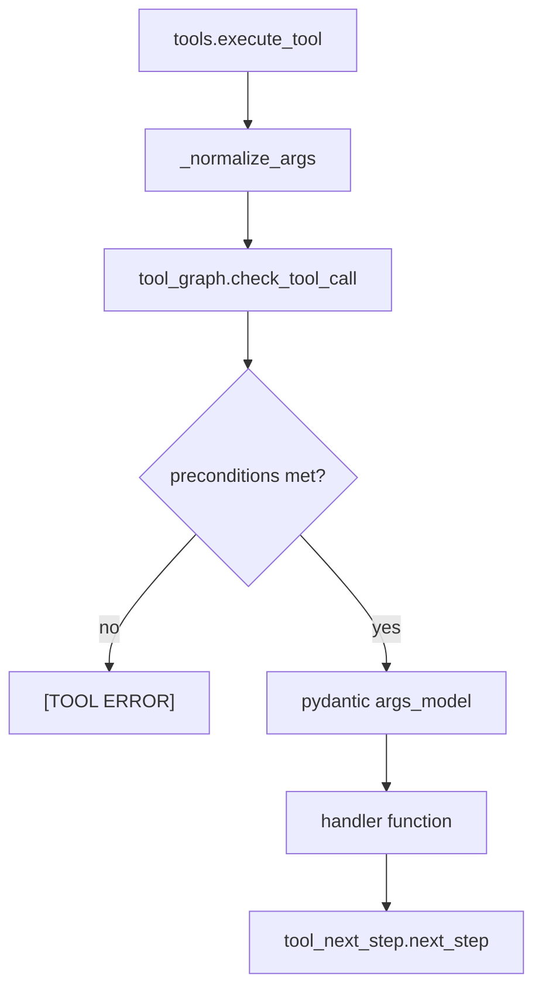
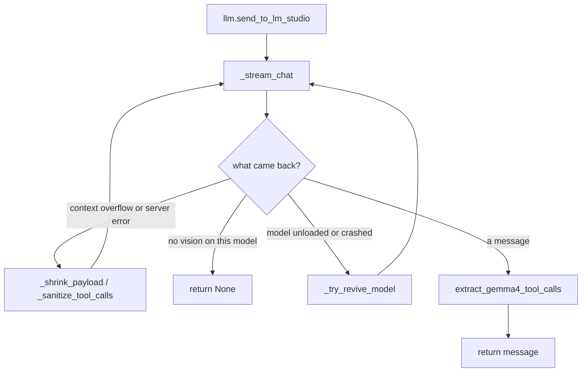

# agent-loop

## What it does

agent-loop decides what to do with a chat message and then proves it did it. A message becomes a sequence of tool calls, search, draw, edit a picture, remember a fact, shop on Ozon, edit a file in a sandbox, chosen by a single per-turn model read of intent rather than keyword regexes, executed against local engines reached through LM Studio, and turned into a spoken-style reply that is not allowed to claim an action no tool in this turn actually performed. Without it, nothing here would call a tool at the right moment or know when one was skipped; a flaky local model server would surface as the user's problem instead of being retried, revived, or reloaded automatically; and a model that spends its whole reply narrating a plan it never executed would go uncorrected. This is also the seam where everything reasoning-shaped runs in English regardless of the user's language, so a Russian instruction can never silently fall through an English-only code path.

## How it works

A turn runs through a fixed LangGraph pipeline before anything else happens to it.

*Every turn is translated to English before any reasoning, optionally detours through vision, and is always spoken back through the same step regardless of which path it took.*

### The tool-calling round loop

`personality_node` is where most of the domain's complexity lives: a fast exit for messages that plainly need no tool, and otherwise a bounded loop that narrows the tool set, calls the model, and either executes what it asked for or corrects it for asking for nothing.

*A round that calls no tool is never trusted silently, it must pass a correction ladder, or the loop ends and `_finalize_answer` resolves what is left, before an answer reaches the user.* `_finalize_answer`'s output then passes through `turn_audit.correct_claims`, which appends an honest correction line for any claim (added to cart, remembered, reminded, ran code, edited a file) that no successful tool call this turn backs.

### Intent routing

One model read of the raw message, cached per text, replaces the keyword routers this codebase used to carry at every one of these decision points.

*The same classification decides whether a tool runs at all, which tools are even offered to the model this round, and whether the turn should look at the picture again.*

### The tool dispatch gate

Every tool call passes the same four-stage gate before a handler ever runs, whether it came from `tool_image_handlers.py`, `tool_code_handlers.py`, or `tool_ozon_handlers.py`.

*A call is rejected on its resource preconditions or its arguments' meaning, an empty prompt, an edit on an already-accepted render, an unknown transfer role, before any handler has a chance to act on it.*

### Model-call reliability

`llm.send_to_lm_studio` is the one function every call to the local model goes through, and most of its length is the repair loop around a backend that regularly rejects, crashes, or silently unloads the model mid-session.

*The same failed call is repaired and retried in place, a too-large prompt is trimmed, a crashed model is revived, rather than handed back to the turn as a bare failure.*

Neither [`docs/injection_guard.md`](../injection_guard.md) nor [`docs/reasoning_toggle_audit.md`](../reasoning_toggle_audit.md) contains a diagram to redraw here; both are prose-and-table design notes, and the shapes above were drawn directly from the source modules they describe.

## Where it lives

**Turn pipeline**

| Path | Role |
|---|---|
| [`agent/graph.py`](../../agent/graph.py) | Builds the LangGraph `StateGraph` and routes each turn: translate → vision/personality → personality → tts. |
| [`agent/graph_compose.py`](../../agent/graph_compose.py) | Assembles the per-turn system prompt, generation settings, and the user message block. |
| [`agent/graph_personality.py`](../../agent/graph_personality.py) | The tool-calling round loop: forced-tool resolution, the corrective-guard ladder, round budgets. |
| [`agent/graph_fastpath.py`](../../agent/graph_fastpath.py) | The no-tool short-circuit for a message that plainly needs no tool. |
| [`agent/graph_finalize.py`](../../agent/graph_finalize.py) | Resolves the loop's end state into one final answer and runs the anti-fabrication guard chain. |
| [`agent/graph_history.py`](../../agent/graph_history.py) | The older rolling-history compactor, superseded by `context_v2` but still present behind an env flag. |
| [`agent/graph_language.py`](../../agent/graph_language.py) | The English-first translation boundary at turn entry and exit. |
| [`agent/graph_guided.py`](../../agent/graph_guided.py) | Graph/cluster-structure-driven query planning for deep research, not the turn loop itself. |

**Tool registry and dispatch**

| Path | Role |
|---|---|
| [`agent/tools.py`](../../agent/tools.py) | The tool registry (`TOOLS`, `TOOL_SCHEMAS`), argument normalization, and `execute_tool`. |
| [`agent/tool_args.py`](../../agent/tool_args.py) | The pydantic argument models and JSON-schema builder shared by every tool. |
| [`agent/tool_descriptions.py`](../../agent/tool_descriptions.py) | The prose description of each tool that the model reads to decide what to call. |
| [`agent/tool_graph.py`](../../agent/tool_graph.py) | The tool control plane: resource preconditions and argument-meaning checks. |
| [`agent/tool_next_step.py`](../../agent/tool_next_step.py) | Appends a "what to do next" hint to a tool result that doesn't carry its own. |
| [`agent/tool_retrieval.py`](../../agent/tool_retrieval.py) | Narrows the tool schema list offered each round from the model's own intent read. |
| [`agent/tool_context.py`](../../agent/tool_context.py) | The two state-mutation helpers (`_remember`, `_set_current_image`) shared by both handler halves. |
| [`agent/tool_code_handlers.py`](../../agent/tool_code_handlers.py) | The coding-agent's file/archive/run/test/plan tools, scoped to `ctx.sandbox`. |
| [`agent/tool_image_handlers.py`](../../agent/tool_image_handlers.py) | Inspect/inpaint/transfer/fix/generate/redraw/video handlers. |
| [`agent/tool_ozon_handlers.py`](../../agent/tool_ozon_handlers.py) | Ozon search/product/cart/shop/reviews handlers, each run inside the asking user's own browser session. |

**Intent and guards**

| Path | Role |
|---|---|
| [`agent/intent.py`](../../agent/intent.py) | The single per-message LLM classification call (`read`) that replaced keyword routers. |
| [`agent/ask_read.py`](../../agent/ask_read.py) | Reads which deterministic text operation (letter count, reverse, sort, dose, requested length) a message asks for, so the program computes it instead of the model. |
| [`agent/decision_gate.py`](../../agent/decision_gate.py) | An ANSWER/ASK/ABSTAIN decision function from evidence-strength signals. |
| [`agent/prompt_guard.py`](../../agent/prompt_guard.py) | Cheap regex injection/secret detection and the `user_words` extractor used by every intent-routing site. |
| [`agent/injection_scan.py`](../../agent/injection_scan.py) | The ML classifier that scores untrusted external text (search results, crawled pages) for injection. |
| [`agent/payload_guard.py`](../../agent/payload_guard.py) | Classifies a raw tool payload as empty/malformed/thin/truncated/stale before the model ever sees it. |
| [`agent/prompt_scope.py`](../../agent/prompt_scope.py) | Trims the system prompt's `[Tools]` rules to only the tools offered this round. |
| [`agent/steer.py`](../../agent/steer.py) | Folds a mid-task user message into the still-running tool loop's next round. |
| [`agent/keyboard_layout.py`](../../agent/keyboard_layout.py) | Detects and fixes Russian typed on an English keyboard layout. |

**Memory and context**

| Path | Role |
|---|---|
| [`agent/context_v2.py`](../../agent/context_v2.py) | Budget-triggered masking/compaction/archive of conversation history, with a recallable archive and append-only working memory. |
| [`agent/memory_center.py`](../../agent/memory_center.py) | CRUD/audit/export management over the plain `facts.json`/`session_memory.json`/`summary.json` stores. |
| [`agent/memory_select.py`](../../agent/memory_select.py) | Embedding-based just-in-time selection of which pinned facts to send this turn. |
| [`agent/madhouse_memory.py`](../../agent/madhouse_memory.py) | Per-speaker dual-track memory for a multi-party group-chat feature. |
| [`agent/chatlog.py`](../../agent/chatlog.py) | A full, untruncated per-chat JSONL transcript of everything sent and logged for that chat. |

**Model backend**

| Path | Role |
|---|---|
| [`agent/llm.py`](../../agent/llm.py) | `send_to_lm_studio`: the one function every model call goes through, including per-model-family reasoning suppression and mend-and-retry logic. |
| [`agent/lmstudio.py`](../../agent/lmstudio.py) | Model load/reload/context-size self-heal against the LM Studio REST API and `lms` CLI. |
| [`agent/llama_backend.py`](../../agent/llama_backend.py) | Runs a second llama-server instance for a model LM Studio's own runtime cannot load; manages only processes bound to its own port. |
| [`agent/llm_gate.py`](../../agent/llm_gate.py) | A cross-process priority queue of model-call slots in front of LM Studio. |
| [`agent/model_selector.py`](../../agent/model_selector.py) | The interactive startup model picker. |
| [`agent/prompts.py`](../../agent/prompts.py) | Assembles the system prompt (base policy, language rules, personality wrapper, concise/length directives) via `build_system_prompt` / `build_system_prompt_lite`. |
| [`agent/nice_names.py`](../../agent/nice_names.py) | Renames a delivered file to a human-readable name instead of its machine-generated one. |

**Observability**

| Path | Role |
|---|---|
| [`agent/turn_audit.py`](../../agent/turn_audit.py) | Checks the final answer's claims against which tools actually succeeded; keeps a trace of a turn that visibly failed. |
| [`agent/turn_trace.py`](../../agent/turn_trace.py) | A full trace of every turn (phases, model calls, log events, token totals) for debugging. |
| [`agent/interim.py`](../../agent/interim.py) | Sends the model's own pre-tool-call sentence to the user before a long tool runs. |

## Constraints

- Reasoning is forced off for every call through `llm.send_to_lm_studio`, independent of the caller or of `ctx.no_think`: the function sets `no_think = True` and `force_think = False` unconditionally at its own top, so no caller can opt back in except by passing `force_think=True` explicitly for long-form synthesis.
- A tool-calling round is capped at `MAX_TOOL_CALLS_PER_ROUND` (8) calls; three times that (`RUNAWAY_TOOL_CALLS`, 24) aborts the round as a runaway loop. The round budget itself can extend by `RECOVERY_EXTRA_ROUNDS` while the loop is actively recovering from consecutive tool failures, plus one final "delivery round" grant when work is done but not yet packaged or run.
- `tool_retrieval.select_tools` only ever narrows the offered tool schemas down from a matched set; it never grows past the full list, and defaults to the full list when nothing matches: an explicit safety invariant against a model losing access to a tool it needs.
- `prompt_scope.scope` strips `[Tools]` rule-lines for any tool not offered this round, since most of the system prompt is tool-specific policy.
- The English-first boundary (`graph_language._translate_to_english` / `_match_reply_language`) means every internal reasoning and tool-calling step runs in English regardless of the user's language; only entry and exit cross that boundary.
- `tool_code_handlers.py` refuses to rewrite an existing code file over `REWRITE_MAX_LINES` (40) lines whole: such a file is fixed one `edit_file` call at a time instead.
- `tool_code_handlers._handle_pack_archive` can deliver only one file per turn: a second `pack_archive` call replaces the first as the surfaces' single deliverable.
- Injection defense is two layers: `prompt_guard.py`'s cheap regex detector runs on anything that persists (facts, framed attachments/quotes), and `injection_scan.py`'s ML classifier (Horizon-Labs/prompt-injection-guard-base) scores untrusted external text such as search results and crawled pages; `tool_ozon_handlers.py` marks shop pages and reviews as that same kind of untrusted text.
- `llm_gate` enforces one model-call queue across every process (desktop app, Telegram bot workers, benches) via OS file locks, with three priority tiers: 0 for a person waiting on an answer, 1 for background work, 2 for benches and test runs; `LLM_GATE=0` disables it.
- `lmstudio.MIN_CONTEXT_TOKENS` (40960 by default) exists because a model loaded at or below roughly 8192 tokens of context rejects every tool-bearing call outright: the system prompt plus tool schemas alone need more than that.

## Coupling

- Depends on [`agent/llm.py`](../../agent/llm.py), [`agent/lmstudio.py`](../../agent/lmstudio.py), and [`agent/llama_backend.py`](../../agent/llama_backend.py) for the model backend: the first is the call boundary, the second manages LM Studio's own loaded model, the third runs a second local server for a model LM Studio's runtime cannot load.
- Depends on `comfy_client` for GPU arbitration with image/video rendering: `tool_image_handlers.py` and `llm.py` both check whether the card is held by a render before calling or loading a chat model.
- Depends on `code_sandbox`, `code_runner`, and `sandbox_access` for the coding-agent tool surface in `tool_code_handlers.py`.
- Depends on `ozon_client` and `ozon_shopper` for the Ozon tools in `tool_ozon_handlers.py`.
- Depends on `knowledge_client` for the per-chat RAG index that `rag_add`/`rag_search` (in `tool_code_handlers.py`) share with the Telegram library feature.
- Depends on `image.py`, `image_router.py`, and `video.py` for the actual render/editing engines that `tool_image_handlers.py` calls into.
- Is driven by the PyQt5 desktop GUI and the Telegram bot, both of which build and run the compiled [`agent/graph.py`](../../agent/graph.py) pipeline once per turn.
- Feeds observability consumers outside this domain: `turn_trace.py` writes `runtime/turns/*.jsonl`, read by [`scripts/turns.py`](../../scripts/turns.py); `turn_audit.py` writes `runtime/failed_turns/*.json`, read by [`bench/triage_failures.py`](../../bench/triage_failures.py).
