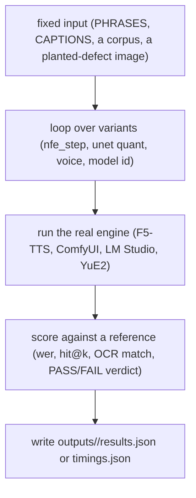

# bench

## What it does

[`bench/`](../../bench) is where a developer decides which model, engine, or parameter the app should actually ship with, by running the real candidates side by side on the same fixed input and reading the numbers or the files they produce. An F5-TTS step count ([`bench/tts_nfe_ab.py`](../../bench/tts_nfe_ab.py)), an Ideogram transformer quantization ([`bench/ideogram_int8_ab.py`](../../bench/ideogram_int8_ab.py)), which LM Studio model to load ([`bench/model_shootout.sh`](../../bench/model_shootout.sh)), whether a FireRed LoRA earns its VRAM ([`bench/night_firered.py`](../../bench/night_firered.py)), each of these was a judgment call a script turned into a side-by-side.

None of this runs inside the app and none of it runs inside the pytest suite: a script here is invoked by hand (`venv/Scripts/python.exe bench/<name>.py`), writes its evidence to `outputs/` or `runtime/`, and a person reads the result and changes a default in `config.py` or a workflow JSON. A failing bench script blocks nothing; it is read, not asserted.

## How it works

Nearly every script in the directory follows the same shape, independent of which engine is under test:

Every bench loads one input set once, sweeps a parameter across the same input, and scores each run the same way, so the comparison is the engine or the parameter, never the input.

What differs from script to script is the input fixture, the comparison axis, and the scoring method, not the shape:

| Stage | Varies as |
|---|---|
| Fixed input | a hardcoded Russian phrase list ([`bench/tts_nfe_ab.py`](../../bench/tts_nfe_ab.py)), the same two ComfyUI captions at a fixed seed ([`bench/ideogram_int8_ab.py`](../../bench/ideogram_int8_ab.py)), a streamed public ASR corpus ([`bench/asr_ru_shootout.py`](../../bench/asr_ru_shootout.py)), a base clip to restyle ([`bench/h3_control_bench.py`](../../bench/h3_control_bench.py)), a request JSON a prior YuE2 run left on disk ([`bench/song_stress.py`](../../bench/song_stress.py)) |
| Comparison axis | a swept parameter (nfe steps), an engine swap (GigaAM vs Whisper), a quant/LoRA variant (fp8 vs int8mr), a model id (`bench/model_ru_probe.py --model`), a fault-injection family ([`bench/planbench.py`](../../bench/planbench.py)) |
| Scoring | word error rate (`wer()` in [`bench/tts_nfe_ab.py`](../../bench/tts_nfe_ab.py) and [`bench/asr_ru_shootout.py`](../../bench/asr_ru_shootout.py)), retrieval `hit@k`/MRR ([`bench/rag_eval/rag_eval.py`](../../bench/rag_eval/rag_eval.py)), a tool-call verdict of `PASS`/`FAIL`/`ERROR` with a Wilson 95% CI ([`bench/tc_run.py`](../../bench/tc_run.py), [`bench/planbench.py`](../../bench/planbench.py)) |

A script often switches the engine knob under test by mutating the app's own config module directly rather than taking a dedicated flag, [`bench/tts_nfe_ab.py`](../../bench/tts_nfe_ab.py) sets `C.TTS_NFE_STEP = nfe` on the imported `config` module before calling the real synth path, so the bench exercises exactly the code path a user's request would.

Two scripts step outside the per-engine shape and coordinate other scripts instead of an engine:

- [`bench/run_bench.py`](../../bench/run_bench.py) chains [`tests/run_all.py`](../../tests/run_all.py), [`bench/payload_audit.py`](../../bench/payload_audit.py), [`bench/sandbox_e2e.py`](../../bench/sandbox_e2e.py), and [`bench/triage_failures.py`](../../bench/triage_failures.py) into one run, appends the result to `runtime/bench_history.jsonl`, and diffs it against the previous run: a suite that passed before and fails now prints as `REGRESSION`, and a payload that grew more than 10% is flagged.
- [`bench/night_queue.py`](../../bench/night_queue.py) runs a list of other bench commands strictly one after another for unattended multi-hour sessions, logging to `runtime/night_queue.log` and letting one failed step fall through to the next rather than aborting the night.

Multi-hour runs checkpoint rather than restart from zero: [`bench/planbench.py`](../../bench/planbench.py) writes `tests/planbench_<model>.json` after every scenario and resumes from it on a second invocation, and `run_bench.py` appends one line per run to `runtime/bench_history.jsonl` instead of overwriting history.

## Where it lives

| Category | What it compares | Representative files |
|---|---|---|
| ASR (speech-to-text) | GigaAM vs Whisper word error rate on real-device and audiobook Russian speech; speaker diarization | [`bench/asr_ru_shootout.py`](../../bench/asr_ru_shootout.py), [`bench/asr_clip.py`](../../bench/asr_clip.py), [`bench/asr_long_split.py`](../../bench/asr_long_split.py), [`bench/diar_eval.py`](../../bench/diar_eval.py), [`bench/diar_music_ab.py`](../../bench/diar_music_ab.py) |
| TTS (voice synthesis) | F5-TTS step count, CFG, model, voice, Russian stress placement | [`bench/tts_nfe_ab.py`](../../bench/tts_nfe_ab.py), [`bench/tts_cfg_ab.py`](../../bench/tts_cfg_ab.py), [`bench/tts_model_ab.py`](../../bench/tts_model_ab.py), [`bench/tts_engine_voice_sweep.py`](../../bench/tts_engine_voice_sweep.py), [`bench/ru_stress_libs.py`](../../bench/ru_stress_libs.py) |
| Image (Ideogram / FireRed, ComfyUI workflows) | transformer quant (fp8 vs int8), LoRAs, recaptioning, object/signage removal | [`bench/ideogram_int8_ab.py`](../../bench/ideogram_int8_ab.py), [`bench/night_firered.py`](../../bench/night_firered.py), [`bench/ideogram_polish_ab.py`](../../bench/ideogram_polish_ab.py), [`bench/objectclear_objects_ab.py`](../../bench/objectclear_objects_ab.py), [`bench/signage_guard_ab.py`](../../bench/signage_guard_ab.py), [`bench/draw_scenarios.py`](../../bench/draw_scenarios.py) |
| Video (H3) | restyle/motion-context variants over the same base clip | [`bench/h3_control_bench.py`](../../bench/h3_control_bench.py), [`bench/motion_context_ab.py`](../../bench/motion_context_ab.py), [`bench/video_stress_ab.py`](../../bench/video_stress_ab.py), [`bench/video_len_probe.py`](../../bench/video_len_probe.py) |
| Music (YuE2) | ABC-score melodic stress vs lyric stress, song length/BPM/VRAM sweeps | [`bench/song_stress.py`](../../bench/song_stress.py), [`bench/song_stress_ab.py`](../../bench/song_stress_ab.py), [`bench/music_duration.py`](../../bench/music_duration.py), [`bench/music_duration_e2e.py`](../../bench/music_duration_e2e.py), [`bench/music_vram_ab.py`](../../bench/music_vram_ab.py) |
| LLM / agent loop | Russian chat quality and speed of whatever LM Studio is serving, the real tool-calling loop against simulated tools, fault-injected recovery | [`bench/model_shootout.sh`](../../bench/model_shootout.sh), [`bench/model_ru_probe.py`](../../bench/model_ru_probe.py), [`bench/tc_run.py`](../../bench/tc_run.py), [`bench/planbench.py`](../../bench/planbench.py), [`bench/context_cost.py`](../../bench/context_cost.py), [`bench/mtp_ab.py`](../../bench/mtp_ab.py) |
| RAG / retrieval ([`bench/rag_eval/`](../../bench/rag_eval)) | `hit@1/3/5` and MRR over a fixed ru-wiki corpus | [`bench/rag_eval/rag_eval.py`](../../bench/rag_eval/rag_eval.py) |
| Orchestration / regression history | chains the stages above into one comparable run over time | [`bench/run_bench.py`](../../bench/run_bench.py), [`bench/night_queue.py`](../../bench/night_queue.py) |

[`bench/assets/`](../../bench/assets) holds the fixed input fixtures several of the above read: `dogovor.pdf` and `receipt.jpg` are a generic sample contract/receipt for document and OCR benches, and `research_note.md`/`shop_project.zip` are sample document/archive fixtures, none of it is a real person's document. [`bench/rag_eval/corpus/`](../../bench/rag_eval/corpus) and [`bench/rag_eval/questions.json`](../../bench/rag_eval/questions.json) are the fixed RAG corpus and its cached, once-generated question set.

## Constraints

- A bench script needs the real backend it measures running locally: LM Studio's REST endpoint (`config.LM_STUDIO_BASE`) for every LLM/agent bench, a ComfyUI server on a fixed localhost port for the image/video benches (`COMFY = "http://127.0.0.1:8000"` in [`bench/night_firered.py`](../../bench/night_firered.py)).
- The GPU card is shared with interactive rendering; several scripts wait for an idle ComfyUI queue before timing a run (`_idle()` in [`bench/night_firered.py`](../../bench/night_firered.py)) so time spent behind another job is never counted as render time.
- [`bench/tc_run.py`](../../bench/tc_run.py) strips its own directory from `sys.path` before importing `config`, because [`bench/knowledge.py`](../../bench/knowledge.py) would otherwise shadow the app's top-level [`knowledge`](../../knowledge) package on import.
- Output location is not uniform: a script picks `outputs/<name>/` or `runtime/<name>/` on its own; there is no single results directory for the whole folder.
- [`bench/tc_run.py`](../../bench/tc_run.py) and [`bench/planbench.py`](../../bench/planbench.py) are explicitly not test suites: they live outside [`tests/`](../../tests) so the offline pytest sweep never picks them up and never makes a live model call.

## Coupling

Every bench script inserts the repo root onto `sys.path` and imports the app's own modules directly rather than going through a stable bench API: `config`, `audio`, `graph`, `tools`, [`models`](../../models), `library`, `llm`, [`knowledge`](../../knowledge), `video_control`, `draw_agent`, `imaging.ideogram_layout`. A bench script tracks whatever shape those modules currently have, not a frozen contract.

- [`bench/tc_run.py`](../../bench/tc_run.py) and [`bench/planbench.py`](../../bench/planbench.py) drive the real LangGraph loop (`graph.personality_node`, `graph.build_graph`) against stubbed tools, so they exercise the agent-loop domain's `graph.py` directly.
- [`bench/rag_eval/rag_eval.py`](../../bench/rag_eval/rag_eval.py) drives `library.Library`, so it exercises the retrieval/knowledge domain directly.
- [`bench/model_shootout.sh`](../../bench/model_shootout.sh) chains [`bench/load_like_app.py`](../../bench/load_like_app.py), [`bench/model_ru_probe.py`](../../bench/model_ru_probe.py), [`bench/tc_run.py`](../../bench/tc_run.py), and [`bench/intent_live.py`](../../bench/intent_live.py) into one shootout per LM Studio model id, writing `outputs/shootout/<model>/`.
- The image/video benches ([`bench/ideogram_int8_ab.py`](../../bench/ideogram_int8_ab.py), [`bench/night_firered.py`](../../bench/night_firered.py), [`bench/h3_control_bench.py`](../../bench/h3_control_bench.py)) read and mutate ComfyUI workflow JSON files under [`workflows/image/`](../../workflows/image); that JSON's node structure belongs to the imaging domain's own page, not here.
- [`bench/payload_audit.py`](../../bench/payload_audit.py) and [`bench/triage_failures.py`](../../bench/triage_failures.py), chained by [`bench/run_bench.py`](../../bench/run_bench.py), belong to this domain's own regression-history orchestration, not to the pytest suite.
- [`bench/run_bench.py`](../../bench/run_bench.py) is the one script that reaches into [`tests/run_all.py`](../../tests/run_all.py), tying bench results and the pytest suite into one persisted regression history (`runtime/bench_history.jsonl`).
