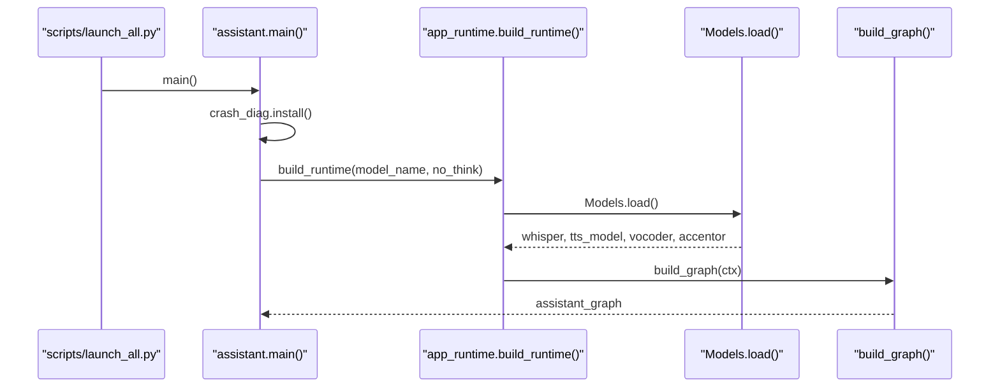
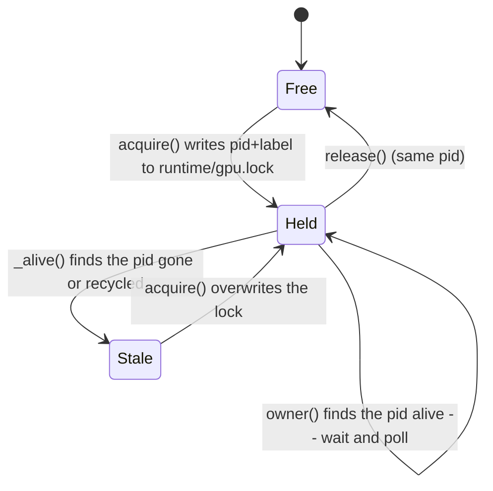
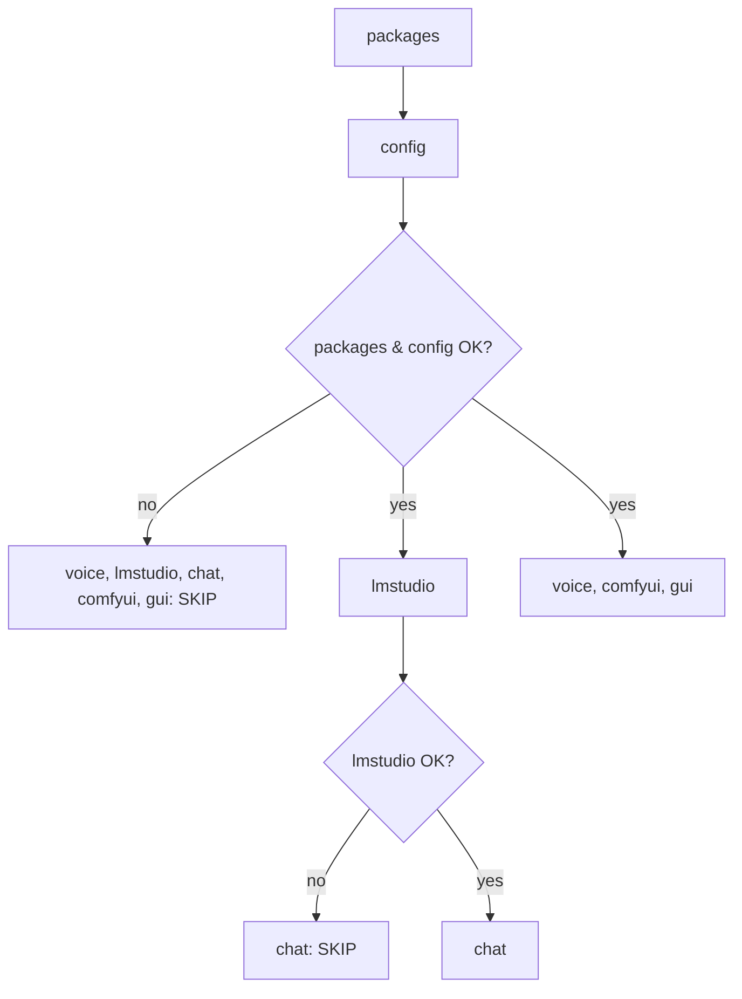

# core

## What it does

Core is the bootstrap and process-management layer underneath the assistant: it is where the desktop app, the terminal loop, and the Telegram bot all get the same thing built (loaded models, a `Context`, a compiled agent graph), where every tunable default lives behind one `os.getenv()` call, and where the process stays alive and diagnosable when something native goes wrong. Nothing downstream, voice, vision, image/video/music generation, search, Telegram delivery, reads its own settings or assembles its own runtime; all of it passes through [`core/config.py`](../../core/config.py) and [`core/app_runtime.py`](../../core/app_runtime.py). [`scripts/`](../../scripts) carries the matching install-run-verify tooling (`setup.py`, `healthcheck.py`, `launch_all.py`) plus a set of standing maintenance utilities that run outside any request.

Without this layer: each front end would re-derive its own settings and drift from the others, a second whole-card job (a LoRA training run, a render batch) would fight a running one for VRAM instead of queuing behind it, an exception inside a Qt slot would abort the process with no traceback, and a fresh clone would have no way to tell "not installed yet" from "installed but broken."

## How it works

### Boot sequence

Every front end reaches the loaded models and the compiled agent graph through the same chokepoint, never by loading them itself.

[`scripts/launch_all.py`](../../scripts/launch_all.py) is the desktop shortcut's actual target: before it calls `assistant.main()` it brings up ComfyUI and LM Studio (each only if its own health URL is not already answering) and starts the sandbox Docker image build in the background, guarded by an OS-level single-instance lock (`msvcrt.locking` / `fcntl.flock`) so two shortcut clicks can never start two bot instances polling the same token. `assistant.main()` installs `crash_diag` and, on Windows, `no_console_windows` before importing Qt, then either hands off to `gui.run_gui()` or drives the terminal loop itself. Either path calls `app_runtime.build_runtime()` exactly once per session: it runs `cleanup_runtime_artifacts`/`cleanup_comfy_inputs`, loads [`Models`](../../Models) (Whisper, the F5-TTS model + vocoder, the bilingual stress accentor), builds the `Context`, loads the chosen LLM into LM Studio via `ensure_exclusive` (skipped outright when `model_name` is empty, the deliberate "leave the card alone" path), migrates `memory/` to the per-profile layout, and calls `build_graph(ctx)`. `make_base_state()` seeds the first `AgentState` with the system prompt. GUI, terminal, and Telegram front ends share this one path; a stray `assistant_app.log` size is bounded by `RotatingFileHandler(maxBytes=2_000_000, backupCount=3)`.

### GPU exclusivity

A lock whose holder process is gone or was recycled by the OS is treated as stale and retaken automatically, so a crashed trainer can never block the card forever.

`gpu_lock.hold(label, wait=...)` is the single-writer policy for any whole-card job: training, a captioning pass, a batch of renders. `owner()` reads `runtime/gpu.lock` as `"<pid> @<create_time> <label>"`; `_alive()` checks not just `psutil.pid_exists` but the holder's recorded process-start time, because Windows recycles pids and a plain existence check would let an unrelated process wearing the same number keep the lock held forever. `acquire()` re-reads after writing (a 0.4s race window) so two near-simultaneous starters resolve to one winner. `hold()` raises `RuntimeError` rather than letting a caller start beside a live holder; `config.COMFY_RESPECT_GPU_LOCK` (default on) is what makes ComfyUI jobs honor it, and it can be turned off per deployment.

### Install and verify

`healthcheck.run()` gates every expensive check behind the cheap ones it depends on, so a broken config fails in milliseconds instead of waiting out a multi-minute LM Studio timeout for nothing.

[`scripts/setup.py`](../../scripts/setup.py) is the install path [`setup.ps1`](../../setup.ps1)/[`setup.sh`](../../setup.sh) hand off to after creating a `uv`-managed `venv` on Python 3.13: environment detection, the Visual C++ runtime check, a CUDA or CPU torch install, [`requirements.txt`](../../requirements.txt) plus [`overrides.txt`](../../overrides.txt) (an explicit `--override` applied only through `uv`), `install_paths.ensure()` to put [`core`](../../core)/[`agent`](../../agent)/etc. on the venv's import path via a `.pth` file, Playwright's Chromium, `.env` creation from [`.env.example`](../../.env.example), ffmpeg, the F5-TTS voice weights, LM Studio, and [`scripts/comfy_setup.py`](../../scripts/comfy_setup.py) for ComfyUI (pinned to `v0.38.2` plus two pinned custom-node commits). Every step is written to look at what already exists and do only the missing part, so a second run is fast and an interrupted one resumes. [`scripts/healthcheck.py`](../../scripts/healthcheck.py) is the standalone verdict: `ffmpeg`, `songs`, and [`docker`](../../docker) run unconditionally and only ever warn (the app works with those features off), while [`voice`](../../voice), `lmstudio`, `chat`, `comfyui`, and [`gui`](../../gui) are skipped outright once `packages` or `config` has failed, and `chat` is additionally skipped when `lmstudio` itself is not serving the configured model. `check_gui()` builds and closes the real `AssistantWindow` headlessly (`QT_QPA_PLATFORM=offscreen`) to catch a native crash before a user does.

### Configuration and the process safety net

[`core/config.py`](../../core/config.py) loads a project-local `.env` exactly once, at import time, before any `os.getenv()` call later in the file runs (`F5_TEST_RUN` skips that load so test suites see clean defaults, not an operator's tuned `.env`); a real environment variable always wins over the file. It also force-exempts `127.0.0.1`/`localhost`/`::1` from `HTTP(S)_PROXY`/`NO_PROXY`, since an unexempted proxy silently routes local LM Studio/ComfyUI calls through it. `DEVICE`, `WHISPER_DEVICE`, and `WHISPER_COMPUTE_TYPE` are resolved lazily through a module-level `__getattr__` (PEP 562): importing `config` does not import `torch` (and does not pay its ~1.9s/~250MB cost) unless something actually asks for a device string, which matters because `config` is imported by most of the modules in the repo and only a few of them need a device. On top of config, [`core/crash_diag.py`](../../core/crash_diag.py) replaces `sys.excepthook` and `threading.excepthook` before Qt is imported (an unhandled exception inside a Qt slot otherwise makes PyQt5 call `abort()` with no traceback), enables `faulthandler` into `faulthandler.log`, and writes a `runtime/heartbeat.json` proof-of-life every 5 seconds so the next start can report a silent death. [`core/log_redact.py`](../../core/log_redact.py) attaches a logging filter that strips the Telegram bot token out of any log line or traceback before it is written. [`core/win_runtime.py`](../../core/win_runtime.py) preloads the newest `msvcp140.dll` it can find before PyQt5 loads its own older bundled copy, which otherwise crashes torch with `0xc0000005`. [`core/no_console_windows.py`](../../core/no_console_windows.py) patches `subprocess.Popen` process-wide so every child process (`lms`, `ffmpeg`, `git`) gets `CREATE_NO_WINDOW` instead of flashing a console over the GUI.

## Where it lives

| Area | Files | Covers |
|---|---|---|
| Entry points | [`core/assistant.py`](../../core/assistant.py), [`scripts/launch_all.py`](../../scripts/launch_all.py), [`scripts/main.py`](../../scripts/main.py) | Terminal/camera loop, GUI handoff, the one-click launcher that also starts ComfyUI/LM Studio/the sandbox image; [`scripts/main.py`](../../scripts/main.py) is an unrelated standalone wav-to-mp3 batch converter |
| Runtime assembly | [`core/app_runtime.py`](../../core/app_runtime.py), [`core/models.py`](../../core/models.py) | `build_runtime()`/`make_base_state()`; the [`Models`](../../Models), `Context`, and `AgentState` dataclasses/TypedDict shared by every front end |
| Configuration | [`core/config.py`](../../core/config.py), [`.env.example`](../../.env.example) | Every `os.getenv()`-backed default across the app; [`.env.example`](../../.env.example) documents the ones worth overriding |
| Process safety net | [`core/crash_diag.py`](../../core/crash_diag.py), [`core/log_redact.py`](../../core/log_redact.py), [`core/win_runtime.py`](../../core/win_runtime.py), [`core/no_console_windows.py`](../../core/no_console_windows.py) | Crash/fault logging, token redaction, DLL preload, hidden child consoles |
| GPU coordination | [`core/gpu_lock.py`](../../core/gpu_lock.py) | Single-writer lock for whole-card jobs |
| Shared helpers | [`core/utils.py`](../../core/utils.py), [`core/stages.py`](../../core/stages.py), [`core/service_http.py`](../../core/service_http.py) | Text/control-token cleanup, cache/file helpers, stage-label Russian translation, the stdlib-only JSON envelope shared by out-of-process services |
| Install & verify | [`scripts/setup.py`](../../scripts/setup.py), [`scripts/healthcheck.py`](../../scripts/healthcheck.py), [`scripts/install_paths.py`](../../scripts/install_paths.py), [`scripts/comfy_setup.py`](../../scripts/comfy_setup.py), [`scripts/install_yue2.py`](../../scripts/install_yue2.py), [`setup.ps1`](../../setup.ps1), [`setup.sh`](../../setup.sh), [`start.cmd`](../../start.cmd), [`start.sh`](../../start.sh), [`requirements.txt`](../../requirements.txt), [`requirements-dev.txt`](../../requirements-dev.txt), [`overrides.txt`](../../overrides.txt) | The install → configure → verify → start pipeline |
| Maintenance / dev tooling | [`core/cleanup_test_fixtures.py`](../../core/cleanup_test_fixtures.py), [`scripts/reset_image_quality.py`](../../scripts/reset_image_quality.py), [`scripts/check_memory_refs.py`](../../scripts/check_memory_refs.py), [`scripts/extract_module.py`](../../scripts/extract_module.py), [`scripts/turns.py`](../../scripts/turns.py), [`scripts/api_to_ui_workflow.py`](../../scripts/api_to_ui_workflow.py), [`scripts/make_icon.py`](../../scripts/make_icon.py), `scripts/sweeps/*.py`, [`scripts/build_sandbox_image.cmd`](../../scripts/build_sandbox_image.cmd), [`scripts/build_telegram_bot_api.cmd`](../../scripts/build_telegram_bot_api.cmd) | One-off and standing scripts: fixture cleanup, per-chat setting resets, memory-note link checking, AST-based module extraction, turn-trace reading, ComfyUI workflow conversion, app icon generation, and the import-cycle/dead-code/duplication/swallowed-exception sweeps over the project's own modules |
| Lint / test config | [`.flake8`](../../.flake8), [`run_tests_inventory.sh`](../../run_tests_inventory.sh) | House flake8 ignore list; a per-file timeout runner that logs PASS/FAIL/TIMEOUT |
| Unrelated to this domain | [`scripts/scale.py`](../../scripts/scale.py) | A standalone SVG generator for a radio tuning-dial scale, not part of the assistant app |

## Constraints

- Python 3.13 only (`healthcheck.REQUIRED_PY`); the venv is created by [`setup.ps1`](../../setup.ps1)/[`setup.sh`](../../setup.sh) via `uv` before [`scripts/setup.py`](../../scripts/setup.py) ever runs.
- `.env` is loaded once, at `config.py` import time, strictly before the `os.getenv()` calls later in the same file; a real environment variable always overrides it, and `F5_TEST_RUN` skips the file entirely so test defaults stay clean.
- `DEVICE`/`WHISPER_DEVICE`/`WHISPER_COMPUTE_TYPE` are resolved on first access, not at import, specifically so importing `config` does not force a `torch` import in the modules that never touch a device string.
- `ASSISTANT_GPU_IDLE=1` starts the app without taking the GPU at all: Whisper and F5-TTS fall back to CPU and the LLM is never loaded, trading voice/chat latency for a free card during a training run.
- `gpu_lock.hold()` raises rather than letting a second whole-card job start beside a live one; `config.COMFY_RESPECT_GPU_LOCK` can disable that refusal for ComfyUI jobs specifically.
- `win_runtime.preload_newest_msvcp()` and `no_console_windows.install()` must run before PyQt5/torch are imported, since both patch process-wide state (the loaded DLL, `Popen`'s default `creationflags`) that an earlier import would already have locked in.
- `crash_diag.install()` must run before Qt is imported; skipping it lets an exception inside a Qt slot abort the process (`0xC0000409`) with no traceback.
- [`.flake8`](../../.flake8)'s `extend-ignore` is deliberate house style (short guard-and-action on one line, aligned tables, lazy/path-dependent imports, small lambdas, re-exported names, long prompt strings), not an oversight.

## Coupling

- [`core/app_runtime.py`](../../core/app_runtime.py) is the one place the desktop GUI, the terminal loop, and the Telegram bot layer all call to get `(ctx, base_state, graph)`; a caller outside core should never assemble these independently.
- [`core/config.py`](../../core/config.py)'s defaults for image, video, music, search, and Telegram-quota behavior are read directly by their respective domains; this page owns where the default lives, not what the setting controls there.
- [`core/models.py`](../../core/models.py)'s `Context` and `AgentState` are the state contract the agent graph reads and writes every turn; a key a tool sets but `AgentState` does not declare is silently dropped by `StateGraph`, so changes to either side need to stay in sync.
- [`core/gpu_lock.py`](../../core/gpu_lock.py) is held by callers outside this domain (a LoRA training run, a render batch); core defines the lock, not who takes it.
- [`scripts/launch_all.py`](../../scripts/launch_all.py) starts ComfyUI, LM Studio, and the sandbox Docker image, each an external-service integration covered by its own domain.
- `core/config.STRESS_OVERRIDES_PATH` points at [`stress_overrides.json`](../../stress_overrides.json), a voice-domain data file read by the stress accentor, not by anything in core itself.
