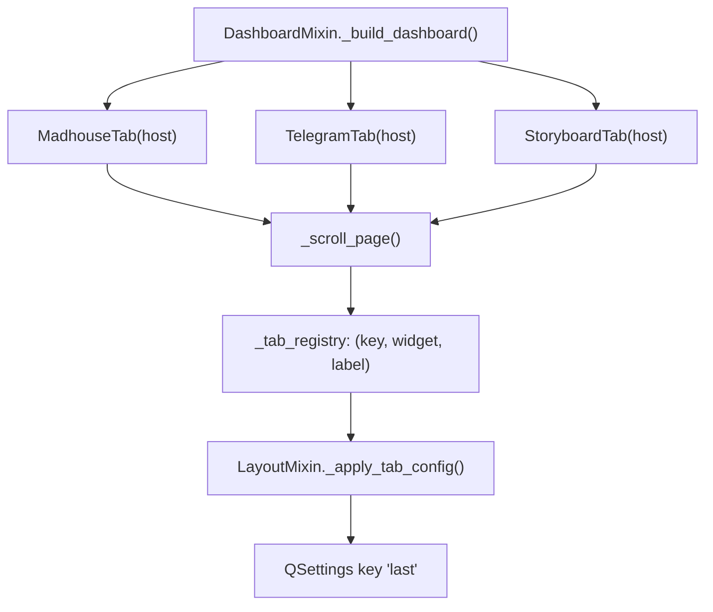
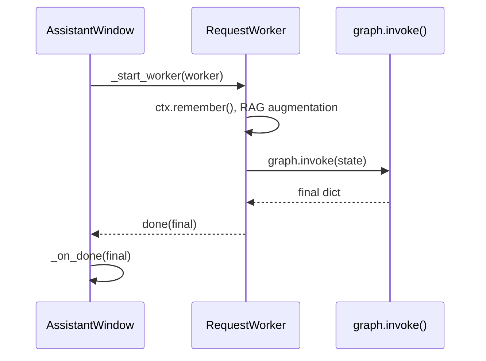
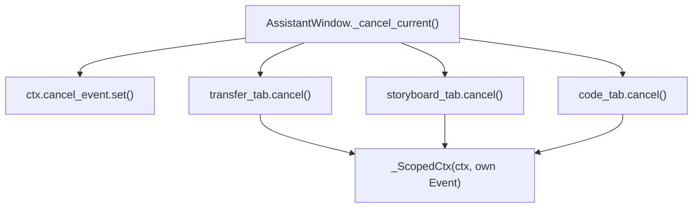
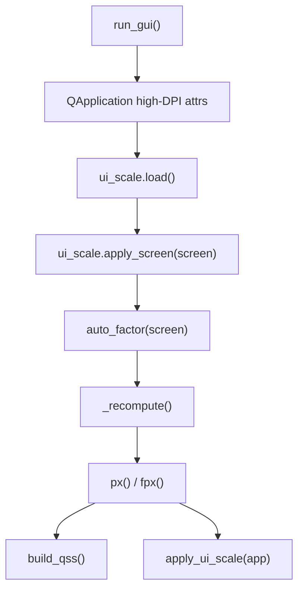
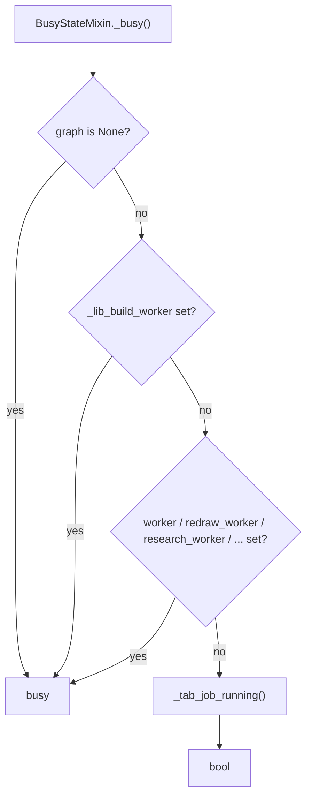

# gui

## What it does

The desktop app is one `QMainWindow` (`AssistantWindow` in [`gui/gui.py`](../../gui/gui.py)) that gives a human everything the assistant can do: chat and voice, drawing and video/music tools, a document-database RAG console, a Memory Center, model/system diagnostics, and a Telegram-bot admin panel, all in one process. It is the only consumer that drives the agent graph, the GPU-resident Whisper/F5-TTS models, and the Telegram bot lifecycle directly rather than through a wire protocol, [`docs/gui_service_boundaries.md`](../gui_service_boundaries.md) states the reason plainly: "a PyQt window cannot become a microservice." Every widget, the `QApplication` event loop, and every `QThread` worker live in one process by construction, so the GUI domain is a thin composition layer over the rest of the assistant, not a client calling a server.

[`gui/gui.py`](../../gui/gui.py) was large enough on its own that the obvious next step, one module per tab, had a precondition: every tab leans on the same handful of primitives (palette, `_card`, `_section`, `_flow`, `_scroll_page`, the flow layout, timestamp/byte formatters). Those had to move into [`gui/gui_common.py`](../../gui/gui_common.py) first, or each tab extraction would either drag a private copy along or re-import `gui.py` and rebuild the cycle the split was meant to remove. The result: one shared toolkit, one DPI/i18n layer, a handful of window-behavior mixins `AssistantWindow` composes, and one module (or a small cluster) per feature tab.

## How it works

### Tab composition

Every feature tab is a `QWidget(host)` built once at startup and registered under a stable key, so hiding, reordering, or reopening a panel from the Layout menu never reconstructs the widget, only `QTabWidget.insertTab`/`removeTab` move it.

[`gui/gui_dashboard.py`](../../gui/gui_dashboard.py)'s `DashboardMixin._build_dashboard()` constructs every tab and wraps each in `gui_common._scroll_page()` before adding it to `_tab_registry`, the single `(key, widget, label)` list that drives the initial tab order, the Layout menu's show/hide checkboxes, named presets, and `_default_layout()`. [`gui/gui_layout_mixin.py`](../../gui/gui_layout_mixin.py)'s `LayoutMixin._apply_tab_config()` rebuilds the visible `QTabWidget` from a saved key list on every restore, and `_persist_layout()` writes the captured state back to `QSettings("AssistantDC", "Layout")` under the key `"last"` on `closeEvent`.

### Worker-thread and signal flow

A worker never touches a widget from `run()`; `AssistantWindow` starts it and reacts only to its signals, so the chat input and the rest of the window stay responsive while the agent graph runs.

[`gui/gui_workers.py`](../../gui/gui_workers.py) holds every long-running call as its own `QThread` subclass, `ModelLoader`, `ModelSwitchWorker`, `RedrawWorker`, `FixHandsWorker`, `FixArtifactWorker`, `LibraryBuildWorker`, `DeepResearchWorker`, `RequestWorker`, `ScanWorker`, each emitting a `done`/`failed` signal that `AssistantWindow._start_worker()` connects before calling `.start()`. `AssistantWindow` stays the sole constructor of all of them on purpose: `gui_workers.py`'s own docstring records that moving a *callee* out of `gui.py` is safe, but moving the *caller* breaks every test suite that patches `gui.ModelLoader` and similarly named classes, because Python resolves those names as `gui.py` globals only while the constructing code stays there.

### Cancellation scoping

Stop sets the one process-wide cancel flag and also calls `cancel()` on each tab holding its own cancellation token, so a single button reaches both a global chat turn and a tab's own job without either one silencing the other.

`gui/gui_common._ScopedCtx` delegates every attribute to the real context except `cancel_event`, which it replaces with a private `threading.Event`. [`gui/gui_madhouse_tab.py`](../../gui/gui_madhouse_tab.py)'s `_room_cancel` and [`gui/gui_telegram_tab.py`](../../gui/gui_telegram_tab.py)'s `_bot_cancel` wrap the same class: without it, the main chat's Stop button clearing the global flag at the start of its own next turn used to un-cancel whatever the Madhouse or the Telegram bot had in flight, and the main Stop setting the flag used to mute them permanently.

### DPI / UI-scale pipeline

The effective scale is resolved from the real screen before any widget exists, and from then on every `px()`/`fpx()` call and the whole stylesheet multiply by that one number.

[`gui/ui_scale.py`](../../gui/ui_scale.py)'s `auto_factor(screen)` targets a constant *total* magnification per physical short side (1080p → 1.0, 1440p → 1.25, 4K → 2.0, plus a further multiplier past a 40-inch diagonal), then divides by the screen's own `devicePixelRatio()` so the result composes with whatever Windows DPI scaling already applied. `_recompute()` folds in the density preset (`compact`/`comfortable`/`tv`) to produce `_effective`, which every `px(n)` and `fpx(n)` call reads, and which `gui/gui_common.build_qss()` multiplies into every literal pixel value in the application stylesheet. `run_gui()` in [`gui/gui.py`](../../gui/gui.py) sets the Qt high-DPI attributes and calls `ui_scale.load()`/`apply_screen()` before constructing any widget, because `px()`/`pt()` are read at widget-construction time and an already-laid-out widget does not re-scale.

### Busy-gate decision

A message is queued rather than dropped the moment any one of several independent conditions says the assistant cannot take a turn right now.

[`gui/gui_busy_state.py`](../../gui/gui_busy_state.py)'s `_busy()` checks, in order: the model still loading (`graph is None`), a document-database build in flight, a model reload (`model_config_tab._reload_worker`), any window-level worker (`worker`, `model_switch_worker`, `redraw_worker`, `research_worker`, `transcribe_worker`, `compact_worker`, `_scan_worker`), and finally `_tab_job_running()`, which walks every host in `_thread_hosts()` (`transfer_tab`, `storyboard_tab`, `madhouse_tab`, `model_config_tab`, `memory_center_tab`, `code_tab`, `voice_clone_tab`) looking for a live `QThread` attribute. The last check only applies when `config.GUI_SERIALIZE_GPU_JOBS` is true, because a chat turn and a tab-driven render share one 24 GB GPU.

## Where it lives

| Responsibility | Files |
|---|---|
| Main window, startup, shutdown | [`gui/gui.py`](../../gui/gui.py) (`AssistantWindow`, `run_gui`) |
| Window-behavior mixins composed onto `AssistantWindow` | [`gui/gui_layout_mixin.py`](../../gui/gui_layout_mixin.py) (`LayoutMixin`), [`gui/gui_busy_state.py`](../../gui/gui_busy_state.py) (`BusyStateMixin`), [`gui/gui_queue.py`](../../gui/gui_queue.py) (`TaskQueueMixin`), [`gui/gui_dashboard.py`](../../gui/gui_dashboard.py) (`DashboardMixin`), [`gui/gui_chat_view.py`](../../gui/gui_chat_view.py) (`ChatViewMixin`), [`gui/gui_dropzone.py`](../../gui/gui_dropzone.py) (`DropPasteMixin`), [`gui/gui_manual_panel.py`](../../gui/gui_manual_panel.py) (`ManualControlMixin`), [`gui/gui_research_progress.py`](../../gui/gui_research_progress.py) (`ResearchProgressMixin`), [`gui/gui_research_tab.py`](../../gui/gui_research_tab.py) (`ResearchTabMixin`), [`gui/gui_image_fix.py`](../../gui/gui_image_fix.py) (`ImageFixMixin`), [`gui/gui_memory_profile.py`](../../gui/gui_memory_profile.py) (`MemoryProfileMixin`), [`gui/gui_database_tab.py`](../../gui/gui_database_tab.py) (`DatabaseTabMixin`), [`gui/gui_voice_tab.py`](../../gui/gui_voice_tab.py) (`VoiceMixin`) |
| Shared theme, stylesheet, layout primitives, cross-tab plumbing | [`gui/gui_common.py`](../../gui/gui_common.py) (`build_qss`, `FlowLayout`, `_scroll_page`, `_card`, `TranscribeWorker`, `_ScopedCtx`) |
| Chrome: title bar, stage pill, startup/settings dialog | [`gui/gui_chrome.py`](../../gui/gui_chrome.py), [`gui/gui_settings_dialog.py`](../../gui/gui_settings_dialog.py) |
| Shared image dialogs | [`gui/gui_dialogs.py`](../../gui/gui_dialogs.py) (`ImageViewerDialog`, `MaskDrawDialog`), [`gui/gui_images_panel.py`](../../gui/gui_images_panel.py) |
| DPI / UI scale | [`gui/ui_scale.py`](../../gui/ui_scale.py) |
| Interface language (desktop widgets) | [`gui/gui_i18n.py`](../../gui/gui_i18n.py), [`gui/gui_ru.py`](../../gui/gui_ru.py) |
| Interface language (outgoing Telegram text) | [`gui/ui_lang_guard.py`](../../gui/ui_lang_guard.py) |
| Background workers (window-level) | [`gui/gui_workers.py`](../../gui/gui_workers.py) (nine `QThread` subclasses) |
| Logging bridge, audio visualizer, report rendering | [`gui/gui_log_bridge.py`](../../gui/gui_log_bridge.py), [`gui/gui_audio_visualizer.py`](../../gui/gui_audio_visualizer.py), [`gui/gui_report_html.py`](../../gui/gui_report_html.py) |
| Chat input, drag/drop, task queue | [`gui/gui_chat_view.py`](../../gui/gui_chat_view.py), [`gui/gui_dropzone.py`](../../gui/gui_dropzone.py), [`gui/gui_queue.py`](../../gui/gui_queue.py) |
| Image editing (redraw / hand fix / artifact fix) | [`gui/gui_image_fix.py`](../../gui/gui_image_fix.py) |
| Storyboard (plan-as-boxes drawing/editing) | [`gui/gui_storyboard_tab.py`](../../gui/gui_storyboard_tab.py), [`gui/gui_storyboard_canvas.py`](../../gui/gui_storyboard_canvas.py), [`gui/gui_storyboard_workers.py`](../../gui/gui_storyboard_workers.py) |
| Transfer / Restyle Video | [`gui/gui_transfer_tab.py`](../../gui/gui_transfer_tab.py), [`gui/gui_restyle_tab.py`](../../gui/gui_restyle_tab.py) |
| Voice clone / stress overrides | [`gui/gui_voice_clone_tab.py`](../../gui/gui_voice_clone_tab.py), [`gui/gui_stress_tab.py`](../../gui/gui_stress_tab.py) |
| Music / Weather | [`gui/gui_music_tab.py`](../../gui/gui_music_tab.py), [`gui/gui_weather_tab.py`](../../gui/gui_weather_tab.py) |
| Madhouse (multi-character room) | [`gui/gui_madhouse_tab.py`](../../gui/gui_madhouse_tab.py), [`gui/gui_madhouse_brain.py`](../../gui/gui_madhouse_brain.py), [`gui/gui_madhouse_cast.py`](../../gui/gui_madhouse_cast.py), [`gui/gui_madhouse_grid.py`](../../gui/gui_madhouse_grid.py), [`gui/gui_madhouse_ui.py`](../../gui/gui_madhouse_ui.py) |
| Deep Research tab | [`gui/gui_research_tab.py`](../../gui/gui_research_tab.py), [`gui/gui_research_progress.py`](../../gui/gui_research_progress.py), [`gui/gui_report_html.py`](../../gui/gui_report_html.py) |
| Document database (RAG) | [`gui/gui_database_tab.py`](../../gui/gui_database_tab.py) |
| Memory Center | [`gui/gui_memory_tab.py`](../../gui/gui_memory_tab.py), [`gui/gui_memory_maint.py`](../../gui/gui_memory_maint.py), [`gui/gui_memory_profiles.py`](../../gui/gui_memory_profiles.py), [`gui/gui_memory_profile.py`](../../gui/gui_memory_profile.py) |
| Model config / system diagnostics | [`gui/gui_model_config_tab.py`](../../gui/gui_model_config_tab.py), [`gui/gui_system_info_tab.py`](../../gui/gui_system_info_tab.py) |
| Telegram bot panel / desktop admin console | [`gui/gui_telegram_tab.py`](../../gui/gui_telegram_tab.py), [`gui/gui_admin_tab.py`](../../gui/gui_admin_tab.py) |
| Code sandbox panel | [`gui/gui_code_tab.py`](../../gui/gui_code_tab.py) |
| Character LoRA tab | [`gui/gui_characters_tab.py`](../../gui/gui_characters_tab.py) |
| Window icon | [`assets/assistant.ico`](../../assets/assistant.ico) (loaded by `gui/gui_common.ICON_PATH`) |

[`assets/assistant_preview.png`](../../assets/assistant_preview.png) and [`assets/banner.png`](../../assets/banner.png) are not loaded by any file in this list: the preview icon is a build artifact of [`scripts/make_icon.py`](../../scripts/make_icon.py), and the banner is a [`README.md`](../../README.md) asset.

## Constraints

- `QObject`/`QThread`/`pyqtSignal` have thread affinity and no serialization story, so `AssistantWindow`, every mixin, and every worker in [`gui/gui_workers.py`](../../gui/gui_workers.py) stay in one process by construction ([`docs/gui_service_boundaries.md`](../gui_service_boundaries.md), §2.1).
- Several classes are reached through the module that owns them at call time (`import gui as _g`) rather than imported by value, because test suites patch them directly on that module: `RedrawWorker`, `FixHandsWorker`, `FixArtifactWorker`, `MaskDrawDialog` ([`gui/gui_image_fix.py`](../../gui/gui_image_fix.py), [`gui/gui_transfer_tab.py`](../../gui/gui_transfer_tab.py)), `CompactMemoryWorker`, `MEMORY_DIR` ([`gui/gui_memory_profile.py`](../../gui/gui_memory_profile.py)), `DeepResearchWorker`, `_QWebEngineView`, `_REPORT_HTML_ENABLED` ([`gui/gui_research_tab.py`](../../gui/gui_research_tab.py)), `MadhouseGrid` ([`gui/gui_madhouse_ui.py`](../../gui/gui_madhouse_ui.py)). Binding any of these by value at import time would freeze the real class and turn every patch into a silent no-op.
- `redirect_settings()` and `_tg_settings()` must stay in the same module ([`gui/gui_telegram_tab.py`](../../gui/gui_telegram_tab.py)): the guard that points the Telegram panel at a throwaway settings file instead of the real BotFather token only works if the flag and the function reading it live together.
- Every tab page passes through `gui_common._scroll_page()` before joining `_tab_registry`, because a widget's minimum size is the sum of its children's `px()`-scaled minimums, and at a high UI scale on a 4K panel that minimum can exceed the screen: `_scroll_page` gives the page a small reported minimum while it keeps its natural size inside a scroll area.
- `AssistantWindow.closeEvent` joins every live `QThread` returned by `BusyStateMixin._live_threads()`: a host-introspection scan, not a hand-maintained list, before the `QApplication` tears down; a signal firing from a thread that outlived its widgets degrades to a logged `RuntimeError` only because this join runs first.
- `_QWebEngineView` must be imported before any `QApplication` is constructed (a PyQt5 hard rule); [`gui/gui.py`](../../gui/gui.py) imports it at module load, ahead of `run_gui()`.
- The high-DPI attributes (`Qt.AA_EnableHighDpiScaling`, `HighDpiScaleFactorRoundingPolicy.PassThrough`) are set in `run_gui()` before `QApplication(sys.argv)` is constructed, because Qt only honors them if they are set first.
- `ctx.cancel_event` is one process-wide `threading.Event`; any job that must be cancellable independently of the main chat turn takes its own `gui_common._ScopedCtx` view with a private `Event` instead of touching `cancel_event` directly (Madhouse, Telegram bot, Transfer, Storyboard, Code tabs).
- The Telegram bot token, admin IDs, and local Bot API credentials are persisted through `QSettings("AssistantApp", "TelegramBot")` (Windows registry/INI), never written into the project tree; `redirect_settings()` also fires automatically under `F5_TEST_RUN` so a test run can never read or overwrite the live token.

## Coupling

| This domain reaches | Through | Why it can't be simpler |
|---|---|---|
| The agent graph (`app_runtime.build_runtime`) | `gui/gui_workers.ModelLoader` / `RequestWorker` | `build_runtime` returns live `(ctx, base_state, graph)` objects holding GPU-resident Whisper/F5-TTS models, `threading.Lock`/`Event` state, and a monkeypatched closure, [`docs/gui_service_boundaries.md`](../gui_service_boundaries.md) §2.2 names this as not movable across a process boundary. |
| Deep research | `gui/gui_workers.DeepResearchWorker` → [`research/research_client.py`](../../research/research_client.py) | The one GUI-adjacent workload already moved behind a boundary ([`research/research_api.py`](../../research/research_api.py) Protocol, optional HTTP backend via `RESEARCH_BACKEND`); the GUI worker is just one of several consumers routed through the same client. |
| The document library (RAG) | `gui/gui_workers.RequestWorker`/`ScanWorker`, [`gui/gui_database_tab.py`](../../gui/gui_database_tab.py) | Goes through `knowledge_client.open_library()`, the same in-process/HTTP-optional boundary the agent tools use. |
| The Telegram bot | `gui/gui_telegram_tab.TelegramTab` → `bot/tg_bot.TelegramBot` | Bot lifecycle, user approval, and sandbox-level grants are owned by `tg_bot`; [`gui/gui_admin_tab.py`](../../gui/gui_admin_tab.py) mirrors `bot/tg_admin.AdminMixin`'s snapshot and actions so the desktop console and the Telegram-side admin panel can't disagree. |
| Interface language | [`gui/gui_i18n.py`](../../gui/gui_i18n.py), [`gui/gui_ru.py`](../../gui/gui_ru.py), [`gui/ui_lang_guard.py`](../../gui/ui_lang_guard.py) → `core/stages.translate` | The same stage-vocabulary table drives the status pill text, the desktop widget translator, and the guard that catches untranslated English left in an outgoing Telegram message. |
| Cancellation scoping | `gui_common._ScopedCtx`, consumed by [`gui/gui_madhouse_tab.py`](../../gui/gui_madhouse_tab.py), [`gui/gui_telegram_tab.py`](../../gui/gui_telegram_tab.py), [`gui/gui_transfer_tab.py`](../../gui/gui_transfer_tab.py), [`gui/gui_storyboard_tab.py`](../../gui/gui_storyboard_tab.py), [`gui/gui_restyle_tab.py`](../../gui/gui_restyle_tab.py), [`gui/gui_code_tab.py`](../../gui/gui_code_tab.py) | Each long-running tab needs a private cancel token layered over the one shared `ctx`, so the primitive is defined once in the shared toolkit rather than per tab. |
