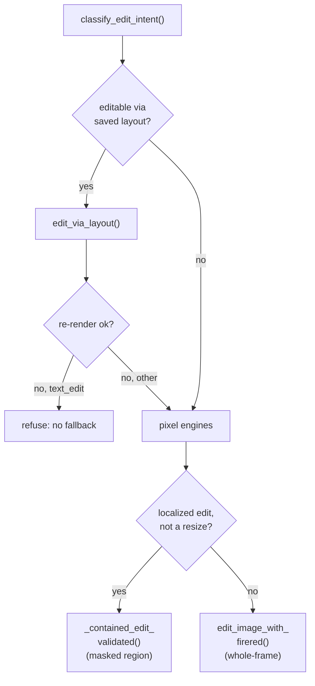
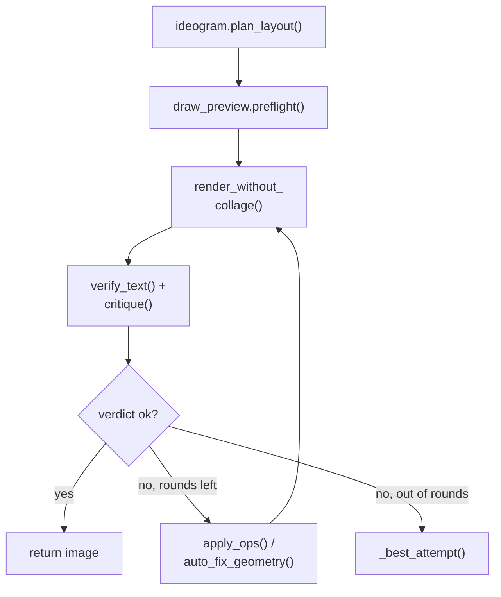
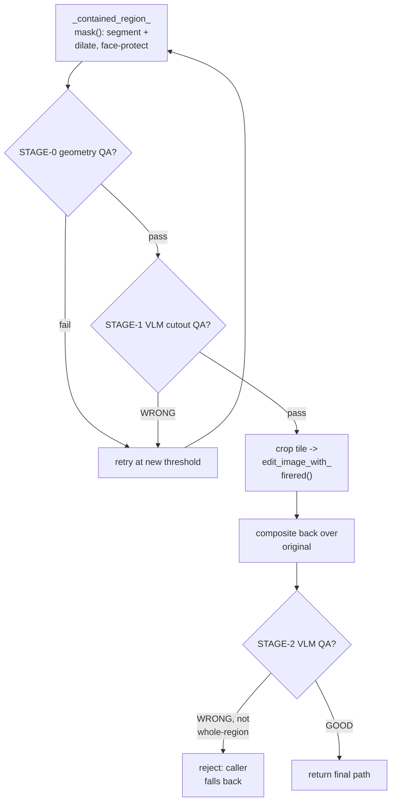

# imaging

## What it does

[`imaging`](../../imaging) turns a text request, or an uploaded photo plus an edit instruction, into a
picture. One request decides which of two ComfyUI-backed engines renders it: Ideogram 4
composes a fresh scene from a layout of boxes, FireRed (Qwen-Image-Edit) carries out
every edit on an existing image. Both come wrapped in checks that catch what the
generative model gets wrong on its own: a layout the renderer ignored, a mask that
grabbed the wrong region, lettering that misspells, a face a whole-frame redraw quietly
swapped for someone else's.

Those checks exist because the failure they catch has already shipped. A whole-frame
instruction edit asked to change a hat regenerates the face underneath it (measured
identity cosine collapsing to near zero); FireRed asked to spell a year wrong wrote
"2025" for "2026" in `21` out of `21` renders on the night bench; a vision critic asked
to judge a well-lit photo calls it "almost entirely black" four verdicts running. None
of those are rare, so the domain does not trust a single render or a single verdict:
it plans before rendering, measures what it can measure (brightness, spelling, mask
geometry), and composites a localized edit back over byte-exact original pixels rather
than hoping a redraw preserves them.

## How it works

Every render and every edit passes through [`imaging/comfy_client.py`](../../imaging/comfy_client.py), the one HTTP/WS
conversation with ComfyUI: `_submit_and_poll` enqueues a workflow graph, polls
`/history` until a file lands, and refuses to even submit when `gpu_holder()` reports a
foreign whole-card job on `gpu_lock`. The card is the one resource that cannot be
shared: `COMFY_MAX_CONCURRENT` defaults to `1`, and a batch of renders can claim the
card exclusively (`card_session`), unloading the resident chat model for the duration
and reloading it only once the render queue drains.

Above that transport, three decision shapes carry the domain's actual logic.

A picture the router itself composed is edited through its boxes before any pixel
engine runs; of what is left, a localized edit prefers the masked contained path and
only falls back to redrawing the whole frame.

`classify_edit_intent` ([`imaging/image_router.py`](../../imaging/image_router.py)) reads a 16-category rubric from a
model rather than keyword regexes (`EDIT_CATEGORIES`); the category then decides the
path. For an image with a stored layout sidecar (`imaging/image.py:load_layout_for`),
most categories (`face_edit`, `clothing_edit`, `subject_edit`, `object_insert`,
`style_transfer`, and more) go through `edit_via_layout`, which asks `draw_agent.edit_layout`
to turn the instruction into box operations and re-renders on the *same seed* so only
the touched boxes change. `object_remove` and `person_remove` are the deliberate
exception (`_LAYOUT_SURVIVES`): a layout re-render reframed the scene and could redraw
the removed thing, so those run on the pixel path and the box is dropped from the
record afterward. `text_edit` with no layout refuses outright: no pixel engine can
correct lettering, so falling through would reproduce the earlier false success.
Among the remaining pixel-path categories, `face_edit`/`clothing_edit`/`product_edit`/
`subject_edit` first check whether the instruction resizes the subject (the contained
path's QA rejects any outline change every time, so a proportion fix goes straight to
whole-frame FireRed); otherwise the contained path runs and only a QA failure falls
back to a whole-frame `edit_image_with_firered` call. `upscale`, `restore` and
`outpaint` have no engine left at all (their ESRGAN/old-model backends were removed)
and are refused with `reason="unsupported"`.

### Generation and self-repair loop

Ideogram's layout is checked as a sketch before it costs a render, and every
subsequent round repairs the same seed's boxes rather than rolling a new picture.

Ideogram 4 takes a structured JSON caption, not a prose prompt (a bare sentence draws
its grey "safety filter" refusal card, `imaging/ideogram.py:is_refusal_card`), so
`plan_layout` has an LLM lay the request out as a background plus a list of boxed
elements. `draw_preview.preflight` shows that layout as a schematic to a vision model
next to the original request before any render runs, because the planner is a text
model and its mistakes are spatial (a cat beside the sofa instead of on it). The seed
is held fixed across every repair round on purpose: moving one box then changes only
the part of the picture that box governs, which is what makes a round an edit rather
than a new roll. `render_without_collage` is the one exception that reseeds anyway:
[`imaging/draw_agent.py`](../../imaging/draw_agent.py) measures that a caption which collages into a grid of separate
photos does so independent of seed, so it escalates through seed reroll, a wider
canvas, filling the boxes to the frame edge, and finally merging every box into one,
in that order, each gated on the pixels rather than retried blindly. After each render,
`draw_text.verify_text` reads the lettering back with EasyOCR before the vision critic
ever looks (the critic cannot see a misspelling; it reads the word it expects), and
`exposure.evidence`/`_drop_unfounded` strip exposure complaints the measured brightness
contradicts. The critic's own `ops` and the deterministic `auto_fix_geometry` repair the
layout for the next round; a round that changes nothing is reported as a stall and the
loop reseeds instead of repeating itself; running out of rounds hands back the best
verdict seen (`_best_attempt`), never automatically the last one drawn.

### Contained-edit mask flow

A region mask passes two QA gates before the edit is attempted and a third after
compositing, so a bad segmentation is caught before it burns a render or before a
leaking result is returned.

`_contained_region_mask` ([`imaging/image_contained_firered.py`](../../imaging/image_contained_firered.py)) segments the region
with Florence/SAM3 (or the YuNet face detector for a whole-face phrase), grows the
silhouette outward so a replace edit covers the old object's antialiased rim, and
subtracts the detected face box for any non-facial region so identity is protected by
construction rather than by a post-hoc gate. STAGE-0 is deterministic mask geometry
(`imaging/image_maskqa.py:_mask_quality_ok`): a scattered-speck mask, an inverted
"selected everything" mask, or a mask that engulfed `> 65%` of the face box (the
segmenter grabbed the whole person) all reject before any render. STAGE-1 shows the
cutout to a vision model and asks whether the selection is correct; either failure
retries once at a different SAM3 threshold before giving up. The edit itself crops the
mask's bounding box from the full-resolution original, lets FireRed instruction-edit
only that tile, then composites the result back through a feathered alpha
([`imaging/compositing.py`](../../imaging/compositing.py)) so every pixel outside the mask stays byte-exact. STAGE-2
re-checks the composited result (not the tile) with a tinted overlay; a `WRONG`/`PARTIAL`
verdict rejects the edit unless it is a whole-region swap (clothing, hair), where the
composite is pasted strictly through the mask and nothing can leak outside it, so the
verdict is advisory there instead of a hard reject.

## Where it lives

| Area | Files | Role |
|---|---|---|
| Edit routing & orchestration | [`imaging/image_router.py`](../../imaging/image_router.py), [`imaging/image.py`](../../imaging/image.py) | 16-category intent router and dispatcher; FireRed edit call, layout sidecar (`load_layout_for`/`save_layout_for`), delivery guard (`assert_deliverable`), edit lineage/rebase after a chain of edits |
| Generation (Ideogram 4) | [`imaging/ideogram.py`](../../imaging/ideogram.py), [`imaging/ideogram_layout.py`](../../imaging/ideogram_layout.py), [`imaging/draw_agent.py`](../../imaging/draw_agent.py), [`imaging/draw_preview.py`](../../imaging/draw_preview.py), [`imaging/draw_geometry.py`](../../imaging/draw_geometry.py), [`imaging/draw_text.py`](../../imaging/draw_text.py), [`imaging/text_layout.py`](../../imaging/text_layout.py) | structured-caption codec and refusal/black-frame detection; the stdlib-only layout/style/caption data model; the plan-draw-judge-repair loop and collage recovery; pre-render sketch check; layout geometry repair (overlap, min-area, element cap); lettering read-back/repair; text-box sizing arithmetic |
| Contained / masked editing | [`imaging/image_contained.py`](../../imaging/image_contained.py), [`imaging/image_contained_firered.py`](../../imaging/image_contained_firered.py), [`imaging/image_contained_graphs.py`](../../imaging/image_contained_graphs.py), [`imaging/image_masks.py`](../../imaging/image_masks.py), [`imaging/image_maskqa.py`](../../imaging/image_maskqa.py) | crop-based localized edit (native-resolution tile, composited back); the FireRed contained edit and its region-mask builder; the shared `_image` proxy; mask construction/dilation/paired-region extension; STAGE-0/STAGE-1 mask quality gates |
| Grounding & region language | [`imaging/image_grounding.py`](../../imaging/image_grounding.py) | turns a free-text edit request into a region + result phrase an LLM/VLM and a segmenter can act on |
| Identity, hands & QA | [`imaging/identity_metrics.py`](../../imaging/identity_metrics.py), [`imaging/image_identity.py`](../../imaging/image_identity.py), [`imaging/image_handfix.py`](../../imaging/image_handfix.py) | YuNet/SFace face detection and cosine similarity (model files in [`models/face/`](../../models/face)); face-paste-back after upscale/redraw; the MeshGraphormer hand-fix ladder |
| Lettering, OCR & removal | [`imaging/ocr_reader.py`](../../imaging/ocr_reader.py), [`imaging/ocr_worker.py`](../../imaging/ocr_worker.py), [`imaging/text_overlay.py`](../../imaging/text_overlay.py), [`imaging/image_lettering_remove.py`](../../imaging/image_lettering_remove.py) | EasyOCR (ru+en, CPU, its own process) as the deterministic lettering reader; exact PIL-drawn lettering fallback when a model cannot spell; OCR-driven removal mask for "all the lettering" |
| ComfyUI transport & registries | [`imaging/comfy_client.py`](../../imaging/comfy_client.py), [`imaging/image_engines.py`](../../imaging/image_engines.py), [`imaging/image_sizing.py`](../../imaging/image_sizing.py), [`imaging/compositing.py`](../../imaging/compositing.py), [`imaging/exposure.py`](../../imaging/exposure.py) | submit/poll/GPU-exclusivity transport shared by every pipeline; the edit-engine name registry (FireRed is the only entry); size/orientation resolution; seam-suppression compositing (Poisson + Laplacian blend, routed by continuation-vs-distinct-content); measured brightness evidence for vision judges |
| Whole-frame / object operations | [`imaging/image_objects.py`](../../imaging/image_objects.py), [`imaging/image_transforms.py`](../../imaging/image_transforms.py), [`imaging/image_generate.py`](../../imaging/image_generate.py) | background remove and FireRed-contained object remove; IC-Light relight; the Ideogram generate/evaluate/retry refinement loop |
| Transfer & LoRA | [`imaging/image_transfer.py`](../../imaging/image_transfer.py), [`imaging/image_lora.py`](../../imaging/image_lora.py), [`imaging/characters.py`](../../imaging/characters.py), [`imaging/lora_training.py`](../../imaging/lora_training.py) | reference-driven role vocabulary (clothing/hair/face/style source → target) and its two execution paths; LoRA injection onto a ComfyUI graph's model loaders; the character registry ([`runtime/characters.json`](../../runtime/characters.json), gitignored); the trainer's own venv and GPU-exclusivity contract |
| Lookup & vision helpers | [`imaging/photo_search.py`](../../imaging/photo_search.py), [`imaging/person_look.py`](../../imaging/person_look.py), [`imaging/vision_close.py`](../../imaging/vision_close.py), [`imaging/vision_selftest.py`](../../imaging/vision_selftest.py), [`imaging/animate_presets.py`](../../imaging/animate_presets.py), [`imaging/style_presets.py`](../../imaging/style_presets.py) | contact-sheet photo search; real-person appearance lookup for drawing requests; zoomed-tile vision reading for small detail; vision-projector health probe at startup; named motion/style presets for one-photo animation and single-image restyle |
| Workflow graphs & model weights | [`workflows/image/workflow_firered_edit.json`](../../workflows/image/workflow_firered_edit.json), [`workflows/image/workflow_ideogram4.json`](../../workflows/image/workflow_ideogram4.json), [`workflows/image/workflow_ideogram4_ui.json`](../../workflows/image/workflow_ideogram4_ui.json), [`models/face/face_detection_yunet_2023mar.onnx`](../../models/face/face_detection_yunet_2023mar.onnx), [`models/face/face_recognition_sface_2021dec.onnx`](../../models/face/face_recognition_sface_2021dec.onnx), [`assets/vision_selftest.jpg`](../../assets/vision_selftest.jpg) | the ComfyUI node graphs the two engines submit; the YuNet/SFace ONNX weights `identity_metrics.py` loads; the known-answer probe image for `vision_selftest.py` |

[`imaging/edit_state.py`](../../imaging/edit_state.py) defines a stateful edit-graph model (`EditSession`,
`LOCK_POLICY` per intent category) but nothing in the live router imports it; its only
importer is [`tests/test_edit_state.py`](../../tests/test_edit_state.py).

## Constraints

- **FireRed is the only edit engine.** `image_engines.EDIT_ENGINE_WORKFLOWS` has one
  entry (`"firered"`); `upscale`/`restore`/`outpaint` have no backend left and are
  refused rather than silently redrawn.
- **The GPU does not share.** `COMFY_MAX_CONCURRENT` is `1`; a render claims the card
  exclusively through `card_session`/`_gpu_slot(exclusive=True)`, unloading the
  resident LLM, and a foreign whole-card job holding `gpu_lock` makes `_submit_and_poll`
  refuse the job outright rather than queue behind it.
- **A contained edit must keep the face it did not touch.** `_contained_edit_validated`
  ([`imaging/image_router.py`](../../imaging/image_router.py)) rejects a non-face edit whose identity cosine
  (`identity_metrics.identity_cosine`) drops below `0.90` after one tighter retry;
  `SFACE_SAME_PERSON_COSINE = 0.363` is the underlying "same person at all" floor.
  A mask that covers more than `65%` of the detected face box is rejected as having
  grabbed the whole person, not the named object.
- **A layout caps at `MAX_ELEMENTS = 6` boxes and `MIN_AREA = 0.012` of the frame**
  ([`imaging/draw_geometry.py`](../../imaging/draw_geometry.py)); past the element cap the renderer stops honouring
  boxes, and below the area floor an element risks vanishing from the render.
- **Lettering has its own geometry floor.** `MIN_TEXT_H = 0.08`, `MAX_TEXT_CHARS = 24`
  ([`imaging/text_layout.py`](../../imaging/text_layout.py)); a box smaller than that renders letter-shaped strokes
  instead of letters. New lettering gets `TEXT_ADD_TRIES` (default `3`) FireRed
  attempts with an OCR read-back before falling back to an exact PIL overlay.
  `TEXT_MATCH_OK = 0.8` is the similarity floor that counts as "it says the word."
  `text_edit` on an image with no stored layout refuses outright: no pixel engine can
  correct a sign's spelling.
- **A chain of edits re-bases from the original.** `FIRERED_REBASE_AFTER = 3`: from the
  4th FireRed edit in a row, the instruction history is replayed against the ORIGINAL
  image instead of the latest result, because edit-on-edit drifts (colour noise, a
  drifting face) by then; `FIRERED_REBASE_MAX = 6` caps how long that chain is kept.
- **`CONTAINED_FULLRES_MP = 4_000_000`** is the pixel-count switch between the
  full-frame in-graph contained path and the crop-based one; above it, the in-graph
  VAE-encode risks OOM, so only the masked tile (capped by `FIRERED_MAX_MP = 2.0`) is
  ever sent through FireRed.
- **Every delivery is gated.** `assert_deliverable` ([`imaging/image.py`](../../imaging/image.py)) rejects any
  path containing an `_INTERMEDIATE_`-style scratch marker and any result smaller than
  its source canvas; nothing reaches the agent/UI boundary without passing it.
- **A vision critic's exposure verdict is not trusted on its own.** `exposure.py`
  measures mean/P95 luminance and drops a darkness complaint the pixels contradict
  (`MEAN_FLOOR = 55.0`, `P95_FLOOR = 140.0`); a verdict that calls a normally-exposed
  picture "almost entirely black" is discarded wholesale (`source="blind"`), including
  whatever else it claimed.
- **Collage reroll is off by default.** `COLLAGE_REROLLS = 0` in
  [`imaging/draw_agent.py`](../../imaging/draw_agent.py): measuring found a fresh seed does not fix a caption that
  collages, so the repair ladder goes straight to a wider canvas or a merged layout
  instead of burning a reroll first.

## Coupling

- **comfy_client.py's GPU exclusivity is shared infrastructure**, not imaging-only:
  video and music pipelines outside this domain submit through the same
  `_submit_and_poll`/`_gpu_slot`/`gpu_lock` machinery, so a long render anywhere on the
  card is visible to this domain as `gpu_holder()` returning non-`None`.
  [`imaging/lora_training.py`](../../imaging/lora_training.py) enforces the same one-job-per-GPU rule from the training
  side.
  `config.py` holds the engine toggles this domain reads live rather than by value
  (`IMAGE_ENGINE`, `COMFY_MAX_CONCURRENT`, `COMFY_RESPECT_GPU_LOCK`, the workflow paths)
  so a GUI switch takes effect without a restart.
- **llm.py / intent.py / utils.py supply every classification call.** `edit_plan`,
  `classify_edit_intent`, `removes_region`, and the many `intent.ask_yes`/`ask_choice`
  calls scattered through `draw_agent.py` and `image_grounding.py` all go through those
  modules, which belong to the agent/LLM domain, not this one.
  `utils.safe_json_from_llm` is what turns a model's free-text reply into the
  structured dict every pipeline here expects.
- **characters.py / lora_training.py / image_lora.py back the character-LoRA feature**
  that `ideogram.attach_lora`/`attach_turbo_lora` wire into the Ideogram graph; the
  registry, training venv and dataset layout are that domain's contract, consumed here
  only as a `.safetensors` path and a trigger word.
- **The desktop GUI and the Telegram bot are the two callers**, neither of which is
  part of this domain's source: they reach `route_edit_request`,
  `generate_image_with_comfy`, `draw_agent.run`, and `transfer`'s
  `plan_and_execute_transfer` as the public entry points, and they are what
  [`docs/transfer_tab_guide.md`](../transfer_tab_guide.md) and [`docs/upscale_modes_and_queue.md`](../upscale_modes_and_queue.md) describe from the
  user-facing side.
