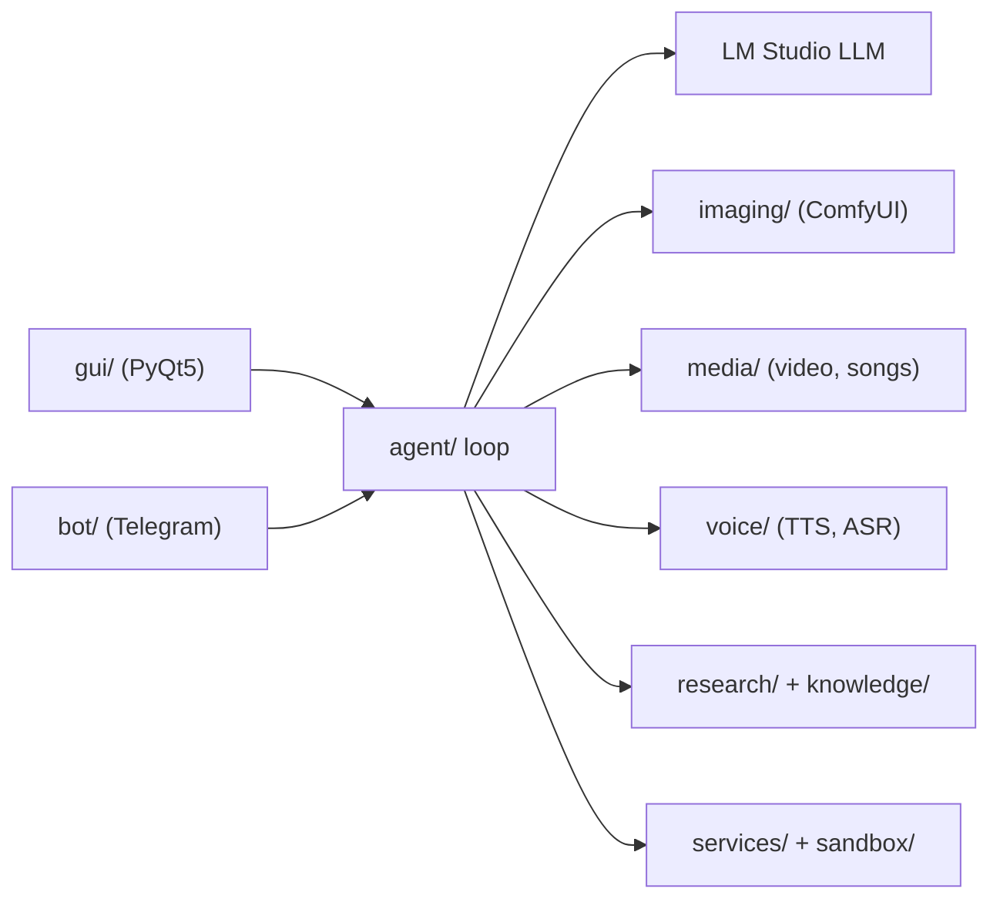

<wiki-type>repo</wiki-type>
<scan-sha>31a8b055160fa3f1f7714d4b62deacbd5b5e3a16</scan-sha>
<wiki-schema>1</wiki-schema>

# Project signals

## What this repo is

Assistant DC: a personal assistant that runs entirely on a local GPU. One agent loop serves a PyQt5 desktop window and a Telegram bot; its tools talk, draw, edit photos, make video and songs, research the web, run code in a sandbox and build slide decks.

Every front end enters through [`core/`](../../core) bootstrap; GPU-heavy engines serialize on the GPU lock owned by [`core/`](../../core).

## Domains

| Domain | Start here | What it does | Detail |
|--------|-----------|--------------|--------|
| agent-loop | [`agent/`](../../agent) | LLM tool-calling loop: intent routing, tool dispatch, memory, guardrails. | [`docs/wiki/agent-loop.md`](agent-loop.md) |
| bench | [`bench/`](../../bench) | Developer-run A/B scripts that pick models, engines, parameters. | [`docs/wiki/bench.md`](bench.md) |
| core | [`core/`](../../core) | Bootstrap, config, GPU lock, process safety, install scripts. | [`docs/wiki/core.md`](core.md) |
| gui | [`gui/`](../../gui) | PyQt5 window: tabs, DPI scaling, i18n, QThread workers. | [`docs/wiki/gui.md`](gui.md) |
| imaging | [`imaging/`](../../imaging) | ComfyUI image generation and editing with mask/identity/OCR gates. | [`docs/wiki/imaging.md`](imaging.md) |
| knowledge | [`knowledge/`](../../knowledge) | Hybrid BM25+embedding RAG, one SQLite index per corpus. | [`docs/wiki/knowledge.md`](knowledge.md) |
| media | [`media/`](../../media) | Songs, voice covers, narration, H3 video generation. | [`docs/wiki/media.md`](media.md) |
| personas | [`personalities/`](../../personalities) | Persona scripts and cast presets for the multi-persona room. | [`docs/wiki/personas.md`](personas.md) |
| research | [`research/`](../../research) | Deep Research: plan, crawl, extract, cluster, cited report. | [`docs/wiki/research.md`](research.md) |
| sandbox | [`sandbox/`](../../sandbox) | Per-user file root and Docker-isolated code execution. | [`docs/wiki/sandbox.md`](sandbox.md) |
| services | [`services/`](../../services) | Shopping, weather, reminders, slides, social feeds, fact-check. | [`docs/wiki/services.md`](services.md) |
| telegram-bot | [`bot/`](../../bot) | Telegram routing, per-chat queue/session state, markup. | [`docs/wiki/telegram-bot.md`](telegram-bot.md) |
| testing | [`tests/`](../../tests) | Regression suite swept by [`tests/run_all.py`](../../tests/run_all.py), live harnesses. | [`docs/wiki/testing.md`](testing.md) |
| voice | [`voice/`](../../voice) | F5-TTS cloning, stress, emotion; ASR and diarization. | [`docs/wiki/voice.md`](voice.md) |

## Framework & runtime

Python 3.13 on Windows, CUDA torch on an RTX 3090 (24 GB). PyQt5 desktop UI; Telegram Bot API. LLM served by LM Studio (OpenAI-compatible HTTP). Image and video through ComfyUI workflows in [`workflows/`](../../workflows); music engines in their own venvs. Dependencies: [`requirements.txt`](../../requirements.txt), [`requirements-dev.txt`](../../requirements-dev.txt), pins in [`overrides.txt`](../../overrides.txt).

## Build / test / lint

| Purpose | Command | Source |
|---------|---------|--------|
| Install | [`setup.ps1`](../../setup.ps1) / [`setup.sh`](../../setup.sh) | [`scripts/setup.py`](../../scripts/setup.py) |
| Start | [`start.cmd`](../../start.cmd) / [`start.sh`](../../start.sh) | [`scripts/launch_all.py`](../../scripts/launch_all.py) |
| Health check | `python scripts/healthcheck.py` | [`scripts/healthcheck.py`](../../scripts/healthcheck.py) |
| Test | `python tests/run_all.py` | [`tests/run_all.py`](../../tests/run_all.py) |
| Lint | `flake8` | [`.flake8`](../../.flake8) |

No build step.

## DevOps & CI

GitHub Actions on `windows-latest`: [`.github/workflows/tests.yml`](../../.github/workflows/tests.yml) installs CPU torch and runs [`tests/run_all.py`](../../tests/run_all.py); [`.github/workflows/setup.yml`](../../.github/workflows/setup.yml) runs the one-command install twice to prove it idempotent. No deploy; the app runs on the owner's machine.
