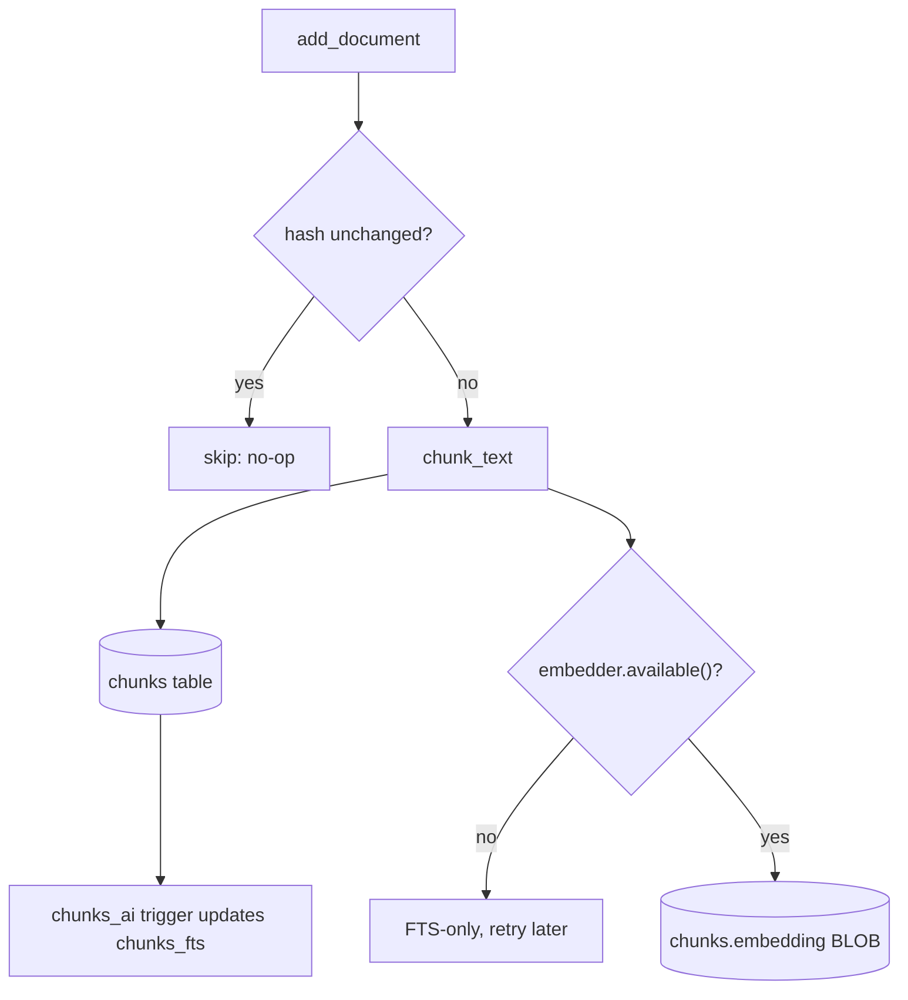
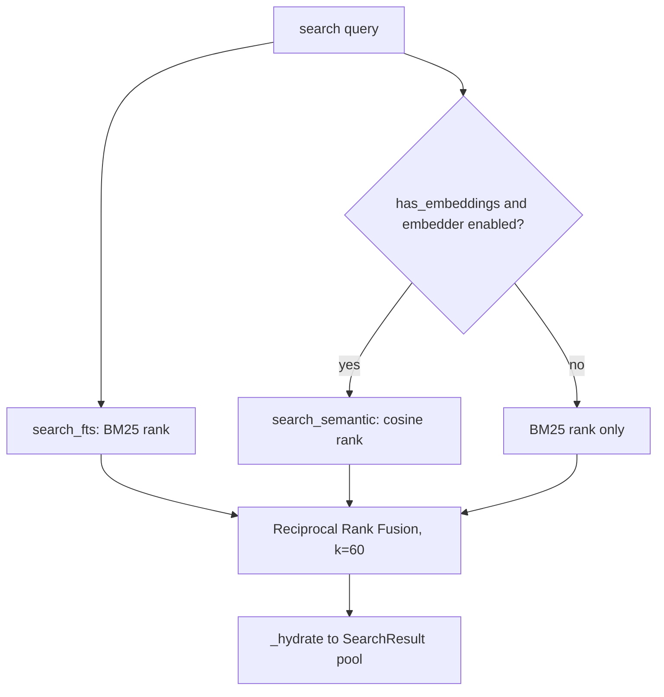
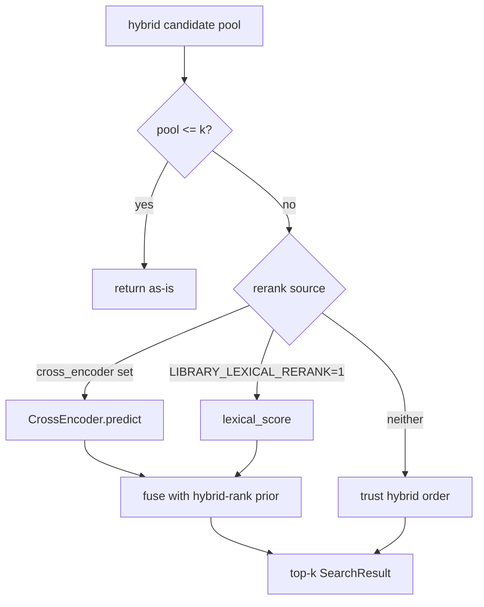
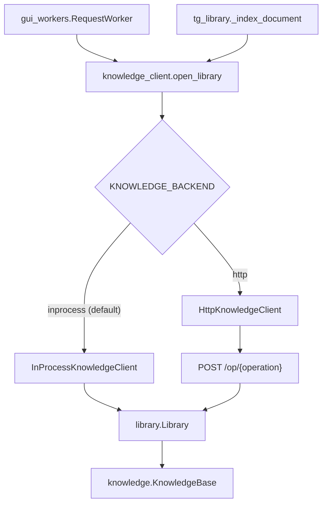

# knowledge

## What it does

[`knowledge/`](../../knowledge) turns two kinds of text that would otherwise vanish after one turn, crawled research pages and user-uploaded documents, into durable SQLite indexes a question can be answered from. A question about a 1,200-page EPUB or last month's research crawl retrieves the passages it needs instead of waiting for the whole corpus to fit inside the model's context window.

Two index families run on the same engine but never share a file: `memory/knowledge.db` for the research-page cache (built via `knowledge.KnowledgeBase.import_research_cache`), and one `library.db` per owner ([`memory/library.db`](../../memory/library.db) for the desktop app, `tg_libraries/lib_<chat>.db` per Telegram chat) for uploaded documents. Three front ends, the desktop Database tab, the Telegram bot's per-chat library, and the research pipeline's page cache, reach both through one contract (`knowledge_api.KnowledgeClient`) rather than three separate storage layers.

## How it works

`knowledge.KnowledgeBase` ([`knowledge/knowledge.py`](../../knowledge/knowledge.py)) is the storage and retrieval engine under both index families: one SQLite file, an FTS5 virtual table (`chunks_fts`, `porter unicode61`) for BM25 keyword search, and a `chunks.embedding` BLOB column filled by an OpenAI-compatible `/v1/embeddings` endpoint (`config.EMBED_MODEL`, falling back to `text-embedding-bge-m3` at 1024 dimensions if `config` cannot be imported). `library.Library` ([`knowledge/library.py`](../../knowledge/library.py)) wraps it with document text extraction, a build-with-progress step, and a reranked retrieve step. `knowledge_client.open_library()` ([`knowledge/knowledge_client.py`](../../knowledge/knowledge_client.py)) is the one door every consumer uses to reach either engine, and it decides at call time whether that door opens in-process or over HTTP to [`knowledge/knowledge_service.py`](../../knowledge/knowledge_service.py).

A document only re-chunks and re-embeds when its text hash changes, and an unreachable embedding endpoint leaves it searchable by keyword rather than blocking the ingest.

### Hybrid search fusion

`KnowledgeBase.search` fuses BM25 and cosine rankings by Reciprocal Rank Fusion when embeddings exist, and drops to BM25 alone the moment they do not, so an embedding outage degrades recall instead of breaking search.

### Candidate rerank

`Library.retrieve` reranks a larger candidate pool against the hybrid rank as a stable prior, reaching for a cross-encoder only when one is configured and otherwise trusting the hybrid order outright.

### Service boundary

Every consumer opens a knowledge client through one call, and an environment variable, not the caller, decides whether that call stays in-process or crosses an HTTP boundary to the same `library.Library` backend.

## Where it lives

| Path | What it holds |
|---|---|
| [`knowledge/knowledge.py`](../../knowledge/knowledge.py) | `KnowledgeBase`: SQLite schema (`documents`, `chunks`, `chunks_fts`), `Embedder`, `chunk_text`, hybrid `search` with RRF, `stats`/`reindex_embeddings`/`purge`/`repair` |
| [`knowledge/library.py`](../../knowledge/library.py) | `Library`: text extraction (txt/md/pdf/epub/docx), `build`, `retrieve`/`retrieve_multi`, `format_context`/`build_rag_prompt`, `map_reduce_scan`, cross-lingual target detection |
| [`knowledge/knowledge_api.py`](../../knowledge/knowledge_api.py) | `KnowledgeClient` protocol, `SEARCH_HIT_FIELDS`/`DOCUMENT_FIELDS`/`OPERATIONS`, the boundary contract's own documentation |
| [`knowledge/knowledge_client.py`](../../knowledge/knowledge_client.py) | `open_library()` backend selector, `InProcessKnowledgeClient`, client-side `build_rag_prompt`/`cross_lingual_targets`/`map_reduce_scan` wrappers |
| [`knowledge/knowledge_service.py`](../../knowledge/knowledge_service.py) | HTTP server (`_dispatch`, `_Handler`, `make_server`, `serve`) and `HttpKnowledgeClient` |
| [`knowledge/reindex_embeddings.py`](../../knowledge/reindex_embeddings.py) | Standalone script: `discover()` every `*.db` with a `chunks` table, then `reindex_embeddings()` each after an `EMBED_MODEL` change |

## Constraints

| Condition | Behavior |
|---|---|
| Embed endpoint unreachable | `Embedder.embed()` returns `None`; `ensure_embeddings` leaves those chunks FTS-only, and `search(mode="auto")` drops to BM25-only |
| A chunk's `embed_model` differs from `config.EMBED_MODEL`, or its vector length doesn't match the majority length in the index | excluded from `_all_embeddings`, logged, and left for a later `ensure_embeddings`/`reindex_embeddings` pass rather than crashing on a shape mismatch |
| `chunk_text(overlap=...)` called with `overlap >= target_words` | clamped to `target_words - 1`; an uncapped overlap made the chunking stride non-positive and the loop never returned |
| A document deleted while an older connection ran without `PRAGMA foreign_keys=ON` | `KnowledgeBase.repair()`, run at the start of every `Library.build()`, deletes the orphaned chunks and rebuilds `chunks_fts` |
| No cross-encoder configured and `LIBRARY_LEXICAL_RERANK` unset | `library.rerank()` returns the hybrid order unchanged; the lexical reranker measured worse than the hybrid order alone on [`bench/rag_eval`](../../bench/rag_eval) |
| `KNOWLEDGE_BACKEND=http` | ingest's `progress()`/`cancel()` callbacks cannot cross the wire: the client fires one synthetic tick before and after the call, and `cancel()` is honored only before dispatch, never mid-request |
| A SQLite connection used from a thread other than the one that opened it | raises; every `KnowledgeBase`/`Library` is opened and closed on the thread doing the work, and the HTTP service opens, serves, and closes one per request for the same reason |
| `knowledge_client`'s `import library` / `import knowledge` calls | kept lazy, inside each constructor and method rather than at module level, and with fixed positional call shapes on purpose: test suites patch `sys.modules['library']`, and call-time resolution keeps that stub live |

## Coupling

- [`gui/gui_workers.py`](../../gui/gui_workers.py) (`RequestWorker`, `LibraryBuildWorker`, `ScanWorker`) and [`bot/tg_library.py`](../../bot/tg_library.py) / [`bot/tg_tasks.py`](../../bot/tg_tasks.py) are the desktop and Telegram front ends; both reach this layer only through `knowledge_client.open_library()`, never by constructing `library.Library` directly.
- [`core/config.py`](../../core/config.py) supplies `EMBED_MODEL`, `EMBED_DIM`, `EMBED_BASE`, and the `LIBRARY_*` tuning knobs (`LIBRARY_CROSS_ENCODER`, `LIBRARY_RETRIEVE_K`, `LIBRARY_CONTEXT_CHARS`, `LIBRARY_EMBED_BATCH`, `LIBRARY_EMBED_WORKERS`, `LIBRARY_SCAN_BATCH_CHARS`); every read falls back to a hardcoded default if the import fails.
- [`research/rerank.py`](../../research/rerank.py) imports `Embedder` directly from the flat [`knowledge`](../../knowledge) module for its own page-relevance scoring, a separate consumer of the embedding helper, not of `KnowledgeBase`.
- [`scripts/install_paths.py`](../../scripts/install_paths.py) puts the [`knowledge/`](../../knowledge) directory itself on `sys.path` (alongside [`core/`](../../core), [`agent/`](../../agent), [`bot/`](../../bot), [`gui/`](../../gui), and others), so every module inside it keeps a flat top-level name. Every file in this domain imports its neighbors as bare `import library` / `import knowledge`, never `from knowledge import library`.
