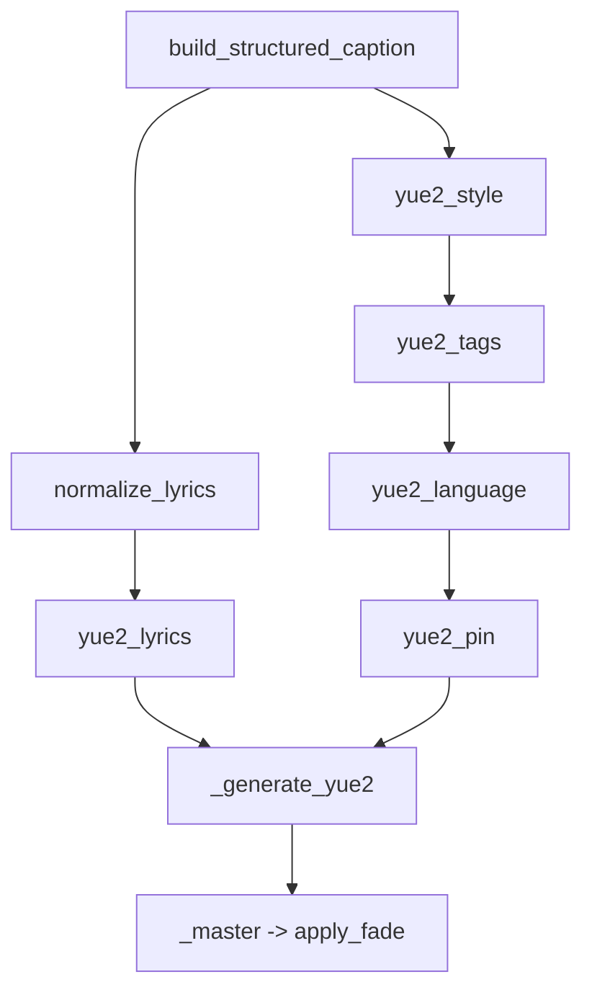
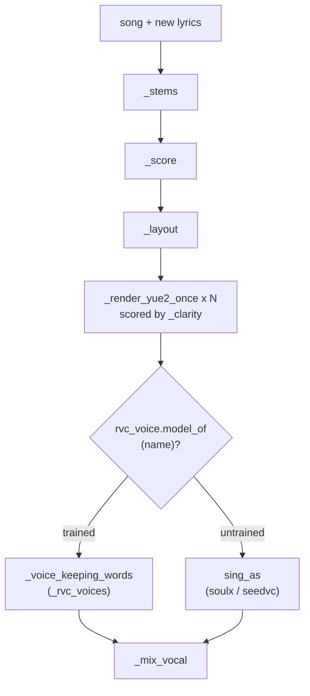
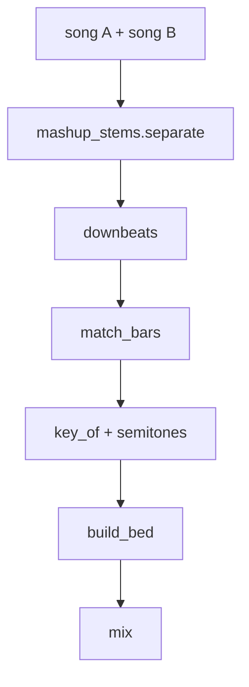
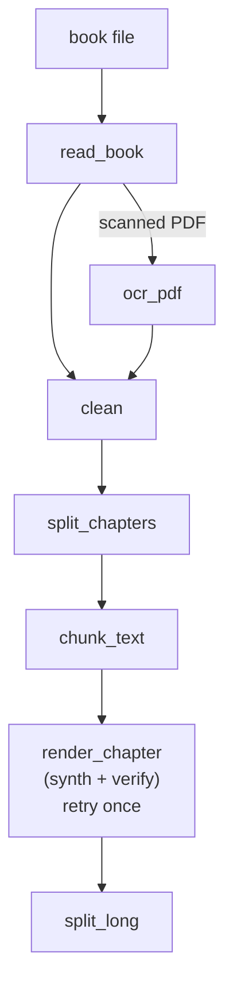
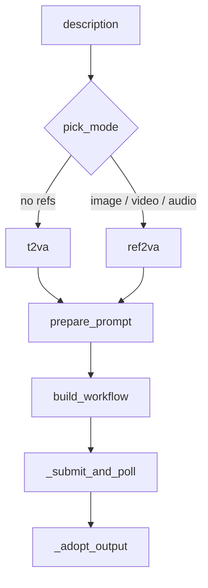
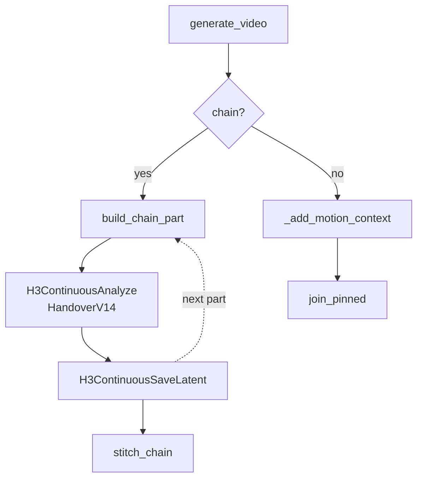
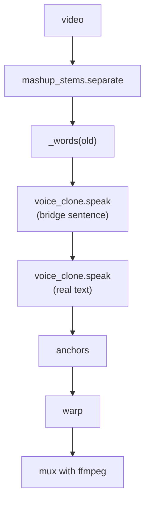

# media

## What it does

[`media/`](../../media) is where a chat request turns into a finished audio or video file. A wish for a song becomes lyrics, a production caption and a YuE2 render; an existing song becomes a cover sung in another voice, re-sung with new words over its own melody, or mashed up with a second track's backing; a book file becomes a multi-hour narration in one cloned voice; a text description becomes an H3 video clip with its own native soundtrack, one that can be continued across several renders, restyled into a different visual look, or have its spoken line re-dubbed afterward when the model read the words wrong.

Everything renders locally. Video and the Music3 path go through a ComfyUI instance; YuE2, RVC (Applio), SoulX-Singer and Seed-VC each run as a subprocess in their own virtual environment, started for a job and torn down after. Nothing in this domain calls an external API, without it the assistant could describe music or video, never produce either.

## How it works

Every engine here shares the same shape: build the model's own input contract in code (a lyric tag vocabulary, a frame-count grid, a reference-numbering scheme), hold the one shared GPU exclusively for the render, then adopt the result into the project's own output tree.

### Music generation (YuE2)

A song's words and style pass through five independent, order-dependent rewrites before YuE2 ever renders a note, because each one enforces a contract the model would otherwise violate silently, a tag sharing a line with its words, a BPM the writer invented fighting the one the user pinned, the wrong gender's vocal tag surviving a 🎤 button press.

`music.build_structured_caption` escalates a three-rung ladder (growing `max_tokens`, never shrinking it) until the model returns a usable `{"lyrics", "style"}` pair with the right line count for the asked duration. `music.normalize_lyrics` then enforces the two input contracts common to both engines: a section tag sits alone on its own line, and the tag vocabulary is canonicalised to lowercase. The `yue2_*` chain adapts Music3's three-heading prose caption into YuE2's flat, capped tag list, strips any genre tag that contradicts the user's pinned one, and leads the tag list with the chosen vocal (or `instrumental`) so a tag model reading "no female vocals" cannot hear "female" instead. `_generate_yue2` renders through `yue2.cpp` when its weights are present, falling back to the PyTorch venv; `_master` loudness-normalizes and tapers a render the token budget cut off mid-line, and `apply_fade` applies the deterministic start/end taper every delivered song gets regardless of engine, since a song whose words outlast its render slot is otherwise severed mid-phrase at full volume.

### Cover, remix and re-singing

`remix.resing` re-sings a whole song on new words: it keeps the original's melody and backing feel but gives YuE2 a brand-new score shaped to the new lyric, then puts a singer's voice on the result.

`_score` transcribes the original's melody and chords to ABC notation; `_layout` places the new lyric's lines onto the score's sections so each section carries about as many syllables as it has notes, and arranges meaningful repeats of the hook using the original's own repetition shape (`_repetition_profile`). Because one YuE2 take is a draw, the same score, words and seed can land anywhere from a quarter to most of the lyric's lines intelligible, `resing` renders up to `RESING_TAKES` takes and keeps the one Whisper hears closest to the intended lyric (`_clarity`). The voice on top is a per-artist RVC model trained once on that song's own vocal stem and reused for later covers of the same artist (`rvc_voice.train`/`model_of`), a small set of pre-trained voices offered in the cover picker, or, when neither exists yet, a zero-shot timbre transfer (SoulX-Singer, falling back to Seed-VC). `_voice_keeping_words` rejects any conversion that lost intelligibility relative to the take itself, since a voice conversion is its own draw on top of YuE2's.

`remix.remix_words` and `remix.remix_voice` cover the two simpler cases: a song singing different words on its own melody and voice (Whisper times the original, F5 speaks the new line into those spans, the original pitch contour rides on top via `pyworld`), and one song's voice singing a second song's words and melody. `rvc_voice.split_lead` separates a lead vocal from backing harmonies and reverb before training or converting, since a model trained on an untreated stem learns the choir and the hall as part of the voice.

### Mashup

`mashup_auto.make` lays one song's vocal over a second song's backing without ever cutting or stretching the vocal, so every word of the original survives by construction.

`downbeats` (beat_this) finds each song's bar grid; `match_bars` reconciles a bar-length mismatch (a half-time or double-time detection) before `build_bed` maps song B's bars one by one onto song A's grid with a single rubberband time map, so B's drums land on A's downbeats for the whole song, transposed by the shortest path to A's key. `mix` balances the vocal against the new bed at the same ratio the vocal had against its own original backing.

### Audiobook narration

`audiobook.render_chapter` turns one chapter into one voice message: a chapter is never handed to the voice whole, nor cut mid-clause, because F5 holds roughly 30 seconds of reference-plus-text per pass and a piece under 40 characters makes it bleed the reference's last words into the speech.

`read_book` extracts text per format (`.fb2` is parsed directly for its main body, skipping notes/comments/binaries; `.pdf`/`.epub`/`.docx` go through [`knowledge/library.py`](../../knowledge/library.py)); a PDF whose pages are mostly pictures (`is_scanned`) falls back to `ocr_pdf`, which prefers PaddleOCR (near-error-free on Russian print) and falls back to the project's EasyOCR worker. `clean` strips running headers/footers and page furniture (a line that recurs far apart, a web address) before `split_chapters` finds the book's own headings or, failing that, cuts even "Часть N" parts at paragraph ends. `chunk_text` packs whole sentences up to `MAX_CHUNK` characters, merging any piece under `MIN_PIECE`. `render_chapter` speaks each piece, trims the engine's own leading/trailing silence, and, when a `verify` callback is given, re-speaks a piece once if an ASR check says it didn't say what it was asked to; `split_long` cuts a chapter's finished audio into parts no longer than `MAX_CHAPTER_SECONDS` at its quietest nearby second.

### Video generation

`video.generate_video` picks a checkpoint from what is attached, rewrites the request into MiniMax's own trained prompt structure, and submits the graph with the whole GPU held exclusively for the job.

`pick_mode` always resolves to one of exactly two checkpoints: `ref2va` whenever any image, video or audio reference is attached, `t2va` otherwise. `prepare_prompt` runs, in order, `_lock_framing_unless_requested` (a static-camera directive, skipped when the request itself asks for camera motion), `to_context_ir` (an LLM rewrite into the `integrated_multimodal_description` / `overall_soundscape` / `non_diegetic_music` structure MiniMax's own prompt guide specifies, read from [`h3_prompt_guides/base-en.txt`](../../h3_prompt_guides/base-en.txt) or `ref-en.txt`), and `mark_speech_stress` (Russian stress marks on quoted dialogue, since H3 reads Russian letters but not stress). `build_workflow` stamps size, frame count and seed onto the loaded graph, attaches every reference at its correct wire slot, and optionally adds a half-size-then-upscale second stage. The hard model constraints, the 24 fps / `n % 17 == 5` frame grid, the 768-short-edge / `768*1344`-area canvas, and `cfg = 1.0` because the released weights are CFG-distilled, are not knobs, they are shapes H3 was trained on; `video.snap_frames` and `video.fit_canvas` enforce them before anything is submitted.

### Video continuation

A long clip is extended by one of two unrelated mechanisms, chosen by which keyword argument `generate_video` received, not by content: a Herrgott latent chain protects and copies the previous part's tail forward through every part before one stitch at the end, while a pinned-frame continuation renders the previous clip's own last frames into the new one and a caller joins the two clips afterward.

`build_chain_part` starts a chain from `H3ContinuousStartV14` (optionally from a first-frame photo) or continues it from the previous part's saved latent through `H3ContinuousContinueV14`, protecting a run of masked context frames natively rather than re-encoding them; `stitch_chain` cuts each part's protected head and crossfades the joins into one file. The pinned-frame mechanism instead copies the previous clip's last `MOTION_CONTEXT_FRAMES` (22 by default) into the new clip's own timeline as never-denoised rows via `MiniMaxH3MotionContext`; `video.join_pinned` is the ffmpeg-based splice a caller runs afterward to cut the old clip at that point and concatenate. `video.motion_context_on` and `video.herrgott_on` gate the two paths behind separate environment variables and separate live-ComfyUI node checks, enabling one says nothing about the other being available.

### Video restyle (ControlNet)

`video_control.restyle` redraws an existing clip's motion in a new visual style: the user's clip supplies motion and composition as a control video (optionally Canny-edge-detected), the prompt supplies the new look, and `MiniMaxH3FunControlNetApply` patches that control into the ordinary `t2va` graph ahead of the sampler. The control nodes live only in a second, separately installed ComfyUI clone (`qi21`); `video_control.on_control_server` starts it on demand, frees the live server's VRAM first, swaps the shared `COMFY_URL` under a lock for the duration of the job, and stops the process it started once the render completes.

### Video dubbing

`video_dub.redub` replaces a rendered clip's Russian speech when H3 read a word's stress wrong, without re-rendering the clip: the new words are time-stretched onto the moments H3's own voice spoke them, found by matching the words Whisper hears in both takes, so the lips still land close to the audio.

The clip's own speech is the reference F5 clones from, but a direct clone copied H3's own (wrong) stress along with the timbre; `redub` first has the clone say a neutral bridge sentence sharing none of the line's words, and uses that take, same voice, no borrowed stress, as the actual reference for the real line. `anchors` finds matching words between the old and new Whisper transcripts; `warp` stretches each stretch of new audio between two anchors onto the old timing with rubberband, keeping its own speed before the first and after the last anchor. A clip whose words mostly fail to match is returned as a failure rather than a mismatched dub; the caller keeps H3's own voice.

### Video look (vision)

`video_look.look_at_video` gives the vision model something to look at, not only transcribed speech. `dense_pass` grabs the whole clip at low resolution and `key_times` turns a frame-to-frame change score plus a sharpness score into one timestamp per shot (the sharpest frame of each shot, never the blurred boundary frame itself), falling back to `sample_times`'s fixed interval if the dense pass fails. `make_sheet` tiles the chosen frames with timestamp labels into a contact sheet kept on disk for follow-up questions, but every frame is also sent to the vision model at full size in one call, since a shrunk tile loses detail a full frame keeps. A known transcript of what is said is passed alongside the frames so named objects settle what a small frame cannot, never to add anything the frames do not show.

## Where it lives

| Path | What it covers |
|---|---|
| [`media/music.py`](../../media/music.py) | YuE2/Music3 song generation: lyric and caption contracts, `build_workflow`, `generate_music`, ETA tracking, weight presets |
| [`media/lyrics_craft.py`](../../media/lyrics_craft.py) | Lyric writing and polishing: the rhyme/rhythm/form rule checker (`analyse`), the draft/critique/revise/judge loop |
| [`media/cover.py`](../../media/cover.py) | MuLaCover entry points: style-tag parsing, vocal-stem extraction, audio-to-wav conversion |
| [`media/remix.py`](../../media/remix.py) | Remix (new words or a swapped voice over a melody) and the full re-singing pipeline: scoring, layout, take selection, voice sourcing |
| [`media/rvc_voice.py`](../../media/rvc_voice.py) | RVC (Applio) training and conversion: per-artist voice folders, the star-voice picker, lead/backing vocal split |
| [`media/mashup_auto.py`](../../media/mashup_auto.py) | AutoMashup: key detection, downbeat alignment, bar-by-bar backing warp, mixing |
| [`media/mashup_stems.py`](../../media/mashup_stems.py) | The cached Demucs separator and its VRAM release, shared across cover/remix/music/mashup/dub |
| [`media/audiobook.py`](../../media/audiobook.py) | Book file to chapter/sentence narration in a cloned voice; OCR fallback for scanned PDFs |
| [`media/video.py`](../../media/video.py) | MiniMax H3 generation: mode selection, Context-IR prompt rewrite, workflow graphs, both continuation mechanisms, delivery helpers |
| [`media/video_control.py`](../../media/video_control.py) | H3 Fun ControlNet-Union restyle, run on a second, on-demand ComfyUI instance |
| [`media/video_dub.py`](../../media/video_dub.py) | Word-aligned re-voicing of a rendered clip's Russian speech |
| [`media/video_look.py`](../../media/video_look.py) | Shot-detection and vision description of a video via a contact sheet |
| [`workflows/music/workflow_music3.json`](../../workflows/music/workflow_music3.json) | The Music3 ComfyUI graph (legacy engine, selected by `MUSIC_ENGINE`) |
| [`workflows/video/workflow_video_h3.json`](../../workflows/video/workflow_video_h3.json), `workflow_video_h3_ref.json` | H3 `t2va` and `ref2va` ComfyUI graphs |
| [`workflows/video/fasth3_t2v_workflow.json`](../../workflows/video/fasth3_t2v_workflow.json), `fasth3_fl2va_workflow.json`, `workflow_video_h3_ui.json`, `workflow_video_h3_ref_ui.json` | UI-editable and fast-preset variants of the two base graphs |
| [`h3_prompt_guides/base-en.txt`](../../h3_prompt_guides/base-en.txt), `ref-en.txt` | MiniMax's own prompt-structure guides, read by `video.to_context_ir` to rewrite requests into H3's trained prompt shape |

## Constraints

| Constraint | Detail |
|---|---|
| H3 frame grid | 24 fps; frame count must satisfy `n % 17 == 5` (`video.snap_frames`) |
| H3 canvas | 768 short edge, `768*1344` area cap, every axis a multiple of 32 (`video.fit_canvas`) |
| H3 guidance | CFG-distilled weights: `cfg` stays `1.0`; a negative prompt is inert, not merely weak |
| H3 reference numbering | wire slots are 0-based and dotted (`ref_images.ref_image_0`…); the prompt's own tags are 1-based per type (`<Picture 1>`, `<Video 1>`, `<Audio 1>`, from `video.reference_tags`), the two numberings are never the same, and a schema-accepted request can still fail at execution |
| `SaveVideo.codec` | must be a bare string the live server actually lists; the structured combo form validates at submit time and fails only at execution, after the render is already paid for |
| Song duration | `duration_s` is an upper bound for both song engines: the song stops when the lyric runs out, so `music.line_budget` sizes the lyric rather than asking the writer for seconds |
| GPU exclusivity | one shared card; `comfy_client._gpu_slot(exclusive=True)` and `music.run_gpu_worker` hold it for the whole job, so a render and anything else never compete for VRAM mid-job |
| Isolated engines | YuE2, Applio/RVC, SoulX-Singer and Seed-VC each run as a subprocess in their own venv, not imported in-process |
| Continuation mechanisms | mutually exclusive, chosen only by which keyword argument `generate_video` received, gated by separate environment flags (`VIDEO_HERRGOTT`, `VIDEO_MOTION_CONTEXT`) and separate live-ComfyUI node checks |
| Timeouts | `VIDEO_JOB_TIMEOUT` (5400s default), `music.YUE2_TIMEOUT` (1500s), `rvc_voice.TRAIN_TIMEOUT` (3600s default); an overrun job is reported as a failure rather than retried silently |

## Coupling

- `comfy_client`: shared ComfyUI transport (upload, `_submit_and_poll`, `_gpu_slot`, `adopt_output`, `last_failure`) used by `music.py`, `video.py` and `video_control.py`
- `config`: every engine's env-overridable constants (`VIDEO_*`, `MUSIC_*`, `WORKFLOW_*_PATH`, `OUTPUT_DIR`) and `venv_python()` for locating each isolated venv
- `llm` / `intent` / `utils`: songwriting and caption generation, lyric critique (`lyrics_craft`), the Context-IR prompt rewrite (`video.to_context_ir`), yes/no classification (`intent.ask_yes`, behind `_no_vocals`, `_own_form`, `_asks_new_style`, camera-motion detection), and `safe_json_from_llm` parsing every one of those replies
- [`voice/stress.py`](../../voice/stress.py) (`BilingualAccentor`): Russian stress marking, shared by `lyrics_craft`'s rhyme checker and `video.mark_speech_stress`
- `audio.py` / `voice_clone.py`: F5 speech synthesis, called by `audiobook.render_chapter`, `remix._speak_on_melody` and `video_dub.redub`
- `mashup_stems.py`: the cached Demucs separator and its VRAM release, shared by `cover.py`, `remix.py`, `music._strip_vocals`, `mashup_auto.py` and `video_dub.redub`
- Callers outside this domain (the Telegram surfaces, any desktop GUI tab) drive every entry point described here; they are documented on their own pages, not this one
