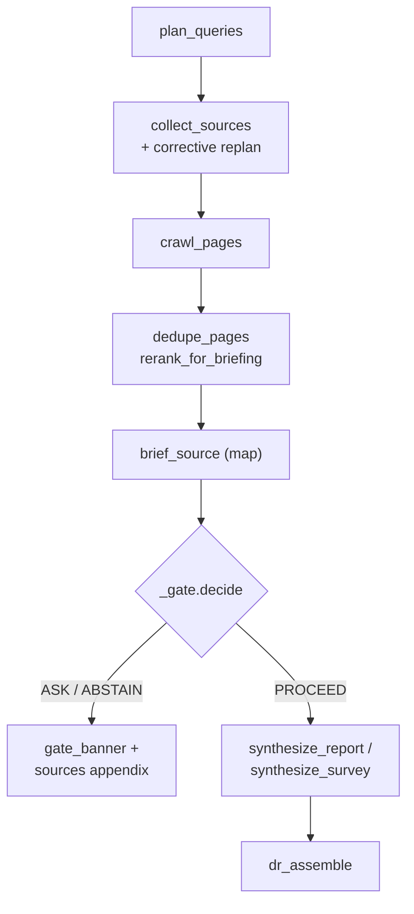
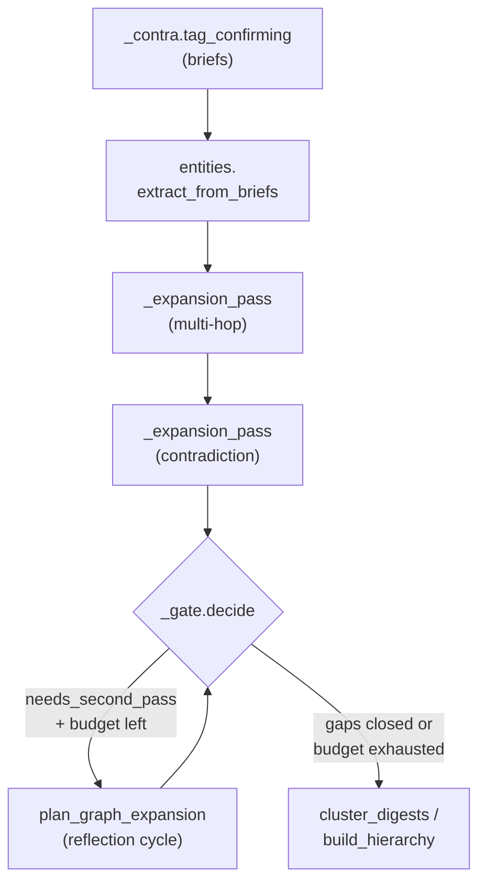
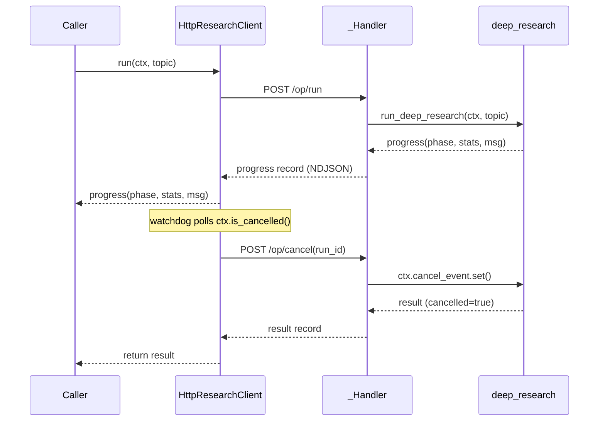
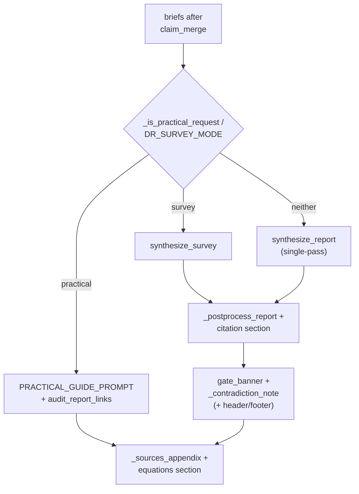

# research

## What it does

This is the Deep Research ("Ultra Search") engine: given a topic, it plans search queries, crawls and extracts web pages, clusters and merges the resulting claims, runs a dedicated pass to disprove its own findings, optionally enriches scholarly topics with a citation graph, and synthesizes the result into one cited Markdown report. [`research/deep_research.py`](../../research/deep_research.py)'s `run_deep_research` is the entry point every caller reaches through [`research/research_api.py`](../../research/research_api.py) / [`research/research_client.py`](../../research/research_client.py).

It is a separate execution path from the one-shot `search` tool in [`research/search.py`](../../research/search.py): that module answers one turn with a quick web lookup, while `run_deep_research` can run for minutes, is bounded by the `DR_*` caps in [`research/dr_settings.py`](../../research/dr_settings.py) so it never runs away, tolerates any single bad source without aborting the run, is cooperatively cancellable via `ctx.cancel_event`, and persists its state to disk ([`research/dr_state.py`](../../research/dr_state.py)) so a run survives across sessions.

## How it works

### The research pipeline

`collect_sources` ([`research/dr_collect.py`](../../research/dr_collect.py)) loops on itself: `coverage_signals` and the `DR_MIN_SOURCES`/`DR_TARGET_SOURCES`/`DR_MIN_UNIQUE_DOMAINS` targets decide whether another corrective round runs, and a round that adds zero new sources stops the loop even under `DR_FORCE_EXHAUSTIVE`. The decision gate (`_gate.decide`, called from `run_deep_research`) can end the run with an `ASK`/`ABSTAIN` banner and the source appendix before synthesis ever runs, a report is never fabricated to look confident over thin or contradicted evidence.

Crawling ([`research/dr_crawl.py`](../../research/dr_crawl.py)) runs structured source adapters ([`research/source_adapters.py`](../../research/source_adapters.py), Wikipedia/arXiv/Crossref) and the extraction cache ([`research/research_cache.py`](../../research/research_cache.py)) ahead of a live fetch, then gates every extraction through `classify_extraction` ([`research/dr_extract.py`](../../research/dr_extract.py), `GATE_OK`/`GATE_EMPTY`/`GATE_THIN`/`GATE_CHALLENGE`/`GATE_SHELL`/`GATE_NAV`) so a CAPTCHA page or a bare site-root link is quarantined with a reason code instead of becoming "evidence". `rerank_for_briefing` then fuses semantic relevance ([`research/rerank.py`](../../research/rerank.py)) with host authority ([`research/dr_urls.py`](../../research/dr_urls.py)) so the brief model only reads the strongest candidates.

A wish typed mid-search is folded into the topic through `steer.with_notes`/`steer.take` both before crawling and again right before synthesis, so a steering note can redirect what gets read and what gets written without restarting the run.

### Evidence expansion and the reflection loop

`_reflect` (in [`research/deep_research.py`](../../research/deep_research.py)) inspects the first-pass briefs for gaps, no strong confirming source, no contradiction evidence gathered, no entities extracted, a gate flagged as uncertain, and records why a second pass is worth running. The reflection loop then keeps re-querying only those gaps, via [`research/clustering.py`](../../research/clustering.py) clusters and the provenance graph ([`research/research_graph.py`](../../research/research_graph.py)) read by `plan_graph_expansion`, for as long as `reflect_budget`/`reflect_iters` (scoped by run depth) remain and a cycle still returns new briefs; one empty cycle stops it. Multi-hop expansion ([`research/entities.py`](../../research/entities.py)) and the contradiction pass ([`research/contradiction.py`](../../research/contradiction.py)) both route through the same `_expansion_pass`, sharing one visited-URL and visited-query set so neither can loop. Contradiction-tagged briefs are counted (`contradiction_summary`) but never merged into confirming evidence; [`research/claim_merge.py`](../../research/claim_merge.py)'s `merge_claims` only collapses near-duplicate *confirming* claims, preserving every source as provenance.

### The service boundary

[`research/research_api.py`](../../research/research_api.py) defines the `ResearchClient` contract; [`research/research_client.py`](../../research/research_client.py)'s `InProcessResearchClient` is the default and passes `ctx` straight through, so cancellation is exact. [`research/research_service.py`](../../research/research_service.py)'s `HttpResearchClient` is optional (`RESEARCH_BACKEND=http`) and cannot see the caller's `threading.Event` across a process boundary, so a Stop press only reaches the run because the client polls its own `ctx` on a watchdog thread and relays through a server-issued `run_id`; `HttpResearchClient.cancellation_mode` reports this honestly as `"run_id"`, not `"shared_event"`.

### Synthesis and assembly

[`research/dr_synthesis.py`](../../research/dr_synthesis.py) picks the document shape: a practical request (profile category + `_is_practical_request`) gets a bookable-options list and skips the decision-gate banner and contradiction note entirely, there is no confidence tier to report on a list of tour prices. Survey mode plans an outline (`plan_report_outline`), writes each section as its own LLM call so a broad topic can run to many pages, and writes its own title/abstract/table of contents, which is why its provenance (`provenance_footer`) is appended at the end instead of the `_report_header` the single-pass path prepends. [`research/dr_assemble.py`](../../research/dr_assemble.py) supplies everything in the synthesized report that is never generated: the trust-mix header, the OpenAlex citation-lineage table built verbatim from [`research/citation_graph.py`](../../research/citation_graph.py)'s brief (never model-recalled counts), the contradiction note, the tiered source appendix, and `_deterministic_digest_report`, the evidence-bound fallback used when the LLM reduce comes back empty twice, so a run never ends in a dead stub. `audit_report_links` additionally repairs or strips any link the model shortened or invented against the actually-collected URLs before a practical report ships.

## Where it lives

| Area | Modules | Covers |
|---|---|---|
| Orchestration | [`research/deep_research.py`](../../research/deep_research.py) | `run_deep_research` wires every stage, re-exports the pipeline's test/patch surfaces, and installs the `_SettingsView` proxy onto [`research/dr_settings.py`](../../research/dr_settings.py) |
| Query planning & policy | [`research/dr_collect.py`](../../research/dr_collect.py), [`research/dr_policy.py`](../../research/dr_policy.py) | `plan_queries`, `collect_sources`, `coverage_signals`, the corrective re-plan loop, practical-vs-survey intent, per-depth caps (`_resolve_caps`) |
| Crawl & extraction | [`research/dr_crawl.py`](../../research/dr_crawl.py), [`research/dr_extract.py`](../../research/dr_extract.py), [`research/dr_urls.py`](../../research/dr_urls.py), [`research/source_adapters.py`](../../research/source_adapters.py) | Fetching, the extraction quality gate (`classify_extraction`/`GATE_*`), URL/authority/source-type scoring, the Wikipedia/arXiv/Crossref adapters |
| Caching & service boundary | [`research/research_cache.py`](../../research/research_cache.py), [`research/research_api.py`](../../research/research_api.py), [`research/research_client.py`](../../research/research_client.py), [`research/research_service.py`](../../research/research_service.py) | The on-disk extraction cache, the `ResearchClient` contract, the in-process backend, the optional HTTP backend and its NDJSON progress/cancel wire protocol |
| Entities, clustering & graph | [`research/entities.py`](../../research/entities.py), [`research/clustering.py`](../../research/clustering.py), [`research/hierarchical.py`](../../research/hierarchical.py), [`research/hierarchy.py`](../../research/hierarchy.py), [`research/communities.py`](../../research/communities.py), [`research/claim_merge.py`](../../research/claim_merge.py), [`research/research_graph.py`](../../research/research_graph.py) | Multi-hop entity queries, lexical clustering, the recursive cluster hierarchy, Louvain community detection, claim dedup/merge, the entity↔source↔claim provenance graph |
| Contradiction & citations | [`research/contradiction.py`](../../research/contradiction.py), [`research/citation_graph.py`](../../research/citation_graph.py) | The disconfirmation pass and `contradiction_summary`; OpenAlex citation-lineage enrichment for scholarly topics |
| Synthesis & assembly | [`research/dr_synthesis.py`](../../research/dr_synthesis.py), [`research/dr_assemble.py`](../../research/dr_assemble.py), [`research/dr_brief.py`](../../research/dr_brief.py), [`research/dr_outline.py`](../../research/dr_outline.py), [`research/rerank.py`](../../research/rerank.py) | Per-source briefing, single-pass/survey synthesis, the deterministic header/appendix/digest assembly, the relevance reranker run before briefing |
| Supporting modules | [`research/dr_settings.py`](../../research/dr_settings.py), [`research/dr_state.py`](../../research/dr_state.py), [`research/dr_progress.py`](../../research/dr_progress.py), [`research/dr_timing.py`](../../research/dr_timing.py), [`research/dr_lang.py`](../../research/dr_lang.py), [`research/dr_math.py`](../../research/dr_math.py), [`research/dr_relevance.py`](../../research/dr_relevance.py), [`research/dr_calls.py`](../../research/dr_calls.py), [`research/formula_audit.py`](../../research/formula_audit.py), [`research/search.py`](../../research/search.py) | The `DR_*` runtime knobs, on-disk run state, progress/phase timing and ETA, output-language handling, LaTeX artifact repair/fidelity audit, relevance-term filtering, the LLM-call effort ladder, and the separate one-shot `search` tool |

## Constraints

- Every run is bounded by the `DR_*` caps resolved per depth (`quick`/`standard`/`deep`) in [`research/dr_policy.py`](../../research/dr_policy.py)'s `_resolve_caps`: max queries/pages/sources, reflection iterations and budget, and the report token ceiling. Raising a cap widens the run; it never removes the bound.
- Searching, crawling and briefing run in English throughout regardless of `out_lang`: that is where the sources are. Only the final document (and the planner's `core_topic` distillation) is written in the reader's language; `hop_anchor` and the relevance-term filters deliberately use the distilled `core_topic`, not the raw request, to avoid searching in the wrong language or matching on filler words.
- [`research/research_service.py`](../../research/research_service.py)'s HTTP backend returns `result["path"]` as a path on the machine that ran the research: same-host only. A remote caller must use `result["report"]` and ignore the path.
- Overrides (`apply_overrides`/`restore_overrides`) mutate `deep_research`'s module globals for the duration of one run; the HTTP service therefore serializes runs behind `_RUN_LOCK` rather than allowing concurrent runs with different knobs.
- `_fetch_page` and `_acquire_page` ([`research/dr_crawl.py`](../../research/dr_crawl.py)) refuse any URL that fails `_is_safe_public_url` ([`research/dr_urls.py`](../../research/dr_urls.py)), the SSRF guard, before ever issuing a request.
- [`research/dr_crawl.py`](../../research/dr_crawl.py)'s `_scrub` runs every fetched page through `injection_scan.scrub` (fails open) before it reaches a brief: a stranger's page gets a chance to carry instructions aimed at the model, not just at the reader.
- A run that produces no briefs at all distinguishes a briefing-model outage (`no_briefs_report`'s "silent" branch) from genuinely irrelevant pages, so an LM Studio outage is never reported to the user as "no sources exist for this topic".

## Coupling

- [`research/dr_settings.py`](../../research/dr_settings.py) reads its defaults from `config.py`'s `DR_*` constants; nothing in this domain hardcodes a knob value outside that one module.
- Every LLM call in the pipeline (`_think_call`, `call_llm_simple`) routes through [`research/dr_calls.py`](../../research/dr_calls.py), which is this domain's only contact point with the model layer (`llm.py`) and with the prompt templates in `prompts.py` (`QUERY_PLANNER_PROMPT`, `SOURCE_BRIEF_PROMPT`, `REPORT_SYNTHESIS_PROMPT`, `OUTLINE_PLANNER_PROMPT`, `SURVEY_SECTION_PROMPT`, `PRACTICAL_GUIDE_PROMPT`).
- [`research/search.py`](../../research/search.py)'s `raw_search_results` (the ddgs backend) is bound in [`research/dr_collect.py`](../../research/dr_collect.py) and is the one seam the test suites patch to fake retrieval; [`research/search.py`](../../research/search.py) also carries `outbound_blocked`, a legal-compliance check on outbound queries that is independent of Deep Research and shared with the one-shot search tool.
- The decision gate (`decision_gate`, imported as `_gate`) and graph-guided expansion (`graph_guided`, imported as `_gguided`) are called throughout [`research/deep_research.py`](../../research/deep_research.py) but live outside this domain's source set; they are this domain's two closest external dependents.
- Social-wall pages (VK/Telegram) are fetched through `social.py`'s `is_social_url`/`fetch_social_posts`, not scraped as ordinary HTML.
- Four front ends consume this domain only through [`research/research_api.py`](../../research/research_api.py)'s `ResearchClient` contract: the desktop Research tab, the agent's deep-research tool, the Telegram bot's direct bypass, and the Telegram ETA lookup. None of them import `deep_research` directly; changes to those consumers belong to their own domain pages.
