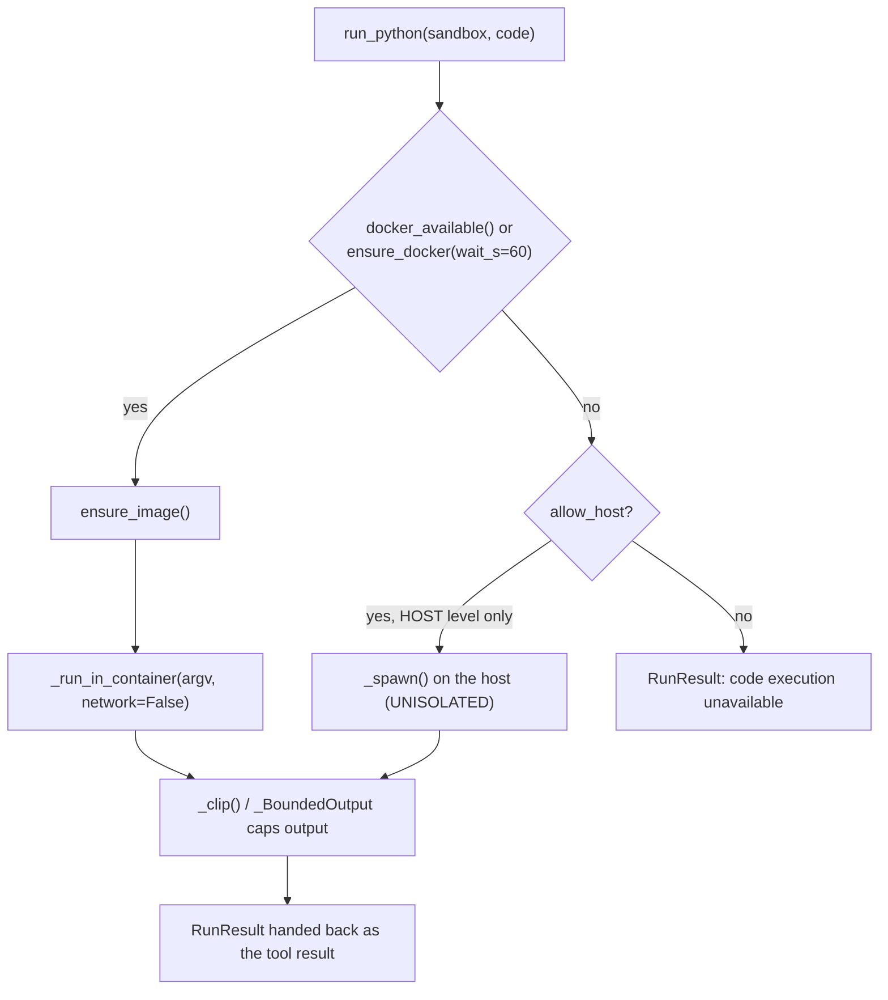
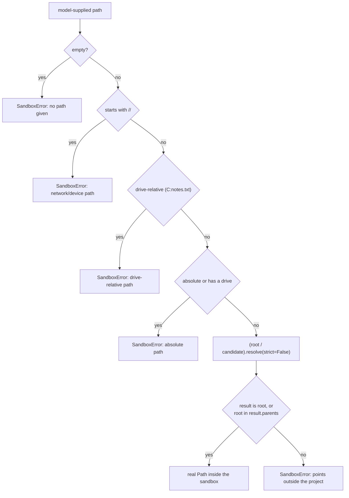
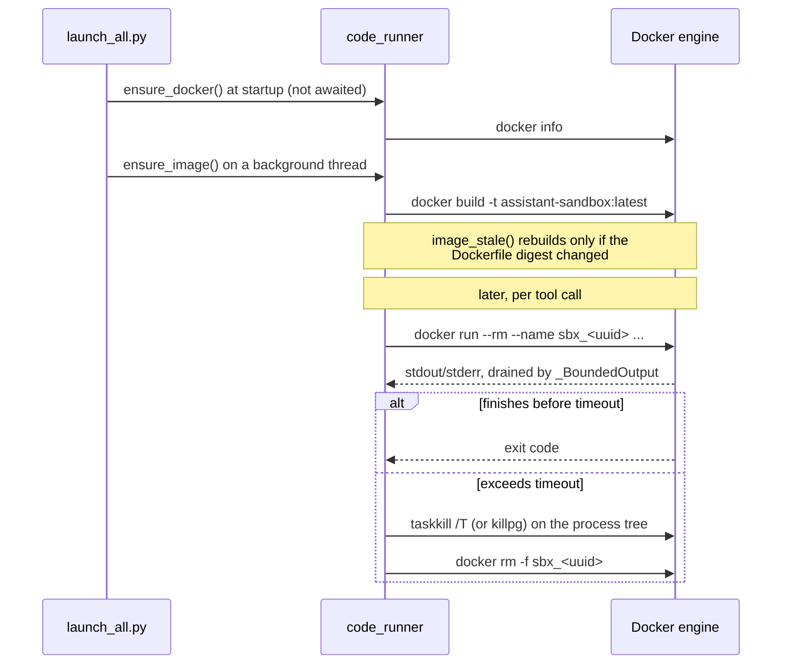

# sandbox

## What it does

The assistant's tools can read, write, and run arbitrary model-written code. That code is generated text, never a user's own click, so it is treated as hostile input on two fronts: it must not read or write outside one user's own folder, and it must not run unconstrained on the machine that hosts the bot. This domain is where both guarantees live, and the module docstrings state why:

- [`sandbox/sandbox_access.py`](../../sandbox/sandbox_access.py): "Handing someone a place to keep files is nothing like handing them the ability to execute code on your machine."
- [`sandbox/code_runner.py`](../../sandbox/code_runner.py): "Running model-written code from a Telegram chat directly on the host is a straight path to a wrecked machine."

Without it, a tool call like `run_code` or `edit_file` would either refuse everything (no coding agent at all) or run with the privileges of whoever started the bot process (one bad script away from a wrecked machine). [`sandbox/code_sandbox.py`](../../sandbox/code_sandbox.py) supplies the walled directory every file tool is confined to; [`sandbox/code_runner.py`](../../sandbox/code_runner.py) supplies the walled process every code-execution tool runs inside; [`sandbox/sandbox_access.py`](../../sandbox/sandbox_access.py) decides which of the two a given user is even allowed to reach; [`sandbox/code_visual_check.py`](../../sandbox/code_visual_check.py) adds a check that a script which drew a picture actually drew something readable.

## How it works

Four access levels gate what a user's tool calls may do, each a strictly stronger grant than the last ([`sandbox/sandbox_access.py`](../../sandbox/sandbox_access.py)):

```mermaid
stateDiagram-v2
    accTitle: Sandbox access ladder
    accDescr: Each level is a superset of the one below; an unrecognized or unreadable stored value always resolves to off.
    [*] --> off
    off --> files: may_use_files
    files --> code: may_run_code
    code --> host: allow_host_execution
```

`normalize()` maps anything unrecognized back to `off`, and `level_for()` returns `off` on a missing user or an unreadable `prefs` row. There is no code path in the module that turns "could not tell" into permission.

A `run_code` or `install_packages` call then picks a backend. The container is the default path whenever Docker answers; the host path exists only for the one user an administrator explicitly moved to `host`, and the engine being down never silently falls through to it on its own.

`_run_in_container` runs the script with `--network none`, `--read-only`, `--cap-drop ALL`, `--security-opt no-new-privileges`, and only the caller's sandbox directory mounted writable at `/work`; `install()` is the one call that gets `--network bridge`, since it is the only operation that needs the network, and it keeps the same memory/pid/cpu ceilings. `_spawn()` is the shared primitive underneath both backends: no stdin, a hard `timeout`, and `_kill_tree()` ends the whole process group on expiry so a forked grandchild cannot outlive the deadline. A named container (`sbx_<uuid>`) is required for the same reason: killing the [`docker`](../../docker) client alone would leave a `--rm` container still running at full CPU after the client reports the run as killed.

Every path a model supplies to a file tool passes through `Sandbox.resolve()` before it touches the filesystem:

`resolve()` runs on the *resolved* path, after following any symlink, which is what stops a directory junction inside the sandbox from pointing a later read or write outside it. `unpack()` sends every archive member name through the same `resolve()` call, which is the zip-slip defense: a member named `../../../../Windows/System32/x.dll` raises instead of extracting.

### Container lifecycle

The house image ([`docker/sandbox/Dockerfile`](../../docker/sandbox/Dockerfile), built as `assistant-sandbox:latest`) is built once and reused, not rebuilt per run. A per-script container is created, used, and torn down inside a single `run_python`/`install` call.

`image_stale()` compares a label baked into the image (`dockerfile_digest()`, a hash of `Dockerfile` and `assistant_tools.py`) against the current files, so a changed Dockerfile is rebuilt without the caller having to know that happened.

### Picture result check

A script that writes an image is not done when it exits 0: [`sandbox/code_visual_check.py`](../../sandbox/code_visual_check.py) exists because a script that ran without error still produced a visibly broken picture (boxes with a line drawn through them, a hand-placed flowchart with no `dot` available). `critique()` sends the newest image the script wrote to the vision model with a narrow prompt restricted to geometric defects (text cut off, overlapping labels, an empty canvas, arrows that miss their shapes), and `note_for()` turns any non-"OK" answer into a tool-result note telling the model to fix the script and rerun it, once per turn (`state["_visual_checked"]`, set by the caller in [`agent/tool_code_handlers.py`](../../agent/tool_code_handlers.py)).

## Where it lives

| Path | Role |
|---|---|
| [`sandbox/code_sandbox.py`](../../sandbox/code_sandbox.py) | [`Sandbox`](../../Sandbox) class: path containment (`resolve()`), read/write/edit, search, archive unpack/pack, per-owner root (`sandbox_for()`) |
| [`sandbox/code_runner.py`](../../sandbox/code_runner.py) | Backend selection (Docker vs host), `run_python()`, `install()`, process spawning, output clipping, container teardown |
| [`sandbox/sandbox_access.py`](../../sandbox/sandbox_access.py) | The `off`/`files`/`code`/`host` ladder, stored in a user row's `prefs["sandbox"]` |
| [`sandbox/code_visual_check.py`](../../sandbox/code_visual_check.py) | Vision-model pass over a script's newest output image |
| [`docker/sandbox/Dockerfile`](../../docker/sandbox/Dockerfile) | The `assistant-sandbox:latest` image definition: `python:3.12-slim` plus pillow/numpy/opencv/matplotlib/pandas/openpyxl/graphviz/pytest and friends |
| [`docker/sandbox/assistant_tools.py`](../../docker/sandbox/assistant_tools.py) | Helpers preinstalled inside the container (`import assistant_tools`): `dedupe`, `sharpness`, `same_scene_score`, `make_collage` |
| `runtime/sandboxes/<key>/` | One directory per user, created on first use by `sandbox_for()`; `<key>` is the owner id reduced to a safe alphabet |

## Constraints

| Constraint | Value / behavior |
|---|---|
| Script timeout | `DEFAULT_TIMEOUT` 60s, capped at `MAX_TIMEOUT` 300s |
| Output kept per run | `MAX_OUTPUT_CHARS` 8,000 chars (head `_HEAD_CHARS` 5,000 + tail), head and tail both kept since a traceback is at the end and its cause is at the start |
| Container resources | `CONTAINER_MEMORY` 2g, `CONTAINER_PIDS` 256, `CONTAINER_CPUS` 2 (env-overridable) |
| Container filesystem | `--read-only` root, `--tmpfs /tmp:rw,size=64m`, only the caller's sandbox mounted writable at `/work` |
| Network | `--network none` for script runs; `install()` alone gets `--network bridge` |
| One read | `MAX_READ_BYTES` 200,000 bytes; larger files must be searched, not read whole |
| One write | `MAX_WRITE_BYTES` 2,000,000 bytes |
| One unpack | `MAX_UNPACK_BYTES` 2 GiB (env `SANDBOX_MAX_UNPACK_BYTES`), `MAX_UNPACK_FILES` 100,000; archive-declared sizes are not trusted, the copy is counted as it streams |
| Directory listing | `MAX_LIST_ENTRIES` 400 per call |
| Secrets | `_spawn()` strips any host env var matching `TOKEN|SECRET|PASSWORD|PASSWD|API_HASH|API_KEY|_KEY$|CREDENTIAL|COOKIE` before a host-backend run sees it |
| Degradation | If the Docker engine is unreachable, code execution reports "unavailable" rather than silently running on the host; the host backend is reached only through `allow_host`, which only the `host` access level supplies |
| Access storage | The access level lives in the user row's `prefs` dict (no schema migration needed for a new level); any unrecognized or unreadable value resolves to `off` |

## Coupling

[`agent/tool_code_handlers.py`](../../agent/tool_code_handlers.py) is the sole caller that turns these primitives into model-facing tools (`read_file`, `write_file`, `edit_file`, `run_code`, `install_packages`, `unpack_archive`, `pack_archive`, `run_tests`, and others): it wraps every `code_sandbox.SandboxError` into a `[TOOL ERROR]` string the model can act on, consults `sandbox_access` before allowing `run_code`/`install_packages`/`run_tests`, and calls `code_visual_check.critique()` after a script writes a new picture.

[`bot/tg_tasks.py`](../../bot/tg_tasks.py) attaches a per-chat [`Sandbox`](../../Sandbox) to the turn's context via `code_sandbox.sandbox_for(chat_id)`. [`scripts/launch_all.py`](../../scripts/launch_all.py) starts the Docker engine and builds the house image on a background thread at app startup, so the first `run_code` call does not pay that cost. [`docker/sandbox/assistant_tools.py`](../../docker/sandbox/assistant_tools.py) ships inside the built image and is imported by scripts the sandbox runs, as well as loaded directly by [`agent/tool_code_handlers.py`](../../agent/tool_code_handlers.py)'s `dedupe_photos` handler outside the container.
