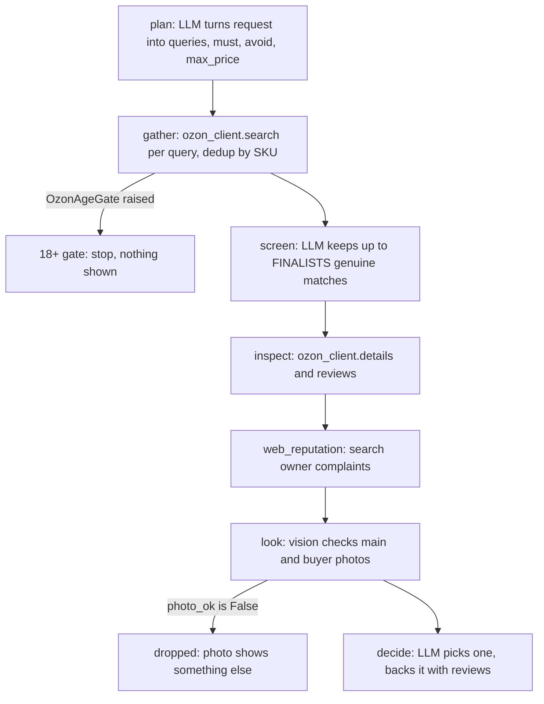
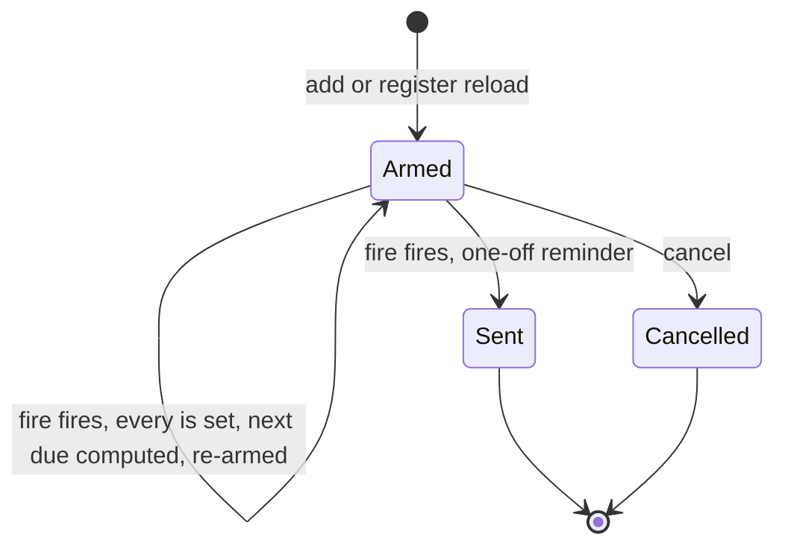
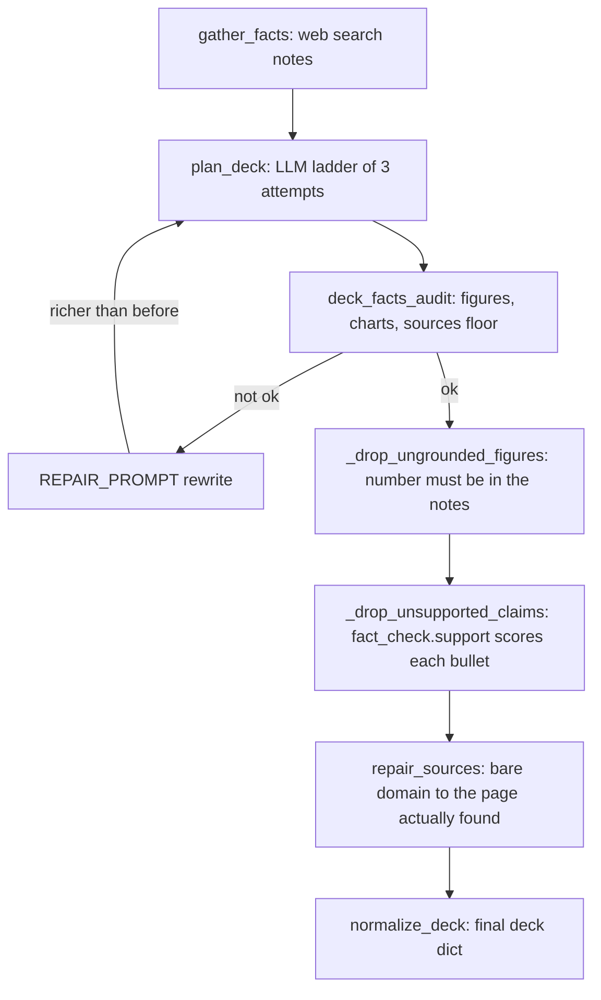

# services

## What it does

The assistant's agent loop reasons and calls tools; this domain is where those tools actually do their work against the outside world. Each service wraps one external source (a marketplace, a weather API, a VK/Telegram wall, a presentation file) and hands back either plain text the model can quote or a file the user can open. Two services carry their own LLM calls rather than being pure data fetchers: [`services/ozon_shopper.py`](../../services/ozon_shopper.py) plans, screens and decides a purchase, and [`services/slides.py`](../../services/slides.py) plans a deck and then checks its own planner's work against search notes before building the file. The rest -- [`services/weather.py`](../../services/weather.py), [`services/reminders.py`](../../services/reminders.py), [`services/social.py`](../../services/social.py), [`services/fact_check.py`](../../services/fact_check.py) -- are deterministic wrappers with no model in the loop, callable and unit-testable on their own.

## How it works

[`services/ozon_shopper.py`](../../services/ozon_shopper.py) turns a shopping request into one chosen product per need by routing every candidate through four separate judges before a model picks: a relevance/price filter (`is_accessory`, `max_price`), an LLM screen (`screen`), a vision check on the photo (`look`), and a web-reputation search (`web_reputation`). An 18+ category short-circuits before any of them run, because Ozon hides the whole category from a search that has not confirmed an age.

Each stage in `shop_item` narrows the candidate set by a different kind of evidence, so a cheap bait listing has to survive four unrelated checks, not one.

### Reminder lifecycle

[`services/reminders.py`](../../services/reminders.py) arms a `threading.Timer` per reminder and treats a Windows Timer-wait ceiling, a one-off due date, and a repeating schedule as three different outcomes of the same `_fire()` callback.

A reminder further out than the capped wait never actually "sleeps" for its full delay; it wakes early, finds itself not yet due, and re-arms, which is why a two-year reminder does not overflow the OS timer.

### Deck fact-grounding pipeline

[`services/slides.py`](../../services/slides.py) does not trust its own planner: `plan_deck` treats the LLM's deck JSON as a draft that three later passes can still strip of content.

`_drop_unsupported_claims` calls into [`services/fact_check.py`](../../services/fact_check.py)'s `support()`, so a bullet with the right number can still be removed when the sentence around that number is not what the notes said.

Outside these three shapes: [`services/weather.py`](../../services/weather.py) resolves a city name (`resolve_city`, with an LLM `correct_fn` retry on a typo or nickname), reads Open-Meteo's current or hourly forecast, and turns it into clothing advice either from an LLM advisor or a fixed temperature-band table; `what_to_wear_periods_for_loc` buckets the hourly points into morning/afternoon/evening windows. [`services/social.py`](../../services/social.py) classifies a URL as `vk` or `telegram` (`social_kind`) and dispatches to `extract_telegram_posts` (scrapes the auth-free `https://t.me/s/<channel>` mirror) or `extract_vk_posts` (the official `wall.get` API, skipped without `config.VK_TOKEN`). [`services/fact_check.py`](../../services/fact_check.py) runs MiniCheck (`lytang/MiniCheck-Flan-T5-Large`) over English-only text, chunking the reference notes and returning the maximum "supported" probability per claim across chunks.

The Ozon tools and the Telegram card renderer sit downstream of `ozon_shopper`/`ozon_client`: [`agent/tool_ozon_handlers.py`](../../agent/tool_ozon_handlers.py) wraps every Ozon call in `_owned`, which opens the asking user's own browser context (`ozon_client.use_owner`) so one Telegram user's chosen pickup point never leaks into another's. A handler that finds products appends them to `ctx.turn_products` (`_remember`); [`bot/tg_product_cards.py`](../../bot/tg_product_cards.py) then picks, from the model's final reply text, only the products the reply actually links to (`pick`), condenses the reply so it does not repeat what the cards will show (`condense`), and sends one Telegram photo card per product (`send_cards`).

## Where it lives

### Ozon shopping
| Path | Responsibility |
|---|---|
| [`services/ozon_client.py`](../../services/ozon_client.py) | Browser-driven Ozon API client: page fetch through the composer JSON endpoint, pure parsers (`parse_search`, `parse_details`, `parse_reviews`, `parse_filters`), age-gate detection (`_age_gated`, `OzonAgeGate`), pickup-point geocoding (`geocode`, `nearest_point`, `set_pickup_point`), and the browser pool (`_Browser`, `OZON_WORKERS` worker browsers, `MAX_CONTEXTS` per-user contexts each) |
| [`services/ozon_shopper.py`](../../services/ozon_shopper.py) | LLM-driven shopping pipeline: `plan`, `gather`, `screen`, `inspect`, `web_reputation`, `look`, `decide`, `shop_item`, `shop`, `shop_photo`, `clarify`, `report` |
| [`agent/tool_ozon_handlers.py`](../../agent/tool_ozon_handlers.py) | The agent-facing tools (`OZON_TOOL_NAMES`: `ozon_search`, `ozon_product`, `ozon_reviews`, `ozon_cart`, `ozon_set_location`, `ozon_shop`), per-user browser context via `_owned`/`_owner_of`, the shopping-cart file (`_cart_load`/`_cart_save`), and the seller-photo vision call (`_look_at_photos`) |
| [`bot/tg_product_cards.py`](../../bot/tg_product_cards.py) | Renders the Ozon products a reply links to as Telegram photo cards: `pick`, `condense`, `caption`, `keyboard`, `send_cards` |

### Weather
| Path | Responsibility |
|---|---|
| [`services/weather.py`](../../services/weather.py) | Open-Meteo geocoding and forecast (`geocode_city`, `resolve_city`, `fetch_current`, `fetch_hourly`), clothing advice (`_clothing_advice`, `periods_advise_fn`, `city_correct_fn`), and reply formatting (`what_to_wear`, `what_to_wear_periods_for_loc`, `format_forecast`) |

### Reminders
| Path | Responsibility |
|---|---|
| [`services/reminders.py`](../../services/reminders.py) | Timer-armed reminders backed by a JSON file: `register`, `add`, `pending`, `cancel`, `stop`, `_arm`/`_fire` |

### Slides
| Path | Responsibility |
|---|---|
| [`services/slides.py`](../../services/slides.py) | `plan_deck` (LLM plan + fact-grounding passes) and `build_pptx` (deterministic `.pptx` assembly: themes, charts, tables, stat bands) plus `pptx_audit` (geometry self-check: overlaps, off-slide boxes, text overflow) |

### Social
| Path | Responsibility |
|---|---|
| [`services/social.py`](../../services/social.py) | `fetch_social_posts` dispatch, `social_kind`/`is_social_url`, `extract_telegram_posts`, `extract_vk_posts` |

### Fact-check
| Path | Responsibility |
|---|---|
| [`services/fact_check.py`](../../services/fact_check.py) | `support()`: MiniCheck probability per claim against reference notes, consumed by [`services/slides.py`](../../services/slides.py)'s `_drop_unsupported_claims` |

## Constraints

| Condition | Behavior |
|---|---|
| Ozon serves the request from a VPN or datacenter IP | `OzonBlocked` is raised with a message naming `OZON_PROXY` or routing `ozon.ru` outside the VPN as the fix; `_fail()` in [`agent/tool_ozon_handlers.py`](../../agent/tool_ozon_handlers.py) tells the model not to retry |
| A search hits an 18+ category and no birthdate is configured | `OzonAgeGate` is raised; `OZON_BIRTHDATE` or `runtime/ozon_birthdate.txt` must hold a `ДД.ММ.ГГГГ` value before `confirm_age` can fill Ozon's own age modal |
| More than `MAX_CONTEXTS` (4) users are shopping on one worker browser | The least-recently-used browser context is saved (`storage_state`) and closed |
| Ozon pools a sibling family's reviews onto one card | `inspect`/`reviews()` keep only reviews whose `itemId` matches the exact SKU; `_dossier` flags a "BORROWED RATING" when fewer than `reviews // 50` of the family's reviews belong to this item |
| A reminder's due time is further out than 86400 seconds | The `threading.Timer` wakes early and re-arms, because a Windows wait cannot exceed `threading.TIMEOUT_MAX` (~49.7 days) |
| One owner already has `MAX_PER_OWNER` (20) pending reminders | `add()` raises `ValueError` rather than scheduling a 21st |
| `plan_deck`'s own planner output fails `deck_facts_audit` (fewer than half the slides carry a figure, no chart, or under 2 sources) | One `REPAIR_PROMPT` rewrite round runs; the rewrite is kept only if it has at least as many slides, figures and charts as before |
| A deck bullet's number is not within rounding of any number in the search notes | `_drop_ungrounded_figures` removes the bullet or stat before the deck is built |
| MiniCheck scores a figure-bearing bullet below 0.08 against the notes | `_drop_unsupported_claims` removes that bullet even though its number matched |
| `config.VK_TOKEN` is not set | `extract_vk_posts` returns `None` immediately; the crawler falls back to the venue's Telegram channel or site |
| `F5_TEST_RUN` is set, or `transformers`/the MiniCheck model fails to load | `fact_check.support()` returns `None`; callers treat an unchecked claim as unchecked, not as false |

## Coupling

- [`agent/graph_fastpath.py`](../../agent/graph_fastpath.py)'s `_UNTRUSTED_DATA_TOOLS` marks `ozon_product`, `ozon_reviews` and `ozon_shop` (alongside `search` and `read_clipboard`) as tools whose output is third-party text for the prompt-injection guard in [`agent/graph_personality.py`](../../agent/graph_personality.py).
- [`agent/tools.py`](../../agent/tools.py) registers `_handle_weather_forecast` and imports `OZON_TOOL_NAMES` from [`agent/tool_ozon_handlers.py`](../../agent/tool_ozon_handlers.py) to wire the Ozon tools into the agent's tool table.
- [`bot/tg_tasks.py`](../../bot/tg_tasks.py) reads `ctx.turn_products` after a turn and calls `tg_product_cards.condense`/`send_cards` to follow a reply with photo cards.
- [`bot/tg_bot.py`](../../bot/tg_bot.py) calls `reminders.register` at startup (to re-arm pending reminders from the JSON file) and `reminders.stop` at shutdown.
- [`research/dr_crawl.py`](../../research/dr_crawl.py) calls `social.fetch_social_posts` for VK/Telegram venue URLs the research crawler encounters.
- [`bot/tg_weather.py`](../../bot/tg_weather.py) and [`gui/gui_weather_tab.py`](../../gui/gui_weather_tab.py) both call into [`services/weather.py`](../../services/weather.py) for the Telegram and desktop surfaces, sharing one clothing-advice prompt so the two surfaces never disagree.
- [`agent/tool_ozon_handlers.py`](../../agent/tool_ozon_handlers.py)'s `_look_at_photos` builds its numbered photo sheet through `photo_search.make_sheet` and fetches each image through `dr_urls.safe_get`, the same redirect-safety path [`services/ozon_shopper.py`](../../services/ozon_shopper.py)'s `_see` uses.
- [`services/ozon_shopper.py`](../../services/ozon_shopper.py) and [`services/slides.py`](../../services/slides.py) both call `llm.call_llm_simple` and `utils.safe_json_from_llm` for their structured LLM steps, and both apply the Gemma4 no-think prefill from `llm.py` to keep a JSON-only step from burning its budget on reasoning.
