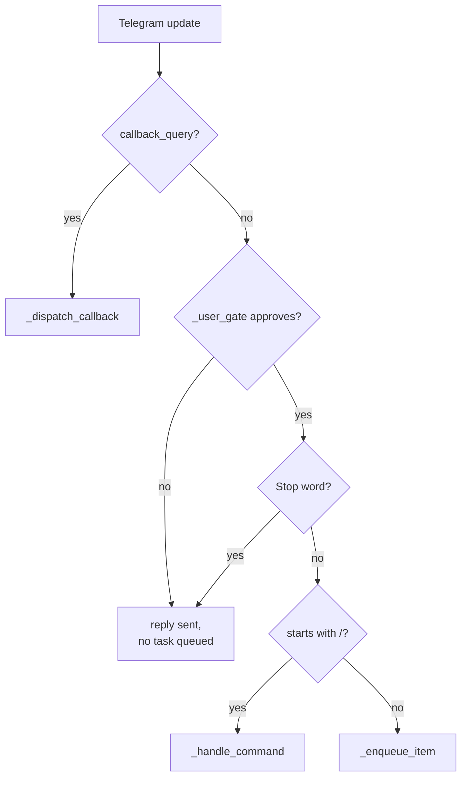
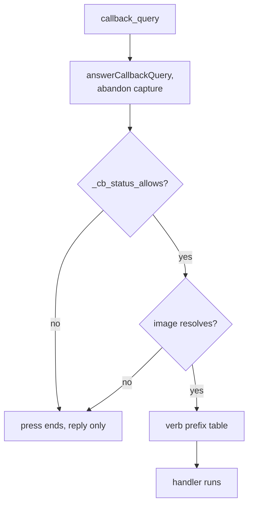
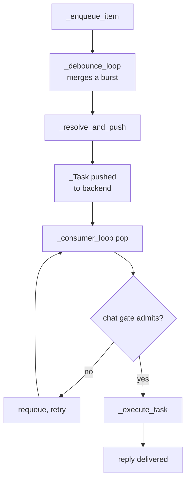
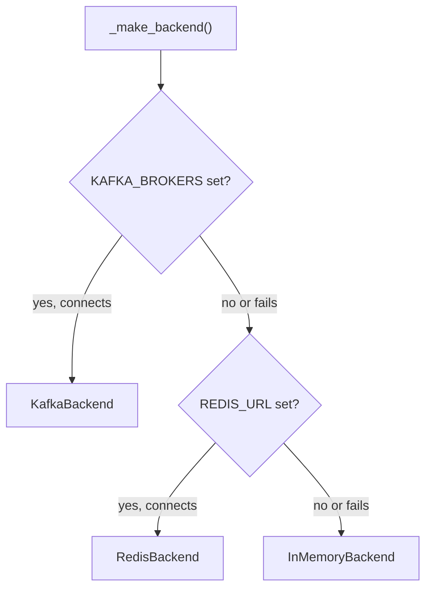

# telegram-bot

## What it does

The Telegram bot is how a user reaches the shared agent (drawing, search, music, video,
documents, Ozon shopping) from a phone instead of the desktop GUI, with every chat getting
its own account, its own conversation state, and a fair turn at the one GPU the whole
deployment shares. Without it the agent core has no multi-user front door: [`bot/tg_bot.py`](../../bot/tg_bot.py)
and its mixins turn Telegram's update stream into gated, queued, per-chat turns that
`graph.invoke()` can run safely alongside each other, each on its own scoped copy of the
shared context so one chat's working image, memory and cancel button never touch another's.

Registration is approval-gated (name, then password, then an admin's yes/no) rather than
open signup, because the bot runs against a single shared GPU and a single shared account
of API keys: every new chat is a cost and a capability grant, not a free action.

## How it works

### Update routing

A `callback_query` (an inline-button tap) and an ordinary `message` are different update
shapes with different routers: a callback never crosses the registration gate a typed
message must clear, because Telegram's inline buttons never expire and a banned or
logged-out chat's old keyboard must still be refused. `_dispatch` ([`bot/tg_dispatch.py`](../../bot/tg_dispatch.py))
tests for a callback first; everything else, the private-chat check, forwarded-message
handling, `_user_gate`, the `⛔ Stop` short-circuit, and only then the debounce queue, runs
on the message path alone.

A slash command (`_handle_command`, [`bot/tg_commands.py`](../../bot/tg_commands.py)) and a plain message both end a
turn without ever entering the per-chat debounce buffer that batches a burst of ordinary
text into one task, a command is control, answered immediately.

### Callback routing

`_dispatch_callback` ([`bot/tg_callbacks.py`](../../bot/tg_callbacks.py)) runs three unconditional steps before any of
its ~30 button handlers: acknowledge the tap (`answerCallbackQuery`), abandon any armed
text-capture mode (📝 feedback, ✏️ rename, 🔑 change password, …) so a stray button press is
never filed as the answer to one of those prompts, and re-check the account's status, since
a callback has no equivalent of the message path's `_user_gate`. A verb button
(`upscale:ab12cd`) also carries the id of the picture it sits under, resolved before the
verb table runs, so a press under a picture that was since cleaned up ends the request
there instead of silently acting on whichever image happens to be current.

Admin actions (`admin_approve:`, `bcast:`) and a request's own `cancel:` button are the one
exception: `_CB_SELF_AUTHORIZING` ([`bot/tg_bot.py`](../../bot/tg_bot.py)) skips the account-status recheck for
them because they authorize the *presser* (`callback_query.from`), not the chat the button
happens to sit in, a demoted admin's old panel message must not keep approving users, and a
stranger in a group must not cancel someone else's request.

### Queue and task lifecycle

A burst of fragments from one chat is merged into a single task before it ever reaches the
queue backend: `_enqueue_item` ([`bot/tg_queue.py`](../../bot/tg_queue.py)) starts (or feeds) a per-chat
`_debounce_loop` thread that waits out a quiet period, 1.8s by default, capped at 7s, longer
for a forwarded message whose instruction may arrive a few seconds later, then hands the
whole batch to `_resolve_and_push` ([`bot/tg_resolve.py`](../../bot/tg_resolve.py)), which decides what kind of task it
is and pushes one `_Task` ([`bot/tg_queue_backends.py`](../../bot/tg_queue_backends.py)). A forward that lands after the
debounce, while that chat's previous task still waits unstarted (at most two minutes old), is folded
into it by `_join_waiting` instead of becoming a second task. `_consumer_loop` pops from the
backend and admits at most two tasks per chat: a fresh task always runs alone, and a second
is admitted only once the first has announced (via `ctx.set_stage`) that it reached a slow,
backgroundable phase such as a render or a web crawl.

`_execute_task` ([`bot/tg_tasks.py`](../../bot/tg_tasks.py)) gives the task its own `_scoped_ctx` ([`bot/tg_bot.py`](../../bot/tg_bot.py)): a
shallow copy of the shared `Context` that shares the expensive global locks (model, ASR,
TTS) but gets a fresh cancel event, session memory, pinned facts and image state, so two
chats running at once cannot see or cancel each other's turn. A text that arrives for a chat
*already* running a task takes a third path, neither queue nor debounce: `_try_steer`
([`bot/tg_tasks.py`](../../bot/tg_tasks.py)) drops it into that task's own `steer.Inbox`, which the running turn reads
at its own checkpoints instead of starting a second, overlapping turn.

Cancellation has three distinct scopes: `⛔ Stop` / `/cancel` (`_stop_and_report`) drops
every queued and running thing for the chat; the per-request `⛔` under a status message
(`_cancel_task`) drops only that one task; and `busy:cancel:<id>` (`_run_cancellable`,
[`bot/tg_queue.py`](../../bot/tg_queue.py)) cancels ad-hoc work that a button started outside the queue entirely
(lyric polishing, voice-clone synthesis). A crash mid-task is recovered from
[`tg_inflight.json`](../../tg_inflight.json): `_write_inflight` journals every running and merely-pushed task, and
`_recover_inflight` offers each affected chat a retry button on the next start.

### Registration and account state

A chat with no `_User` row goes through `_user_gate` ([`bot/tg_registration.py`](../../bot/tg_registration.py)): name, then
password, then (unless the chat is on the pre-configured admin list) a pending state an
admin must approve or reject from the inline buttons `_user_gate` sends them. An approved
account can still be locked at the *session* level, `reg_state == "awaiting_login"` after a
logout, independently of the account's own `status` in `_UserStore`
([`bot/tg_userstore.py`](../../bot/tg_userstore.py), SQLite with WAL and a rolling backup after every write).

```mermaid
stateDiagram-v2
    accTitle: Legal transitions of an account's registration and status state
    accDescr: A banned or logged-out account cannot reach Approved by replaying an old button; only a correct password or an explicit admin action moves it there.
    %% source: bot/tg_registration.py (_user_gate), bot/tg_accounts.py (approve_user/reject_user/ban), bot/tg_userstore.py (_User.status)
    [*] --> Unregistered
    Unregistered --> AwaitingName : first message
    AwaitingName --> AwaitingPassword : name accepted
    AwaitingPassword --> Pending : ordinary user
    AwaitingPassword --> Approved : pre-configured admin
    Pending --> Approved : admin approves
    Pending --> Rejected : admin rejects
    Approved --> LoggedOut : session logs out
    LoggedOut --> Approved : correct password
    Approved --> Banned : admin bans
```

`_Session` ([`bot/tg_sessions.py`](../../bot/tg_sessions.py)) carries the rest of a chat's standing state, history,
image register, menu, every armed "wait for the next message" flag, as one JSON row per
chat in [`tg_sessions.json`](../../tg_sessions.json), loaded and locked through `_Store`. A photo or video the user
sent, or the bot delivered, is logged into `sess.image_log` (capped at 12 entries, see
Constraints) so a later reply or button can resolve back to the exact file, and
`tg_artifacts_store.py`'s separate SQLite table makes that survive a restart for kinds
`image_log` does not cover (songs, decks, delivered videos).

### Queue backend selection

`_make_backend` ([`bot/tg_queue_backends.py`](../../bot/tg_queue_backends.py)) tries `KAFKA_BROKERS`, then `REDIS_URL`, then
falls back to the in-process `InMemoryBackend`; [`docs/queue_backend_decision.md`](../queue_backend_decision.md) records why
production leaves `KAFKA_BROKERS` unset on purpose. `KafkaBackend` is FIFO by construction,
partition order cannot be reordered client-side, so putting it in the request path would
let one chat's ten queued jobs block every other chat behind them, which is the exact
complaint Redis's round-robin `InMemoryBackend`/`RedisBackend` fairness exists to fix.

All three backends implement the same round-robin fairness contract except Kafka
(`_Backend.service_order`/`tasks_ahead`, used to quote a queue position and ETA back to the
user) and the same per-chat `drop_chat`/`drop_task` used by Stop and the per-request cancel.

### Rendering and delivery

[`bot/tg_markup.py`](../../bot/tg_markup.py) converts the agent's Markdown into Telegram HTML and splits long replies
on tag boundaries (`_split_html`) rather than character counts, because Telegram rejects a
message whose markup is malformed and a rejected *edit* deletes the status message the user
was reading. [`bot/tg_transport.py`](../../bot/tg_transport.py) owns the retrying HTTP calls to `api.telegram.org`,
keyboard-row width fitting (`fit_rows`), and the photo/video/document/voice send paths with
their parse-mode fallbacks. `TelegramBot` itself ([`bot/tg_bot.py`](../../bot/tg_bot.py)) is a single class built
from every mixin in this domain (`AdminMixin`, `CallbackMixin`, `CommandsMixin`,
`DispatchMixin`, `QueueMixin`, `RegistrationMixin`, `ResolveMixin`, `TaskRunnerMixin`,
`TransportMixin`, plus one mixin per Creativity-menu flow), the split across files is a
source-organization choice; at runtime it is one object with one `_store`, one `_backend`
and one set of per-chat locks.

## Where it lives

| Area | Path | Owns |
|---|---|---|
| Routing & lifecycle | [`bot/tg_bot.py`](../../bot/tg_bot.py) | `TelegramBot` class, mixin assembly, lifecycle (`start`/`stop`), `_scoped_ctx`, the image register, admin-badge and help text |
| Routing & lifecycle | [`bot/tg_dispatch.py`](../../bot/tg_dispatch.py) | Long-poll loop, `_dispatch` router, reply-target and forwarded-message resolution |
| Routing & lifecycle | [`bot/tg_callbacks.py`](../../bot/tg_callbacks.py) | Inline-button router and every `_cb_*` handler |
| Routing & lifecycle | [`bot/tg_resolve.py`](../../bot/tg_resolve.py) | `_resolve_and_push`: decides what kind of task a debounced batch is |
| Routing & lifecycle | [`bot/tg_commands.py`](../../bot/tg_commands.py) | Every `/slash` command |
| Routing & lifecycle | [`bot/tg_queue.py`](../../bot/tg_queue.py) | Debounce buffer, cancellation bookkeeping, crash-recovery journal, watchdog |
| Routing & lifecycle | [`bot/tg_queue_backends.py`](../../bot/tg_queue_backends.py) | `_Task` record, `InMemoryBackend`/`RedisBackend`/`KafkaBackend`, `_make_backend` |
| Routing & lifecycle | [`bot/tg_sessions.py`](../../bot/tg_sessions.py) | `_Session` state and the `_Store` JSON persistence behind it |
| Routing & lifecycle | [`bot/tg_tasks.py`](../../bot/tg_tasks.py) | `_execute_task`/`_run_task_inner`: running one queued task to completion and delivering the result |
| Accounts | [`bot/tg_registration.py`](../../bot/tg_registration.py) | `_user_gate`: registration, login, and every armed text-capture mode |
| Accounts | [`bot/tg_accounts.py`](../../bot/tg_accounts.py) | approve/reject/ban/admin operator actions, account self-service menu, broadcast |
| Accounts | [`bot/tg_userstore.py`](../../bot/tg_userstore.py) | SQLite `_User`/usage store, password hashing (scrypt v3, legacy upgrade path) |
| Accounts | [`bot/tg_admin.py`](../../bot/tg_admin.py) | The live admin snapshot and console shared with the desktop GUI |
| Transport & rendering | [`bot/tg_transport.py`](../../bot/tg_transport.py) | HTTP calls to Telegram, message/photo/video/document/voice delivery |
| Transport & rendering | [`bot/tg_markup.py`](../../bot/tg_markup.py) | Markdown→Telegram-HTML, tag-safe splitting |
| Transport & rendering | [`bot/tg_strings.py`](../../bot/tg_strings.py) | The full message catalogue and button-label lookup (`_t`/`_b`) |
| Transport & rendering | [`bot/tg_keyboards.py`](../../bot/tg_keyboards.py) | Reply- and inline-keyboard builders |
| Support | [`bot/tg_links.py`](../../bot/tg_links.py) | Reading a linked page or video into the turn |
| Support | [`bot/tg_sandbox_links.py`](../../bot/tg_sandbox_links.py) | Tap-to-download deep links for sandbox files |
| Support | [`bot/tg_local_api.py`](../../bot/tg_local_api.py) | Self-hosted Bot API server for files over Telegram's cloud 20 MB limit |
| Support | [`bot/tg_product_cards.py`](../../bot/tg_product_cards.py) | Ozon answers rendered as tappable product cards |
| Support | [`bot/tg_reply_shape.py`](../../bot/tg_reply_shape.py) | Search-answer shape: queries, footnotes, sources list |
| Support | [`bot/tg_depth.py`](../../bot/tg_depth.py) | Per-kind quota accounting and deep-research depth/ETA |
| Support | [`bot/tg_artifacts_store.py`](../../bot/tg_artifacts_store.py) | Durable, restart-safe registry of every delivered file |
| Support | [`bot/tg_library.py`](../../bot/tg_library.py) | Per-chat document library, `/status`, report-file delivery |
| Creativity flows | [`bot/tg_characters.py`](../../bot/tg_characters.py), `tg_lora_collect.py`, `tg_songs.py`, `tg_music.py`, `tg_cover.py`, `tg_lyrics.py`, `tg_video.py`, `tg_continue.py`, `tg_restyle.py`, `tg_audiobook.py`, `tg_anim_voices.py`, `tg_voice_clone.py`, `tg_voice_library.py`, `tg_weather.py` | One multi-turn button-armed flow each (session state + background render), sharing the preamble/cancel conventions above |

## Constraints

| Constraint | Why it matters |
|---|---|
| `callback_data` is capped at 64 bytes (Telegram) | Image ids are 8 hex characters (`_new_image_id`); a verb-with-id button is `"<verb>:<id>"` |
| `redirect_data_dir()` must run before constructing a `TelegramBot` in a test | Every persistent path ([`tg_users.db`](../../tg_users.db), [`tg_sessions.json`](../../tg_sessions.json), the queue backend) is module-level; skipping it writes fixtures into the live store |
| `KafkaBackend` is FIFO-only | Must stay out of the request path ([`docs/queue_backend_decision.md`](../queue_backend_decision.md)); one chat's backlog would block every other chat |
| Redis must be 6.0.6+ | `RedisBackend`'s pop script uses `LPOS`, absent on older Redis; the suite asserts the server version so this fails as "too old," not an opaque Lua error |
| Group chats are refused outright | `_dispatch` answers `group_chat` and returns for any non-private chat type; registration and passwords never run in a group |
| `TARGET_TTL_S` = 15 minutes | A picture pointed at by reply or button stops being "the" target after this; a stale pointer does not silently redirect a later, unrelated message |
| `_IMAGE_LOG_MAX` = 12 entries per chat | Oldest register entries are dropped first; a picture past that window needs `pick:latest` or a fresh upload to reach again |
| A Telegram inline keyboard never expires | Every callback handler that is not in `_CB_SELF_AUTHORIZING` must pass `_cb_status_allows`; an old button on a since-banned or logged-out chat must not still act |
| `_debounce_loop` runs one thread per active chat | A quiet period, not a fixed timer: default 1.8s, capped 7s; a forwarded message's instruction gets a longer window (15s, capped 45s) since it is typed a few seconds after the forward |
| At most two tasks run per chat concurrently | A second slot opens only after the first announces a slow phase (`_INTERRUPTIBLE_STAGE_KEYWORDS`); a byte-identical repeat of the running task's text is never admitted as the "quick" one |

## Coupling

Depends on the agent core for the actual turn: `get_ctx`/`get_graph`/`get_base_state`
callbacks supplied at construction, `graph.build_graph`/`graph.invoke`, and `intent.read`
for every model-backed routing decision this domain makes (is this a name or a request, does
this message need an image choice, what does a forwarded voice note's follow-up ask for).
Also reaches into `config.py` for env-driven tuning (`TG_WORKERS`, `TG_WATCHDOG_S`,
`TG_SCRYPT_N_LOG2`, image aspect/quality tables), `weather.py`, `music.py`, `voice_clone.py`,
`audiobook.py`, `cover.py`/`remix.py`, `lyrics_craft.py`, `style_presets.py`/
`animate_presets.py`, `deep_research.py`, `steer.py`, `turn_trace.py`, `chatlog.py`, and
`sandbox_access.py`/`code_sandbox.py` for the per-chat sandbox grant.

The desktop GUI shares the same `graph`/`ctx` callbacks and reads this domain's state back
out: `admin_snapshot()` ([`bot/tg_admin.py`](../../bot/tg_admin.py)) feeds both the in-chat admin panel and the
desktop "Админка" tab from one snapshot, and `get_queue_stats()` ([`bot/tg_queue.py`](../../bot/tg_queue.py)) is what
the GUI's status display reads. Files this domain delivers are archived through
`nice_names`, a module owned elsewhere, so a Telegram-delivered file and a desktop-generated
one land in the same naming scheme.
