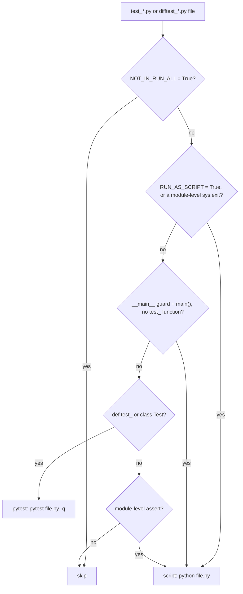
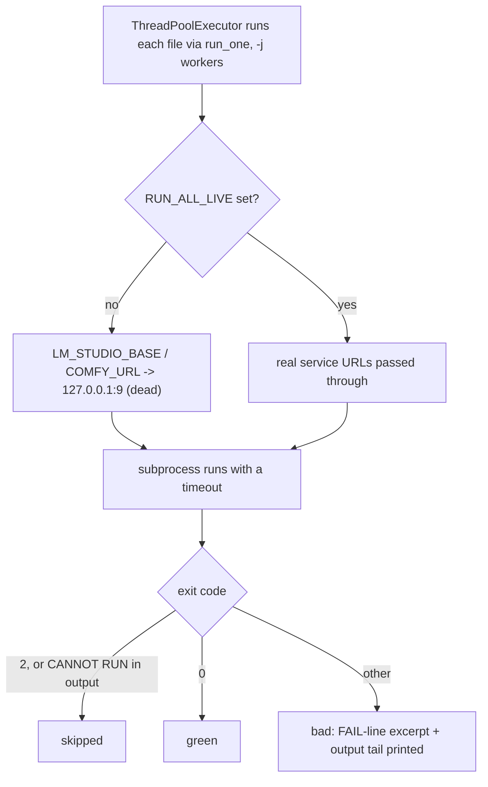

# testing

## What it does

[`tests/`](../../tests) holds two populations that look like one directory but serve different jobs. The `test_*.py` and `difftest_*.py` files are the regression suite: offline, deterministic, meant to run unattended and catch a real regression before it ships. Everything else in [`tests/`](../../tests), `eval_harness.py`, `lmstudio_harness.py`, `role_live.py`, `transfer_benchmark.py`, and the rest, is a harness or probe meant to be invoked by hand, one at a time, against a live LM Studio or ComfyUI, to score an answer, reproduce a bug, or benchmark a pipeline change.

[`tests/run_all.py`](../../tests/run_all.py) exists because `pytest tests/` cannot run the first population at all: collection imports every file in the directory, and importing a script-style suite executes it immediately and calls `sys.exit`, which aborts the whole pytest session with `INTERNALERROR` before a single test runs. `run_all.py` reads each file's source, decides whether it is a script or a pytest module, and runs it the way that file expects, which is the only way the suite runs as one command at all.

## How it works

### Classifying a file before it ever executes

`run_all.py` never imports a candidate file to find out what it is; it parses the source text and the AST. A regex check or a `sys.exit`/`assert` anywhere at module level (including inside a module-level `if`/`try`, which is not a new scope) marks a file a script; a `def test_` or `class Test` marks it pytest. Two explicit opt-outs win over both: `NOT_IN_RUN_ALL = True` drops a file from the sweep entirely (a live external-service audit, or an interactive tool with no pass/fail of its own), and `RUN_AS_SCRIPT = True` forces script dispatch on a file that does have `test_` functions, because pytest runs them in definition order and ignores the explicit order a `main()` wants.

`classify()` decides script vs. pytest vs. skip from the source text alone, before any file executes, so a module-level `sys.exit` can never abort pytest's own collection pass.

### Dispatch, isolation, and reporting

`run_all.py` hands the classified work list to a `ThreadPoolExecutor` (`-j`, default 24) and runs each file in its own subprocess with a timeout (`--timeout`, default 600s). Every subprocess gets `F5_TEST_RUN=1`, which `lmstudio._lms_unload_all` refuses to run under, one suite's context-overflow recovery path shells out to `lms unload --all`, and a full sweep would otherwise unload the operator's loaded model every time it ran.

Every script and pytest subprocess talks to a dead port unless `RUN_ALL_LIVE` is set, so a suite that forgot to stub its LLM or ComfyUI call fails fast offline instead of silently reaching the operator's live service.

A second, independent offline layer sits in [`tests/conftest.py`](../../tests/conftest.py): `pytest_configure` patches `socket.create_connection` and `socket.socket.connect` to raise `LiveServiceBlocked` on ports 1234 and 8000 (LM Studio and ComfyUI) unless `ALLOW_LIVE=1`. This catches a raw socket call that bypasses whatever a suite stubbed at the Python-API level, and only covers files pytest actually collects. [`tests/offline_guard.py`](../../tests/offline_guard.py) is a third, opt-in layer a suite imports explicitly: `offline_llm()` replaces `llm.send_to_lm_studio` with a stub that returns `None` (the documented "model unavailable" contract every caller already falls back on) and propagates the same stub to any already-imported module holding its own `from llm import send_to_lm_studio` binding; `no_model_management()` makes `lmstudio._lms_unload_all` and `lmstudio.reload_via_cli` raise `LiveModelTouched` instead of running, for a suite that must prove it never touches the operator's loaded model.

[`tests/conftest.py`](../../tests/conftest.py)'s `pytest_sessionfinish` also calls `qt_teardown.release_widgets` on any live `QApplication`: a `QWidget` that outlives its `QApplication` segfaults at interpreter shutdown in an order CPython does not define against Qt, which reads in a sweep as a crash with every check printed `PASS`. The same helper (`release`, `install`) is reused directly by GUI-facing scripts outside pytest, such as [`tests/shot_memory_center.py`](../../tests/shot_memory_center.py), which builds its own `QApplication` to render widgets for visual inspection.

`run_all.py` also flags, without failing the sweep, any pytest file whose `check`/`chk`/`_check`/`ok` helper only tallies instead of raising or asserting, pytest still collects its `test_` functions and each returns normally regardless of what the helper saw, so the file reports green without asserting anything.

### Suite naming and fixture conventions

Script-style suites (`test_*.py` files with a module-level `sys.exit`) share one shape across prefixes (`test_tg_*`, `test_image_*`, `test_llm_*`, `test_video_*`): a `check(name, cond, extra)` helper that increments module-level `OK`/`BAD` counters and prints `PASS`/`FAIL` per line, ending in `sys.exit(1 if BAD else 0)`. Pytest-style suites (`test_gui_*`, `test_video_control.py`-shaped files) use plain `def test_*()` functions with `assert`, collected and run by `pytest -q`. Both styles bootstrap their own import path with `sys.path.insert(0, ...)` at the top rather than relying on a package install, since the same file may also run as a standalone script; most also reconfigure `sys.stdout` to UTF-8 before importing anything else, to survive non-ASCII text on a console that defaults to a narrower codepage. Isolation for stateful code (`tg_userstore`'s SQLite-backed store, image lineage logs) is a fresh `tempfile.mkdtemp()` per test file, and a bot or graph `Context` is built as a bare `types.SimpleNamespace`/duck-typed stand-in rather than the real class, carrying only the attributes the code under test reads.

### The harness and probe population

Files in [`tests/`](../../tests) that `run_all.py` never touches (no `test_`/`difftest_` prefix) are invoked individually, usually with their own `argparse`/`sys.argv` interface, against a live model or GPU:

| File(s) | What it exercises |
|---|---|
| [`tests/eval_harness.py`](../../tests/eval_harness.py) + [`tests/eval_tasks.py`](../../tests/eval_tasks.py) | Scored LLM-judged evaluation of the Deep Research pipeline across nine metrics (retrieval quality, hallucination rate, citation coverage, etc.), with a trend log (`evaluation_trend.jsonl`) that flags a metric regression against the previous run |
| [`tests/lmstudio_harness.py`](../../tests/lmstudio_harness.py) | Hardened LM Studio client: asserts the served model id matches the requested id, preflights model availability, and serializes requests across processes with a file lock, to rule out the confounds (phantom model id, silent substitution) that produced a wrong conclusion in a past investigation |
| [`tests/hardening_probe.py`](../../tests/hardening_probe.py), [`tests/reasoning_lever.py`](../../tests/reasoning_lever.py), [`tests/reasoning_runtime_evidence.py`](../../tests/reasoning_runtime_evidence.py), [`tests/prefill_tools.py`](../../tests/prefill_tools.py), [`tests/concise_evidence.py`](../../tests/concise_evidence.py) | Real-model probes of the agent tool loop and the reasoning/direct-mode toggle, each capturing the exact outbound LM Studio payload and raw response rather than reconstructing it |
| [`tests/difftest_refactor.py`](../../tests/difftest_refactor.py), [`tests/difftest_knowledge_backends.py`](../../tests/difftest_knowledge_backends.py), [`tests/difftest_research_backends.py`](../../tests/difftest_research_backends.py) | Differential harnesses: capture deterministic output across two checkouts of a refactor, or run the identical operation sequence against both the in-process and the HTTP implementation of a service boundary and assert they agree |
| [`tests/math_live.py`](../../tests/math_live.py), [`tests/math_stage_trace.py`](../../tests/math_stage_trace.py), [`tests/sci_fidelity_audit.py`](../../tests/sci_fidelity_audit.py) | Formula/equation fidelity through the Deep Research pipeline's briefing, clustering, and synthesis stages, against real papers and a live model |
| [`tests/validate_concise.py`](../../tests/validate_concise.py), [`tests/validate_content_fidelity.py`](../../tests/validate_content_fidelity.py), [`tests/validate_geometry.py`](../../tests/validate_geometry.py), [`tests/validate_hires_contained.py`](../../tests/validate_hires_contained.py), [`tests/validate_identity.py`](../../tests/validate_identity.py), [`tests/tattoo_validation.py`](../../tests/tattoo_validation.py), [`tests/transfer_benchmark.py`](../../tests/transfer_benchmark.py), [`tests/role_live.py`](../../tests/role_live.py), [`tests/repro_portrait.py`](../../tests/repro_portrait.py) | Live image-editing validation against ComfyUI: identity preservation, resolution drift, edit containment, and standalone bug-repro scripts for a specific reported defect |
| [`tests/planbench_report.py`](../../tests/planbench_report.py) | Renders a scored report (fabrication risk, recovery difficulty) from an existing PlanBench JSON checkpoint; does not run anything live itself |
| [`tests/probe_devices.py`](../../tests/probe_devices.py), [`tests/verify_russtress.py`](../../tests/verify_russtress.py), [`tests/run_real.py`](../../tests/run_real.py) | Standalone print-based probes: audio input devices, the Russian stress-accent library's raw output, and a headless live Deep Research run for inspecting report quality |

[`run_tests_inventory.sh`](../../run_tests_inventory.sh) is a separate, simpler runner: it takes an output path and a list of files on argv, runs each under a 90s `timeout`, and appends one `PASS`/`TIMEOUT`/`FAIL($code)` line with duration to the output file. It does no classification, the caller supplies the exact file list, and does not go through `run_all.py`'s dead-port or `F5_TEST_RUN` protections.

## Where it lives

| Path | Role |
|---|---|
| [`tests/run_all.py`](../../tests/run_all.py) | Classifies and runs every `test_*.py`/`difftest_*.py` file as one sweep; prints the summary, slow list, skipped list, and hollow-check list |
| [`tests/conftest.py`](../../tests/conftest.py) | pytest-session socket block on ports 1234/8000 (`ALLOW_LIVE=1` lifts it) and the post-session Qt widget release |
| [`tests/offline_guard.py`](../../tests/offline_guard.py) | Opt-in stub of `llm.send_to_lm_studio` and a hard block on live LM Studio model (un)loading, for a suite that imports it explicitly |
| [`tests/qt_teardown.py`](../../tests/qt_teardown.py) | `release_widgets`/`release`/`install`, shared fix for the Qt-teardown segfault, used by `conftest.py` and by GUI scripts run outside pytest |
| `tests/test_*.py`, `tests/difftest_*.py` | The regression suite itself, one file per feature or behavior under test |
| [`tests/eval_harness.py`](../../tests/eval_harness.py), [`tests/eval_tasks.py`](../../tests/eval_tasks.py) | Scored Deep Research evaluation harness and its benchmark task table |
| [`tests/lmstudio_harness.py`](../../tests/lmstudio_harness.py), [`tests/hardening_probe.py`](../../tests/hardening_probe.py), [`tests/reasoning_lever.py`](../../tests/reasoning_lever.py), [`tests/reasoning_runtime_evidence.py`](../../tests/reasoning_runtime_evidence.py), [`tests/prefill_tools.py`](../../tests/prefill_tools.py), [`tests/concise_evidence.py`](../../tests/concise_evidence.py) | Live LM Studio investigation harnesses |
| [`tests/difftest_refactor.py`](../../tests/difftest_refactor.py), [`tests/difftest_knowledge_backends.py`](../../tests/difftest_knowledge_backends.py), [`tests/difftest_research_backends.py`](../../tests/difftest_research_backends.py) | Differential/behavior-preservation harnesses |
| [`tests/math_live.py`](../../tests/math_live.py), [`tests/math_stage_trace.py`](../../tests/math_stage_trace.py), [`tests/sci_fidelity_audit.py`](../../tests/sci_fidelity_audit.py) | Deep Research math/science fidelity audits |
| `tests/validate_*.py`, [`tests/tattoo_validation.py`](../../tests/tattoo_validation.py), [`tests/transfer_benchmark.py`](../../tests/transfer_benchmark.py), [`tests/role_live.py`](../../tests/role_live.py), [`tests/repro_portrait.py`](../../tests/repro_portrait.py), [`tests/shot_memory_center.py`](../../tests/shot_memory_center.py) | Live ComfyUI image/video validation and bug-repro scripts |
| [`tests/planbench_report.py`](../../tests/planbench_report.py), [`tests/probe_devices.py`](../../tests/probe_devices.py), [`tests/verify_russtress.py`](../../tests/verify_russtress.py), [`tests/run_real.py`](../../tests/run_real.py) | Report rendering and standalone probes |
| [`run_tests_inventory.sh`](../../run_tests_inventory.sh) | Ad hoc runner for an explicit file list, independent of `run_all.py` |

## Constraints

| Condition | Effect |
|---|---|
| `NOT_IN_RUN_ALL = True` at module level | `run_all.py` drops the file from the sweep entirely |
| `RUN_AS_SCRIPT = True` at module level | Forces script dispatch even when `def test_` functions exist, for a suite whose tests must run in a fixed order |
| `check`/`chk`/`_check`/`ok` helper that only counts (no `raise`/`assert` in its body) | pytest still collects and passes every `test_` function regardless of outcome; `run_all.py` lists the file as reporting green without asserting, rather than failing the sweep |
| `RUN_ALL_LIVE` unset (default) | `run_all.py` overrides `LM_STUDIO_BASE`/`COMFY_URL` to `127.0.0.1:9` for every subprocess, so an unstubbed call fails fast instead of reaching a live server |
| `ALLOW_LIVE` unset (default) | [`tests/conftest.py`](../../tests/conftest.py) raises `LiveServiceBlocked` on any socket connect to port 1234 or 8000 from inside a pytest-collected file |
| A file imports [`tests/offline_guard.py`](../../tests/offline_guard.py) | Must call `offline_llm()`/`no_model_management()` before the code under test's first call; the patch only reaches modules already imported at that point, not ones imported later |
| Every `run_all.py` subprocess | Gets `F5_TEST_RUN=1`, which makes `lmstudio._lms_unload_all` refuse to run, so a suite exercising the context-overflow recovery path cannot unload the operator's loaded model |
| A suite builds a `QApplication` | Must release widgets before interpreter shutdown (`qt_teardown.release_widgets`/`install`) or risk a segfault that reads as a crash with every check printed `PASS` |
| [`run_tests_inventory.sh`](../../run_tests_inventory.sh) | Has no classification step and no dead-port/`F5_TEST_RUN` protection; the caller's file list is trusted as-is |

## Coupling

Regression suites import the modules of the domain they verify directly (`tg_bot`, `image`, `video`, `llm`, `graph`, `tools`, `deep_research`, GUI modules), so a change to any of those domains' public functions is checked here rather than re-described here; see that domain's own wiki page for the behavior itself. [`tests/difftest_knowledge_backends.py`](../../tests/difftest_knowledge_backends.py) and [`tests/difftest_research_backends.py`](../../tests/difftest_research_backends.py) exist specifically because the knowledge and research domains each gained a second, HTTP-backed client implementation alongside the in-process one. The live harnesses ([`tests/lmstudio_harness.py`](../../tests/lmstudio_harness.py) and the reasoning/concise/prefill probes) exercise the LLM/LM Studio boundary directly against a loaded model, and [`tests/offline_guard.py`](../../tests/offline_guard.py)'s `offline_llm()` patches the same `llm.send_to_lm_studio` entry point that boundary's real callers use.
