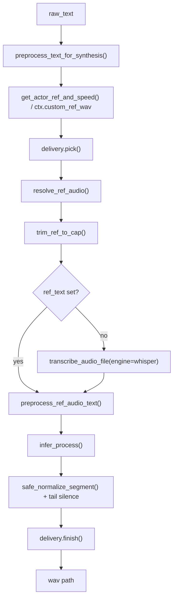
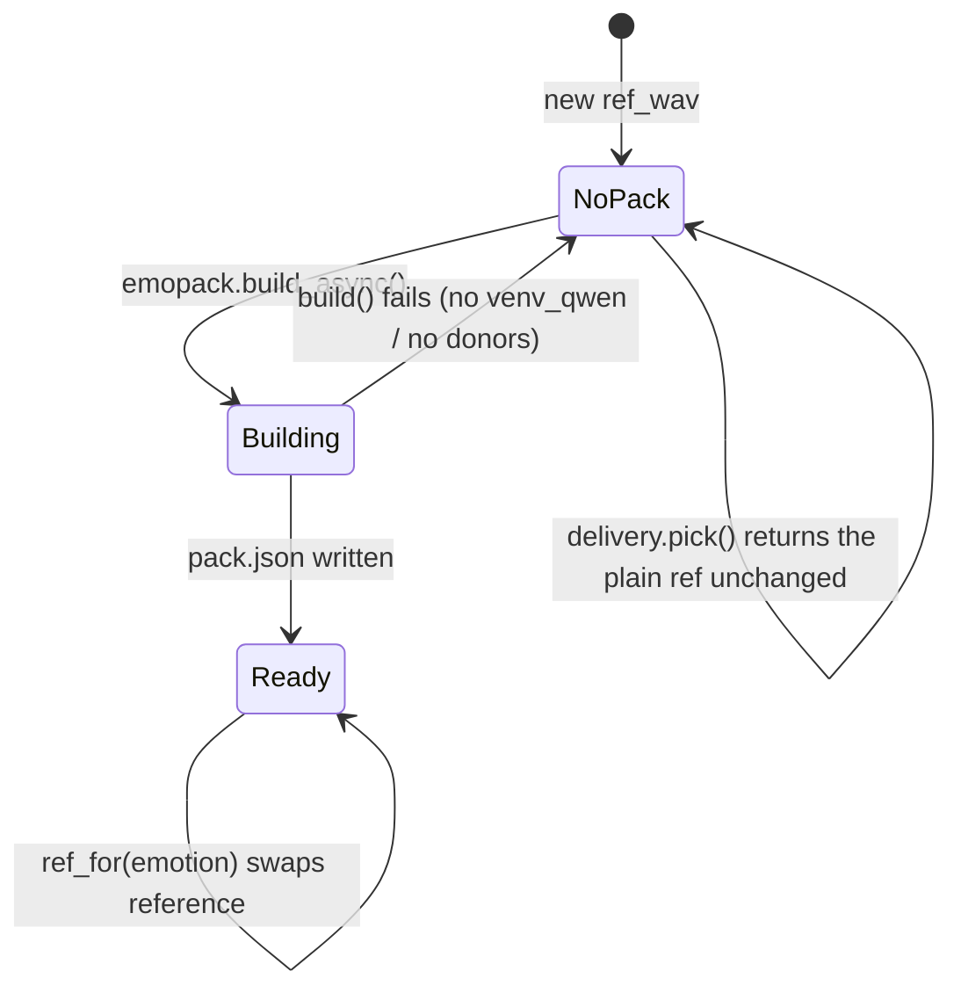
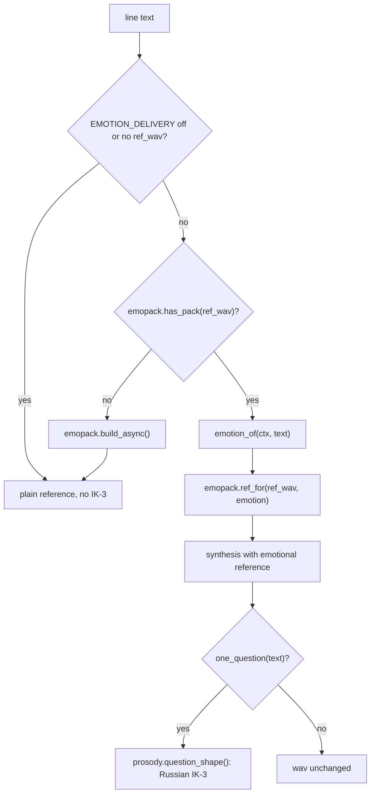
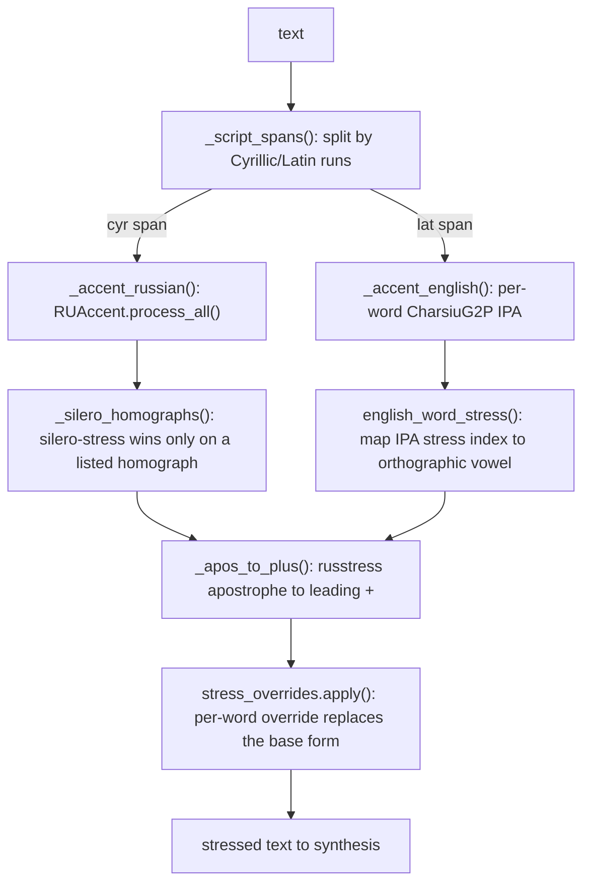
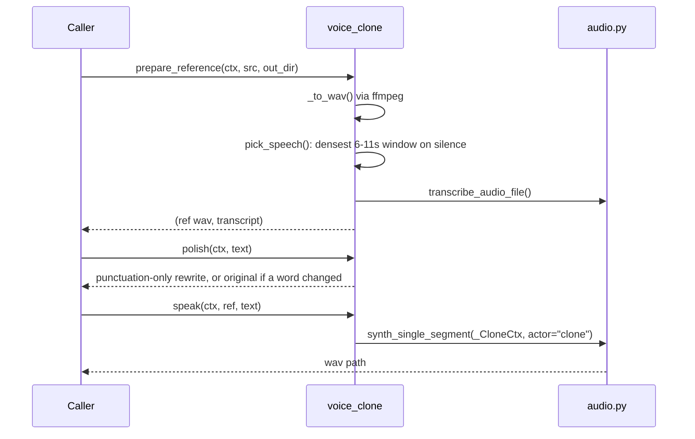
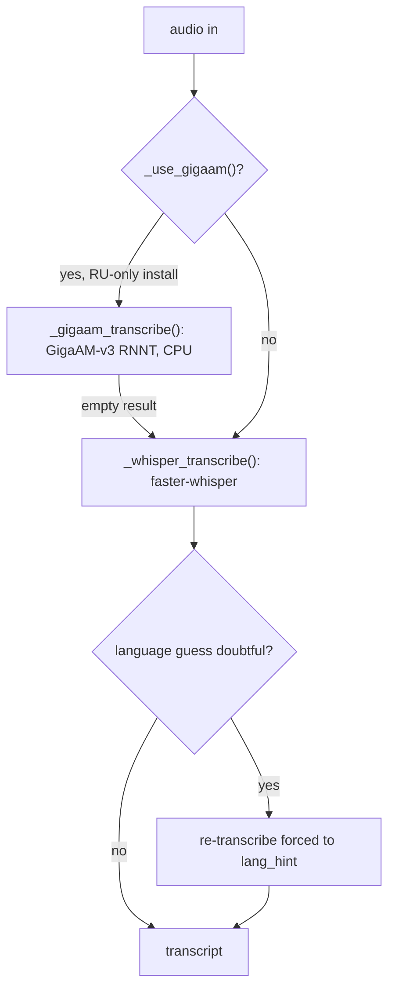

# voice

## What it does

Everything in [`voice/`](../../voice) turns text into a spoken line and spoken audio back into labelled text. The two directions share one constraint: F5-TTS (the `F5TTS_v1_Base` checkpoint, fine-tuned on Russian) only pronounces what its training saw, character-level Russian plus a `+` stress marker ([`vocab.txt`](../../vocab.txt)), so text has to be rewritten into that alphabet before synthesis, and the result still needs a reference clip to know how to say it. Without this domain, F5 reads digits, Latin words, and acronyms as noise bursts, has no notion of emotional delivery, and gives every cloned voice the one flat affect of its reference recording.

The directory also owns the reverse path: Whisper/GigaAM transcription and Nemotron-based speaker diarization, used to caption voice notes, dub videos, and build the transcript a cloned voice is trained against.

## How it works

### The synthesis pipeline

`voice/audio.py:synth_single_segment` is the one path every caller (desktop app, bot, voice cloning) goes through to turn text into a wav. The claim: text preprocessing, reference selection, and synthesis each exist to undo a specific way F5 fails, and removing any one step reintroduces that failure.

`preprocess_text_for_synthesis` (`voice/audio.py:557`) chains `clean_text`, profanity censoring, `spell_cyrillic_acronyms`, `to_spoken_form` (LLM rewrite of Latin/digits, falling back to `latin_to_cyrillic`'s rule table), `stress_plus` ([`voice/stress.py`](../../voice/stress.py)'s `BilingualAccentor` plus [`voice/stress_overrides.py`](../../voice/stress_overrides.py)), and finally appends `TTS_END_PADDING` dots so the fine-tune's end-of-phrase clipping lands on padding, not on words. `trim_ref_to_cap` runs before any reference is transcribed, because F5 itself silently clips a reference past `REF_CAP_MS` (12 s) while still reading the untrimmed transcript, which bleeds the reference's tail into the reply. `delivery.pick`/`delivery.finish` are the only two calls into [`voice/delivery.py`](../../voice/delivery.py); nothing else in the pipeline knows emotion packs or prosody exist.

### The emotion-pack lifecycle

A cloned voice starts with one neutral reference clip and only that clip's flat delivery. [`voice/emopack.py`](../../voice/emopack.py) builds a per-emotion set of references in the same timbre so a line can be spoken with feeling without retraining anything. The claim: a pack is either absent, building, or ready, and `delivery.pick` behaves differently in each state.

`build_async` (`voice/emopack.py:91`) fires once per `ref_wav` (`_asked` in [`voice/delivery.py`](../../voice/delivery.py) prevents re-firing while a build runs) and converts each donor clip in [`voice/emodonors.json`](../../voice/emodonors.json) into the target's timbre via Seed-VC, run as a subprocess in [`venv_qwen`](../../venv_qwen), with F0 kept so the pitch contour of the donor's emotion survives the timbre swap. Once `pack.json` exists, `ref_for(ref_wav, emotion)` (`voice/emopack.py:79`) returns that emotion's `(wav, text)` pair in place of the neutral reference; `delivery.pick` calls `emotion_of` to classify the line first (`"neutral"` short-circuits to the plain reference, since `voice/delivery.py:MIN_CHARS` also skips anything too short to carry feeling).

### Delivery decision per line

`voice/delivery.py:pick` and `:finish` are the only emotion/prosody entry points `synth_single_segment` calls, and the claim worth drawing is which of four outcomes a given line gets, since the branches are easy to misread as one fallback chain.

`emotion_of` (`voice/delivery.py:24`) defers to `ctx.delivery_emotion` when a caller sets it explicitly (`""` forces plain, `None` means "decide automatically"); otherwise it calls `intent.ask_choice` to classify the line as `joy`/`anger`/`sad`/`neutral`. `prosody.question_shape` runs only when `ctx.delivery_ik3` is not `False` and the text is a single unpunctuated question (`prosody.one_question`).

### Stress accentuation flow

[`voice/stress.py`](../../voice/stress.py)'s `BilingualAccentor` and [`voice/stress_overrides.py`](../../voice/stress_overrides.py) both feed `voice/audio.py:stress_plus`, and the claim is that script detection decides which of two unrelated accenting engines a span goes through, with a manual override able to beat either.

Russian spans keep their sentence-level context so RUAccent's homograph model sees the whole clause, English spans are stressed word-by-word because CharsiuG2P has no Russian stress and no context model. Both engines land in the same `+`-before-vowel format so `voice/audio.py:_apos_to_plus` and the override table apply identically regardless of which engine produced the mark; `StressOverrides.apply` (`voice/stress_overrides.py:149`) always runs last and always wins, matching on a case- and ё-folded base form so the GUI-edited dictionary overrides an automatic mark the model got wrong.

### Voice cloning

[`voice/voice_clone.py`](../../voice/voice_clone.py) turns one arbitrary audio clip into a usable TTS reference without touching the synthesis pipeline itself.

`pick_speech` (`voice/voice_clone.py:64`) prefers Silero VAD's speech spans over plain loudness detection, because loudness alone picks up background music with no words in it. `polish` rejects its own LLM output whenever the rewritten text's words differ from the input's, so punctuation cleanup can never silently rewrite content. `speak` wraps the shared `ctx` in `_CloneCtx`, which overrides `custom_ref_wav`/`custom_ref_text`/`delivery_emotion`/`delivery_ik3` without mutating the original context, so one chat's cloned voice can't leak into another request synthesizing concurrently. In `synth_single_segment` (`voice/audio.py:1311`), a caller that has already set `custom_ref_wav` on its context skips `get_actor_ref_and_speed` and supplies its own reference and transcript directly, which also avoids re-transcribing the same reference on every call.

### Transcription and diarization

[`voice/audio.py`](../../voice/audio.py) routes speech-to-text between two ASR engines, and [`voice/diarize.py`](../../voice/diarize.py) adds speaker labels on top when a clip has more than one voice.

GigaAM only runs when the installation is pinned to Russian (`_use_gigaam`, `voice/audio.py:983`), because it has no language rejection and renders any other language as confident Russian nonsense; a caller that needs to transcribe audio that is not known to be Russian passes `engine="whisper"` explicitly. `diarize.speaker_transcript` (`voice/diarize.py:66`) runs the Nemotron diarization worker as a subprocess in its own [`venv_diar`](../../venv_diar) (CPU, no GPU contention), merges and filters the resulting turns (`turns()` drops anything shorter than `MIN_TURN`), transcribes each turn with a 0.15 s pad through `audio.transcribe_audio_file`, and, only when the transcript itself names a speaker, asks the LLM to replace a `"Спикер N"` label with that name, dropping any name the LLM proposes that does not literally occur in the transcript.

## Where it lives

| Path | Responsibility |
|---|---|
| [`voice/audio.py`](../../voice/audio.py) | Text preprocessing for TTS (number/date/acronym/Latin rewriting, stress), reference resolution, `synth_single_segment` (the synthesis entry point), microphone capture (`MicRecorder`, `VadListener`), ASR routing (Whisper/GigaAM), playback (`AudioPlayer`) |
| [`voice/delivery.py`](../../voice/delivery.py) | Per-line emotion choice and Russian question-intonation gate; the only caller of `emopack` and `prosody` from the synthesis path |
| [`voice/emopack.py`](../../voice/emopack.py) | Builds and serves per-emotion reference clips for a cloned voice via Seed-VC timbre transfer |
| [`voice/prosody.py`](../../voice/prosody.py) | PSOLA pitch/tempo/loudness reshaping of an already-synthesised wav (emotion presets, Russian IK-3 question contour) |
| [`voice/stress.py`](../../voice/stress.py) | `BilingualAccentor`: RUAccent for Russian, CharsiuG2P for English, both emitting `+`-before-vowel |
| [`voice/stress_overrides.py`](../../voice/stress_overrides.py) | User-editable per-word stress dictionary, hot-reloaded, applied after the automatic accentor |
| [`voice/diarize.py`](../../voice/diarize.py) | Speaker turns via a Nemotron subprocess, labelled transcript assembly, LLM speaker naming |
| [`voice/voice_clone.py`](../../voice/voice_clone.py) | Reference extraction from an arbitrary clip, punctuation-only polish, cloned-voice synthesis |
| [`voice/emodonors.json`](../../voice/emodonors.json) | Manifest of donor clips (file, transcript, source) per emotion, consumed by `emopack.build` |
| [`voice/emosteer.py`](../../voice/emosteer.py) | Activation-steering experiment (`Steerer`); a benchmark tool, not called from `delivery.py` or `synth_single_segment` |
| [`voice/emoedit.py`](../../voice/emoedit.py) | FlowEdit-style velocity-transport emotion editing experiment; likewise not called from the synthesis path |
| [`vocab.txt`](../../vocab.txt) | The F5 character-level vocabulary synthesis is constrained to, including the `+` stress token |

## Constraints

| Constraint | Why |
|---|---|
| Reference audio is capped at 12 s (`voice/audio.py:REF_CAP_MS`) | F5 silently clips anything longer but still reads the full transcript, so `trim_ref_to_cap` must cut the audio to match before transcription |
| `TTS_END_PADDING` must reach the model exactly once, appended only in `preprocess_text_for_synthesis` | The fine-tune clips the end of a phrase; every caller going through this one function is what guarantees the padding is never skipped or doubled |
| GigaAM is only selected when the install is pinned to Russian | It has no language rejection and will transcribe non-Russian audio as fluent Russian with no signal that it failed |
| [`voice/emosteer.py`](../../voice/emosteer.py) and [`voice/emoedit.py`](../../voice/emoedit.py) are not wired into `delivery.py` | Measured activation-steering window is too narrow (`alpha` 0.005-0.02) before voice similarity degrades; kept as standalone benchmark tools |
| A diarized speaker only gets a real name if that name is spoken in the transcript itself | `diarize.name_speakers` rejects any LLM-proposed name that does not literally occur in the text, so a label is never invented |
| A voice-cloning punctuation polish is rejected if it changes any word | `voice_clone.polish` compares the word sequence before and after; any mismatch returns the unpolished original |

## Coupling

`voice/audio.py:synth_single_segment` is called from `voice_clone.speak`, and from callers in [`media/video_dub.py`](../../media/video_dub.py), [`media/video.py`](../../media/video.py), [`media/remix.py`](../../media/remix.py), [`bot/tg_tasks.py`](../../bot/tg_tasks.py), [`bot/tg_audiobook.py`](../../bot/tg_audiobook.py), [`bot/tg_voice_clone.py`](../../bot/tg_voice_clone.py), and [`bot/tg_voice_library.py`](../../bot/tg_voice_library.py); [`gui/gui_voice_clone_tab.py`](../../gui/gui_voice_clone_tab.py) drives `voice_clone.py` and `stress_overrides.py` from the desktop GUI's Stress tab. `voice/diarize.py:speaker_transcript` is reached from the same media/bot callers for forwarded videos and circles. [`voice/audio.py`](../../voice/audio.py) imports `llm` (for `to_spoken_form` and diarization speaker naming) and `intent` (for `delivery.emotion_of` and `prosody.question_shape`'s word choice), both outside this domain. Configuration (`SAMPLE_RATE`, `DC_REF_WAV`, `TTS_END_PADDING`, VAD thresholds, `ASR_ENGINE`, `STRESS_OVERRIDES_PATH`) comes from [`core/config.py`](../../core/config.py).
